# The Recon Module, A–Z

A learning guide: what the recon module is, how one run flows, what every part
does, and where the interesting decisions live. Diagrams first, prose second.

> **Read this after you know the code exists, not instead of reading it.** Per the
> docs' own rule, the code is the source of truth and this guide is a map: every
> claim here is checkable in a file the guide names. Where a number appears, it was
> measured on a live run and the run is described.

---

## 1. What recon is for, and what it is not

Recon **widens the attack surface**: it enumerates what the target owns, validates
what is reachable, and hands a ranked, explained model to the next module. It does
not find or prove vulnerabilities — that is the vulnerability-finder engine's job.
The boundary is deliberate and was re-affirmed on 2026-09-19 (see
`progress.md`): mixing finding into recon would duplicate the engine and blur the
one responsibility split the architecture depends on.

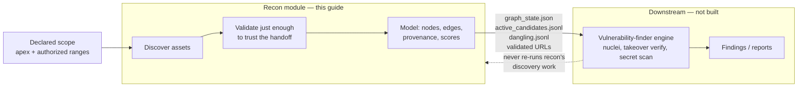

Two consequences worth internalising early:

- **Recon stops when evidence stops.** It has no clock-based decay, no "monitoring
  mode", and nothing that assumes the next run happens. A program is engaged once.
- **Recon refuses rather than guesses.** Every refusal is a named reason
  (`escalation_refusals.jsonl`), and "no answer" is never recorded as "absent".

---

## 2. The shape: a platform plus pipelines

The tree is split so that **adding an asset pipeline is adding a folder**. The
platform carries no asset knowledge; a pipeline folder carries no infrastructure.

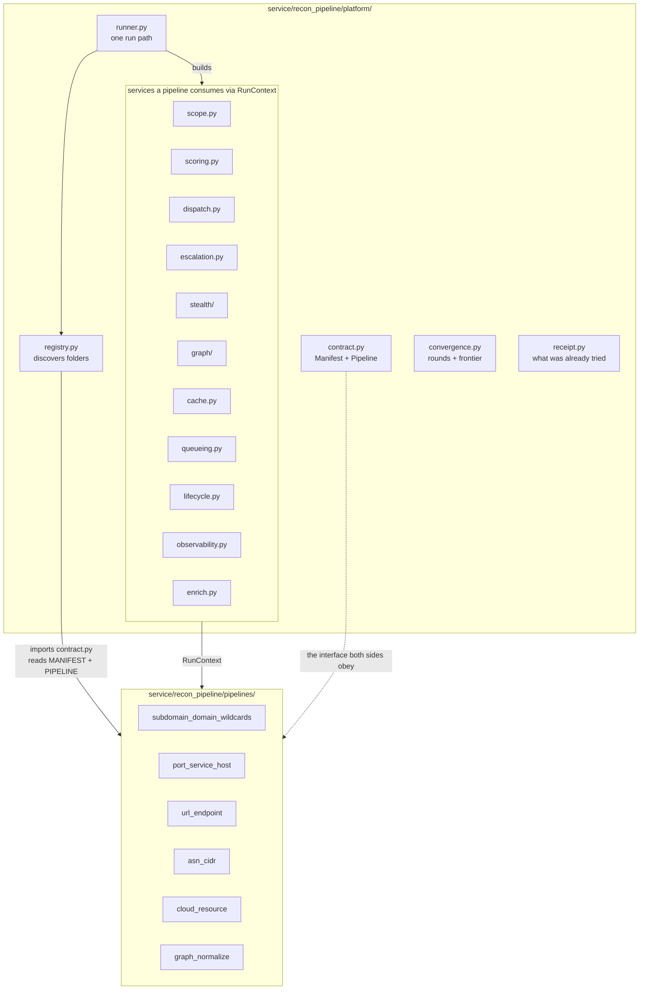

### The contract, concretely

A folder qualifies when one module exposes both names. `contract.py` is preferred,
`pipeline.py` then `__init__` are fallbacks (`platform/contract.py`,
`platform/registry.py`).

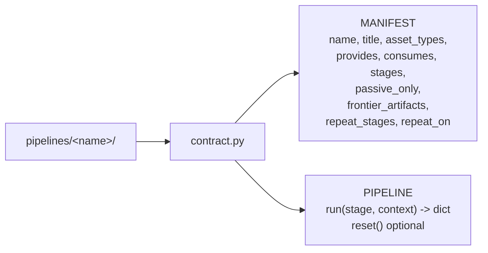

Rules the registry enforces (each is a one-line invariant in `registry.py`):

| Rule | Why it exists |
|---|---|
| folder name must equal `MANIFEST.name` | one name everywhere is how artifacts stay findable |
| a broken folder is **skipped, never fatal** | one experimental pipeline cannot take the run down |
| `consumes` declares ordering | a consumer runs after the pipelines whose artifacts it reads |
| `consumes` may name a pipeline that is not run | selecting one pipeline must not drag in its producers |

---

## 3. One ordinary run, end to end

`run_recon.py` is the full-engagement driver; `python -m service.recon_pipeline run`
is the platform CLI. Both end at the same artifacts.

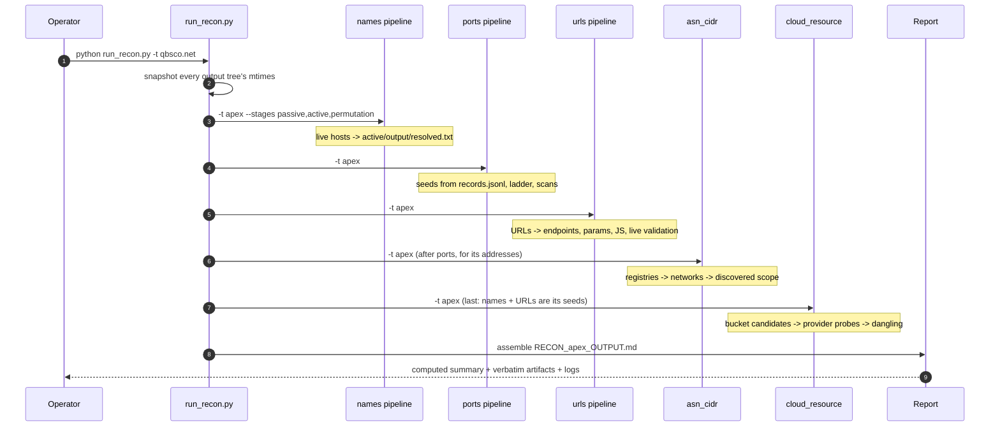

Note what is *not* in that sequence: `run_recon.py` runs the five collectors and
leaves the model out. `graph_normalize` is run by the platform CLI
(`python -m service.recon_pipeline run`), because it is cheap (0.5–0.8 s), reads
only artifacts, and belongs after every collector has finished rather than inside
an engagement driver whose stages also stream log files to the terminal.

Three properties the report assembler guarantees (`run_recon.py`), each of which
exists because a real run got it wrong once:

- **Only this run's artifacts are embedded.** A pre-run mtime snapshot means a
  file nobody rewrote is labelled *stale* rather than passing as fresh evidence.
- **The summary is computed, not authored.** Tables are read from the stages'
  `summary.json`/`report.json`; a statement the machine reports cannot support is
  impossible to write by hand.
- **Children run unbuffered (`-u`).** A piped child block-buffers until 8 KiB, so
  an interrupted long stage used to leave a zero-byte log.

Measured on `qbsco.net`: names 1123.6 s (passive 105.8, active 107.0, permutation
910.9), ports ~105 s, URLs ~94 s, networks 55–94 s, buckets ~225 s — roughly 22
minutes for one pass, and **the names stage is slow by design**: 12 539 permuted
names spread over 34 resolvers by the DNS budget.

---

## 4. The collectors, one at a time

### 4.1 Names — `subdomain_domain_wildcards`

Three stages, and the reason there are exactly three is the most important insight
in the module.

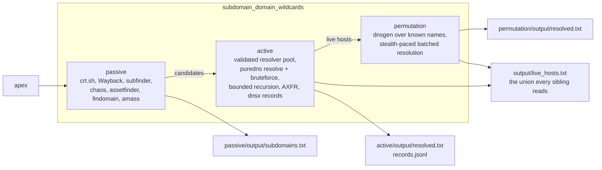

**The insight: `passive` is a subtree query, so it never needs repeating.** crt.sh is
asked for `%.<apex>` and Wayback with `matchType=domain`; one call returns every
depth. Re-feeding deep findings as new seeds would re-query a subset of a set we
already hold. This is pinned twice — once for the stage
(`tests/recon/test_passive_sources.py`: "why the passive stage needs no recursion
loop") and once for the convergence loop
(`tests/recon/test_convergence.py`: `passive` is not in `repeat_stages`).

**The generators are `active` and `permutation`**: bruteforce under newly-resolved
parents, and permutations of newly-known names. That is where new names come from,
which is why only they repeat.

### 4.2 Ports and services — `port_service_host`

A ladder, not a sweep: every address is placed on a rung whose level decides how
much it is allowed to cost.

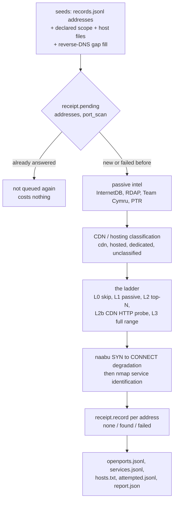

Rungs are a **policy** instrument, and its two hardest rules were both learned from
live runs:

- **`hosted` is its own verdict.** A name resolving through a third party's tenant
  naming (`autodiscover` → `outlook.com`) gets a top-N scan and **no** L3
  escalation — 16 M365 addresses once consumed a 13-minute full-range scan and
  found nothing new.
- **Absence of classification is not absence of sharing.** `unclassified` became a
  third hosting state after 14 addresses were found admissible to a port scan
  purely because a snapshot artifact did not mention them.

### 4.3 URLs, endpoints, parameters — `url_endpoint`

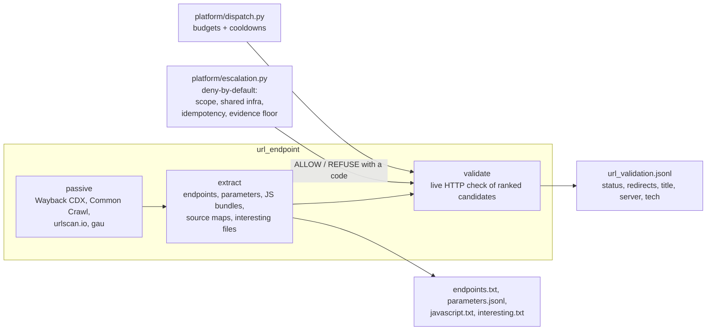

Two contracts that make its output trustworthy:

- **Discovery and measurement stay separate claims** on the same node ("the archive
  mentioned this URL" is not "it answered today").
- **An unreachable source is a failure, not an empty result.** `SourceUnavailable`
  exists because Common Crawl returning `[]` on a transport error once read as
  "Common Crawl has never crawled this domain".

### 4.4 Network ownership — `asn_cidr`

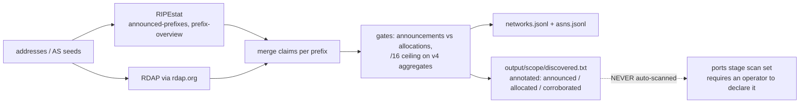

The §5.4 line this stage enforces: **announced ≠ owned ≠ in scope**. It discovers
without touching, and its one strongest possible output is a *corroborated* network
— announced by an AS **and** allocated to the target's hoster **and** containing a
resolved address (`103.53.44.0/22` was the single one on `qbsco.net`).

A measured lesson is encoded as a gate: `40.0.0.0/8`, announced by AS8075 and
containing one target address, was once presented as a discovered network — 16
million addresses the AS does not operate. The `/16` ceiling now refuses v4
aggregates, and refusals are counted in the report.

### 4.5 Storage buckets — `cloud_resource`

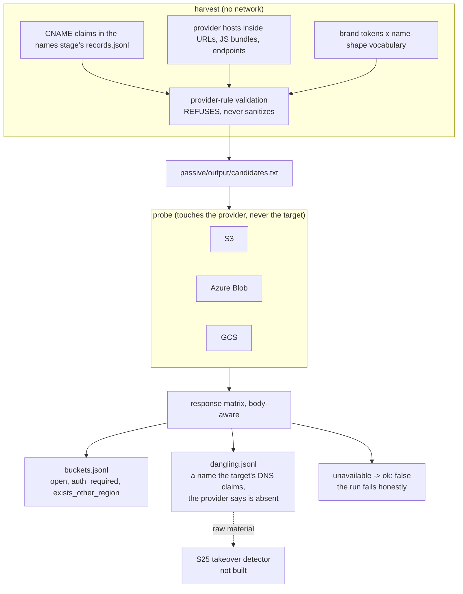

The verdict matrix has two traps the code names explicitly, because both produce
false confidence:

- **Azure answers 409, not 404, for an absent account**, and its error body decides
  the verdict — a naive status check reads "exists" for a name nobody owns.
- **`auth_required` means "exists and denies anonymous reads"**, never "not found".
  On `qbsco.net`: 2 open, 39 `auth_required`, 215 dangling, 1 `unavailable`.

And the headline from that run bounds its recall honestly: **zero candidates came
from the siblings** — every one was a derived brand shape, which is exactly what a
missing JS crawl (S24) would have supplied.

### 4.6 The model — `graph_normalize`

The only pipeline that answers *what do the others have to do with each other*. It
reads artifacts, never re-runs a collector, and writes no database rows (the schema
is not final).

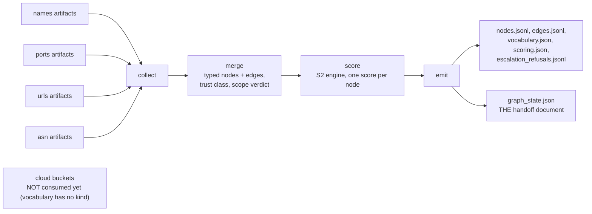

Every node and edge carries **provenance** (which artifact, which source), a
**trust class** (`declared` / `observed` / `discovered` / `inferred`, merged
strongest-wins so an InternetDB port and a scanned port stay different facts), and
a **scope verdict**. Measured: 9 812 rows → **6 817 nodes / 6 842 edges** in 0.8 s,
an 8.58 MB `graph_state.json`.

The model is **deterministic by test** — two runs over the same artifacts produce
byte-identical output. That is what makes it diffable, and it is the property the
convergence loop leans on.

Three defects this pipeline's live run caught, all worth knowing as *classes*:

| Defect | Class |
|---|---|
| both entry points wrote the outputs, one silently omitted the handoff document | two writers, one artifact set |
| an allocation row with no ASN was dropped by nesting the edge inside the ASN loop | iterating a parent to emit a child |
| the standalone CLI built no scope engine, so the same pipeline produced a different model | two entry points, one behaviour |

---

## 5. The platform services a pipeline may use

A pipeline receives these in `RunContext`; it never imports a sibling's code.

```mermaid
flowchart TD
    rc["RunContext"]
    rc --> scope["scope<br/>in_scope / needs_review / out_of_scope"]
    rc --> scoring["scoring (S2)<br/>pure weights + corroboration"]
    rc --> dispatch["dispatch (S10)<br/>ALLOW / DEFER / DENY + budgets"]
    rc --> escalation["escalation<br/>should this operation run, and why"]
    rc --> stealth["stealth (S12)<br/>identity, pacing, detection, quarantine"]
    rc --> cache["cache (S8) - degrades to a miss"]
    rc --> queue["queueing (S9) - spools locally"]
    rc --> graph["graph seam - journals offered writes"]
    rc --> enrich["enrich (S13) - no key, no opinion"]
    rc --> obs["observability (S14) - runs.jsonl"]
    rc --> live["lifecycle (S11)<br/>rescore, prune, diff"]

    dispatch -->|"scope first, always"| scope
    dispatch -->|"operation named"| escalation
    escalation -->|"ordered rules"| erules["1 scope<br/>2 shared infra / hosting<br/>3 idempotency<br/>4 evidence floor"]
```

**Graceful degrade is a contract, not a nicety.** With Redis down and no LLM key,
a live run still completes and reports each cause. The graph seam always
journals today: the pre-run schema was removed on 2026-09-19 (it was guessed
before any run existed), so writes are recorded and `available` is False with
that reason until the replacement is designed from `graph_state.json`.

```
"graph":      {"available": false, "reason": "ServiceUnavailable: ... 7687 refused"}
"queue":      {"available": false, "reason": "TimeoutError: ..."}
"enrichment": {"available": false, "reason": "LLM_API_KEY not set"}
```

Two design rules that keep the gate honest:

- **Deny-by-default.** No scope decision, no score, or an unknown type ⇒ `DENY`
  with a reason. The gate cannot be "configured open" by accident.
- **One policy, not two.** When a caller names its *operation*, the decision is
  delegated to `escalation.py`, so "why does this asset deserve this work" lives in
  one module instead of being re-derived at every call site.

---

## 6. The convergence loop

One pass finds one generation. A converged run keeps going while the surface grows,
and stops for a **named reason**.

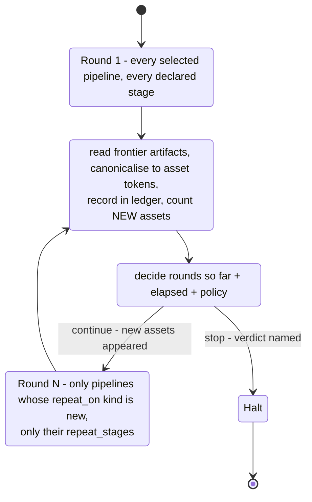

### 6.1 The frontier is measured, never assumed

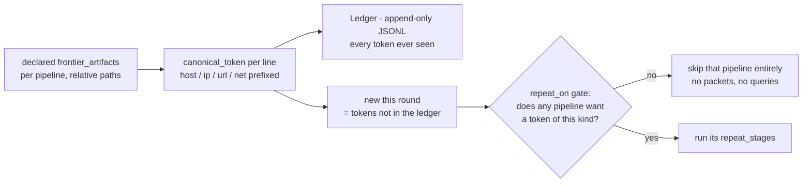

Why the kind prefix matters: a bucket name and a hostname are the same shape
(`qbsco-assets`), so `host:` and `ip:` prefixes keep two collections from silently
merging into one asset. CIDR host-bits are cleared so `103.53.44.7/22` and
`103.53.44.0/22` are one network, not two.

### 6.2 Only what a new asset can change repeats

| Pipeline | `repeat_stages` | `repeat_on` | Why |
|---|---|---|---|
| `subdomain_domain_wildcards` | `active`, `permutation` | `host` | the only true generator; `passive` excluded — subtree queries |
| `port_service_host` | `scan` | `ip` | packets are spent for addresses |
| `asn_cidr` | `lookup` | `ip` | seed-keyed: only a new address makes a repeat pay |
| `cloud_resource` | `harvest`, `probe` | `host`, `url` | candidates come from names and provider hosts in URLs/JS |
| `url_endpoint` | *(none)* | — | all four sources are per-domain archives; its real second-pass generator is the S24 JS crawl, which does not exist |
| `graph_normalize` | `collect`, `merge`, `emit` | all kinds | 0.5–0.8 s, and the handoff must describe the final surface |

### 6.3 Stopping is a decision, and the reason is always named

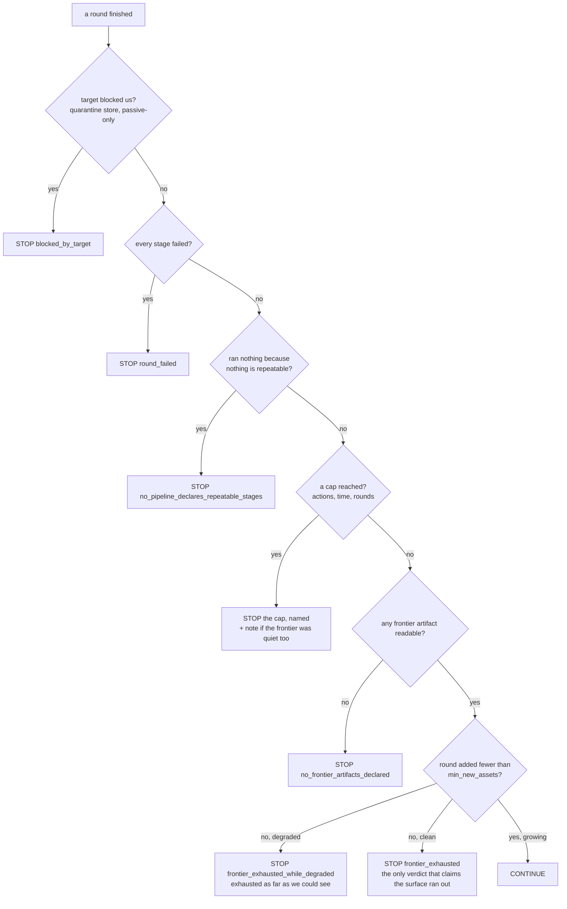

**Caps outrank the happy ending on purpose.** A run that hit its wall clock *and*
found nothing new reports the budget — with a note that the frontier was quiet too
— rather than overstating "exhausted". Only `frontier_exhausted` claims the surface
ran out.

### 6.4 Convergence, as a sequence

```mermaid
sequenceDiagram
    autonumber
    participant D as ConvergenceDriver
    participant R as Runner/gating
    participant P as repeat pipelines
    participant F as frontier artifacts
    participant L as Ledger

    D->>R: round 1, nothing new yet
    R->>P: every selected pipeline, every stage
    P->>F: write discovery artifacts
    D->>F: read + canonicalise
    D->>L: observe tokens; new = not seen before
    D->>D: decide - 6472 new assets, caps not hit
    D->>R: round 2, new kinds = ip
    R->>R: skip pipelines whose repeat_on misses those kinds
    R->>P: run repeat_stages only, over receipt.pending assets
    P->>F: rewrite artifacts
    D->>L: observe again
    D->>D: decide - 0 new, nothing degraded
    Note over D: verdict frontier_exhausted<br/>the loop ends with a reason
```

Run it with `--until-converged`, plus `--max-rounds`, `--time-budget SECONDS` and
`--max-active-actions`. Artifacts: `convergence.json` (rounds, verdict, policy) and
`frontier_ledger.jsonl`, with stage reports under `stages/round-<n>/` so a later
round cannot overwrite an earlier one's record.

### 6.5 The loop, measured on a real target

`qbsco.net`, 2026-09-19, `--until-converged --max-rounds 4 --time-budget 10800`:

| Round | New assets | Known | Pipelines run | Seconds | What happened |
|---|---|---|---|---|---|
| 1 | 6 472 | 6 472 | names, ports, url, asn, cloud | 1 696.8 | the full pass — everything is new |
| 2 | 4 | 6 468 | names, ports, asn, cloud | 1 344.0 | second generation; 4 new addresses from re-resolution |
| 3 | 0 | 6 468 | ports, asn (gated) | **63.9** | `skipped cloud/names: nothing new of kind ip to spend on` → STOP |

**Verdict: `frontier_exhausted`** — the only one that claims the surface ran out.
The instructive numbers: round 3 cost 64 s (under 4 % of round 1) because the kind
gate skipped two whole pipelines, the port ladder skipped 5 of 13 addresses via
the receipt and re-attempted nothing (17 distinct assets, one attempt each), and
the time budget was never touched. Convergence is not free — round 2's
permutation pass costs ~15 min by design — which is exactly why the gate and the
receipt exist. On this small M365-hosted target the loop added 4 assets
(~0.06 %); its value was the *proof* of exhaustion, and its recall case lives in
the missing S24 JS crawl, not in more rounds of what already ran.

---

## 7. The attempt receipt — what was *tried*, not what was *found*

The ledger records what a run has **seen**. The receipt records what it has
**attempted**, which is a different question: an address scanned with nothing open
leaves no trace in any discovery artifact, so "already scanned" and "never scanned"
looked identical — and a repeated round paid for it again.

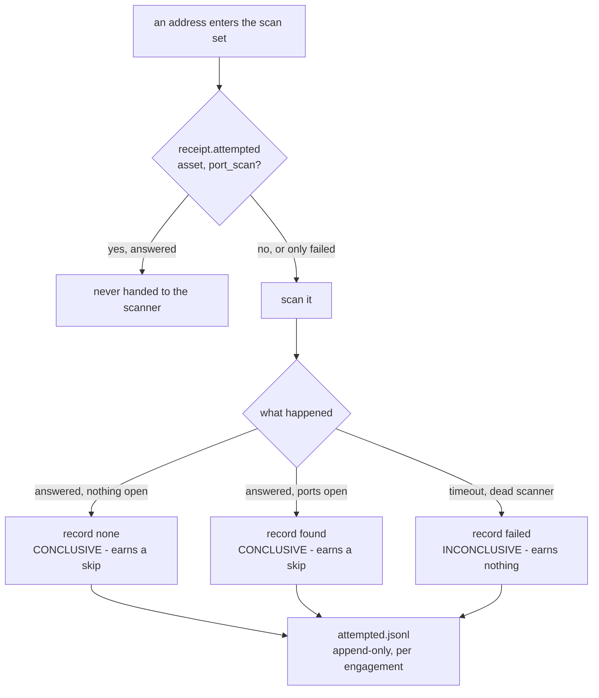

**The rule that matters:** only a conclusive attempt earns a skip. An outage is not
knowledge, so recording a failure as an attempt would turn a transient problem into
a permanent blind spot. A later conclusive attempt *upgrades* an inconclusive one; a
later failure never overwrites an answer.

Measured in the converged run above: round 2 built its ladder over
`receipt.pending()` — 5 of 13 addresses skipped, 8 planned — and wrote 4 new
attempts with zero re-attempts. The addresses that already answered are simply
never handed to the scanner again.

Scope, and why it is scoped that way: the receipt is **per engagement**. A converged
run points every round at one file per *run* (`recon_<apex>_attempts_<stamp>.jsonl`),
so a fresh engagement cannot inherit the last one's scan history and skip work it
never did — while rounds *inside* a run share it, which is the entire point. Left
unset, it lives at the stage's `output/attempted.jsonl` and persists across runs,
which is what the escalation policy's idempotency rule always assumed.

---

## 8. What recon hands over

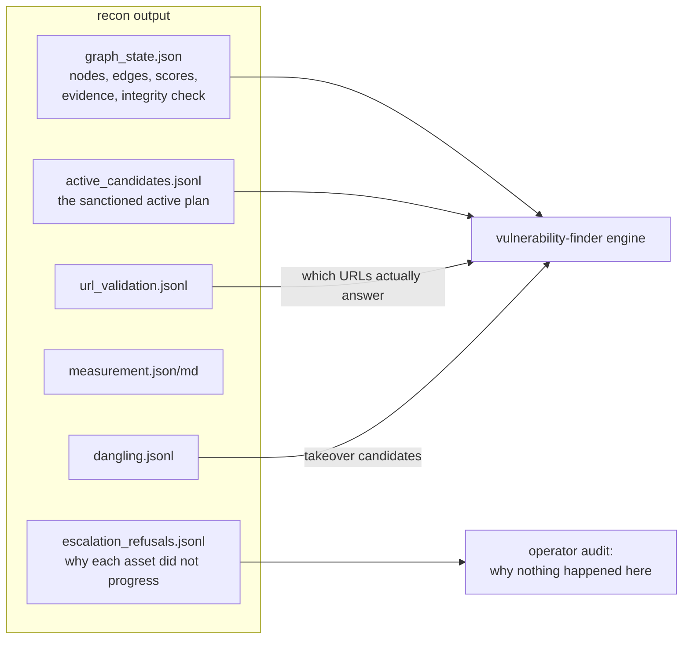

`graph_state.json` is self-describing by design: it carries the vocabulary mapping
and the scoring contract alongside the data, and a computed `integrity` block that
is `true` only when every edge endpoint resolves to a node in the same file.

**The schema is now settled (2026-09-19)** — argued from this document's observed
assets, after the pre-run Neo4j schema (designed from the plan before a single
run existed) was removed the same day:

- **Ten asset kinds** — `domain`, `wildcard`, `ip`, `service`, `url`, `parameter`,
  `asn`, `network`, `organization`, and the previously missing **`cloud`**
  (identity `provider:name`, so a bucket seen at three regional endpoints is one
  node and a *dangling* reference — no region, no bucket — is still well-formed).
- **Twelve claim-typed edges** — the type names the claim, provenance moves to
  properties: `resolves_to` carries `method` (`a`/`ptr`/`shodan`) for what was
  three types; `owned_by` carries `claim` (`allocation`/`registration`) for what
  was two; `announced_by` and `hosted_by` stay separate because routing ≠
  ownership and inference ≠ observation; `cname_points_to` is new, and the
  dangling-CNAME finding is one traversable edge carrying its outcome.
- **Time on everything** — `first_seen` (write-once) and `last_seen` (monotonic
  max) on every node and edge; "is this stale?" is answered by looking, and the
  deep history stays in the artifacts each `evidence` entry names.

The mapping lives in `vocabulary.py` (`GRAPH_LABELS` / `GRAPH_RELATIONSHIPS`),
pinned by test. **The remaining gap is only the writer**: no pipeline emits
`context.graph` yet, and the journaling seam (`platform/graph/ingest.py`)
records every offered write in the meantime. Feeding `context.graph` from the
model is what turns six file-writing pipelines into an ASM system.

---

## 9. Where state lives

| Path | What | Tracked? |
|---|---|---|
| `pipelines/<name>/output/`, `.../passive/output/` | per-stage artifacts, fully reproduced by re-running | gitignored |
| `output/runs/<target>/<stamp>/` | `summary.json`, `stages/<pipeline>/<stage>.json`, `convergence.json`, `frontier_ledger.jsonl` | gitignored |
| `output/runs/runs.jsonl` | the run timeline `history` reads | gitignored |
| `RECON_<target>_OUTPUT.md` | the combined report | tracked |
| `recon_<apex>_convergence_*.json`, `_ledger_*.jsonl`, `_attempts_*.jsonl` | the loop's own record, per run | gitignored |
| `recon_<apex>_*.log` | per-stage console logs | gitignored |

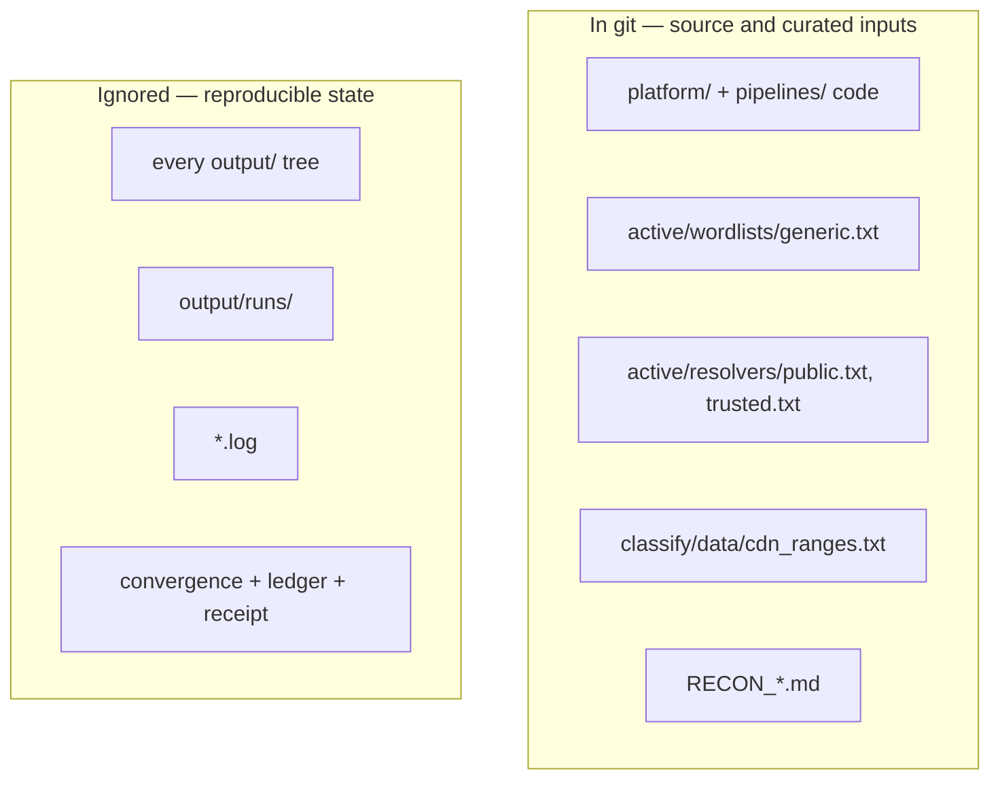

---

## 10. When things go wrong: what the code does

| Situation | Behaviour, and where it is decided |
|---|---|
| Redis down | cache is a no-op miss, queue spools locally, both report `available: false` with a reason |
| Graph storage | the seam journals every offered write (`available: false` + reason); `replay` reports the debt — the schema is being redesigned from observed data |
| No LLM key | enrichment answers "no opinion"; it never gates anything |
| Docker/tool image missing | the stage records the reason, drops to passive-only, still writes every artifact |
| Target blocks or challenges us | quarantine records the scope, escalates host → WAF → passive-only, and the convergence loop stops on it |
| A source is unreachable | the URL pipeline raises `SourceUnavailable`; the stage runner catches it, records that source as **failed with its reason**, and still emits the union of the sources that did answer — so an outage never becomes "this domain has no history" |
| A scan fails | recorded `failed` in the receipt ⇒ no skip; `ok: false` in the report |
| A child prints a character the console cannot encode | the streamed writer degrades the glyph instead of raising, and children are pinned to UTF-8 — a live run once died on a U+FFFD the cp1252 console could not show (`_console_write`, `_child_env` in `run_recon.py`) |
| A stage crashes | the runner isolates it per stage; one failure does not stop the run |
| A pipeline folder is broken | the registry skips it with a logged reason |

---

## 11. Glossary

| Term | Meaning here |
|---|---|
| **apex** | the registrable domain being engaged (`qbsco.net`) |
| **asset token** | canonical, kind-prefixed identifier used for growth accounting: `host:`, `ip:`, `url:`, `net:` |
| **frontier** | the union of tokens found in the pipelines' declared discovery artifacts |
| **ledger** | append-only record of every token an engagement has seen |
| **receipt** | append-only record of every `(asset, operation)` an engagement has *attempted* |
| **repeat_stages / repeat_on** | which stages may be re-run, and which new asset kinds justify it |
| **verdict** | the named reason the convergence loop stopped |
| **rung** | an address's permitted cost level on the ports ladder |
| **escalation** | the policy module answering "should this operation run against this asset, and why" |
| **trust class** | `declared` / `observed` / `discovered` / `inferred`, strongest-wins per claim |
| **stale artifact** | a file not rewritten during the current run; embedded as a labelled marker, never as evidence |

---

## 12. Reading order, and where to change what

**If you want to…**

| Goal | Start at |
|---|---|
| run it | `README.md` § Running, then `python run_recon.py -t <apex>` |
| add a pipeline | `service/recon_pipeline/README.md` — copy the contract template |
| understand one collector | that pipeline's `README.md`, then its `DESIGN.md` |
| understand the round loop | `service/recon_pipeline/README.md` § Converging, then `platform/convergence.py` |
| understand the refusal machinery | `platform/escalation.py`, then `docs/codebase/PLATFORM.md` |
| see what is not built | `docs/codebase/PLATFORM.md` § Not built, `docs/codebase/CONCERNS.md` |
| know the plan | `docs/recon_docs/recon.md` (v1 spec), `recon_v2.md`, `IMPLEMENTATION_PLAN*.md` |

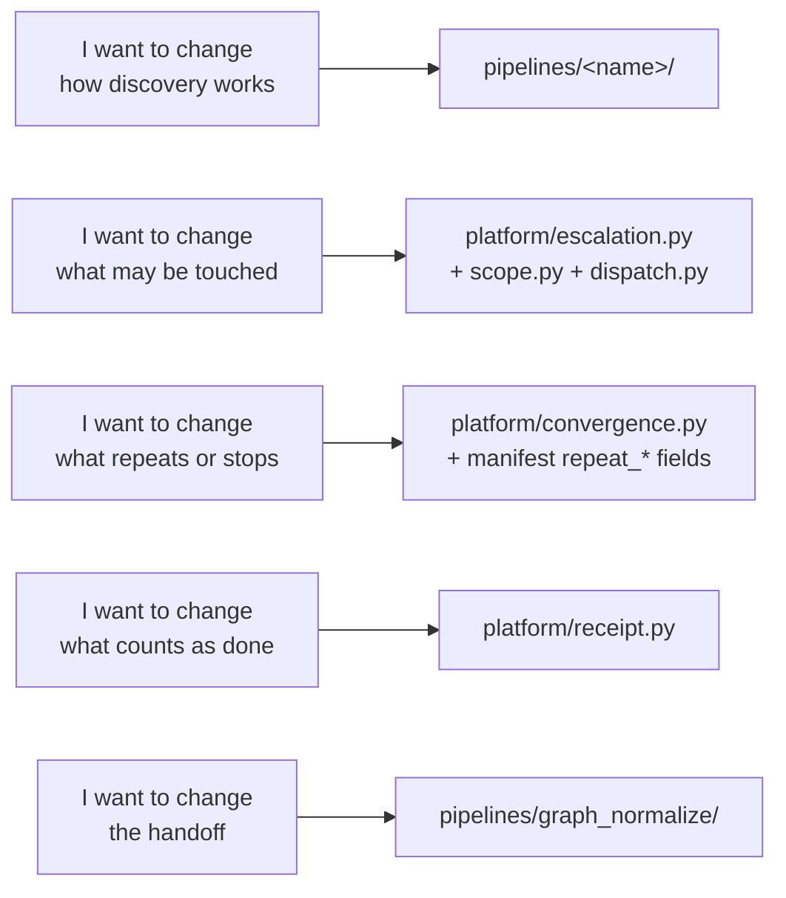

---

*Companion docs: `ARCHITECTURE.md` (the built system, section by section),
`PLATFORM.md` (module-by-module state and the not-built list), `STRUCTURE.md` (where
every file is), `TESTING.md` (what each test file pins), `../recon_docs/recon.md`
(the v1 spec this implements).*
