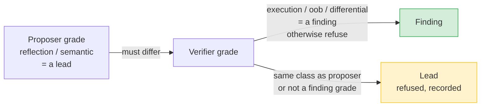
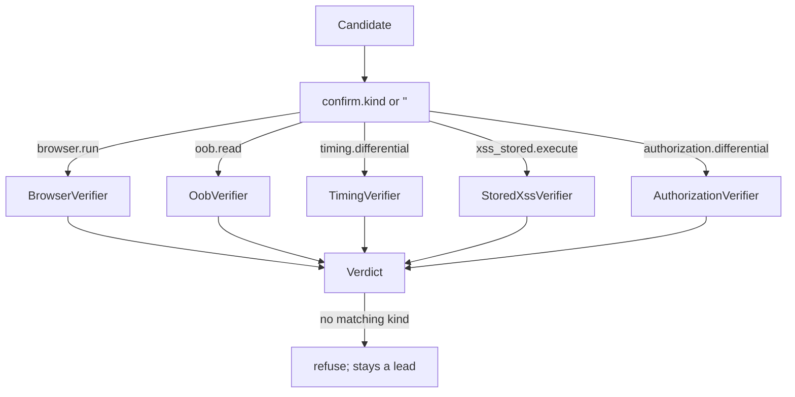
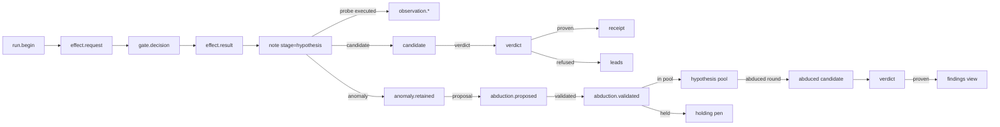

# Vuln Engine — Complete Implementation Reference

> One source of truth for how `service/vuln_engine/` works, from discovery to verdict, with every component named and every relationship traced to its code location. Built from the repo at `512cc9d`.

---

## 0. The one-line model

**The vuln engine is a deterministic, offline-verifiable measurement instrument.** A technique proposes candidates, but a technique can never confirm its own finding. A probe spec passes through the PolicyGate — the only network door — observations come back, the technique's `interpret()` derives candidates, and an **independent verifier in a different evidence class** executes the confirmation. Everything is recorded in an append-only JSONL ledger, and every report is a *derived view* recomputed from that ledger. The LLM junctions are quarantined and advisory-only.

In one diagram:

```mermaid
flowchart TB
    SEED[EngagementSeed<br/>operator declares surfaces] --> REG[TechniqueRegistry<br/>discover()]
    REG --> TECH[Technique instance<br/>pure functions]
    TECH -->|surfaces()| SURF[Surface]
    SURF --> HYP[Hypothesis<br/>claim + preconditions]
    HYP --> PROBE[ProbeSpec<br/>oracle + purpose]
    PROBE --> GATE[PolicyGate<br/>only network door]
    GATE --> EFFECT[Effect / effect.result<br/>transports only]
    EFFECT --> OBSERV[Observation<br/>typed dict payload]
    OBSERV --> TECH2[technique.interpret()<br/>pure candidates]
    TECH2 --> CAND[Candidate<br/>with confirm spec]
    CAND --> VERIF[5 verifiers<br/>independent class]
    VERIF --> VERDICT[Verdict<br/>proven / refused]
    VERDICT --> LEDGER[WorldLog JSONL<br/>append-only]
    LEDGER --> VIEWS[world.views<br/>findings / leads / report]
```

---

## 1. The rule that governs everything

**The single most important rule:**

> The thing that proposes cannot be the thing that confirms.

If one source both writes the books and signs off on them, you have a closed loop that can be *confidently wrong*. So:

- A `Candidate` carries `evidence` (the proposer's grade) and a `confirm` spec (a request spec for a verifier).
- `Verdict.check_independence` raises unless the **verifier's evidence grade differs from the proposer's grade**.
- Only three evidence grades may support a finding: `execution`, `oob`, `differential`.
- Therefore a hypothesis (grade `hypothesis`) is a **lead**, never a finding.



---

## 2. Evidence grades

`service/vuln_engine/kernel/evidence.py`

| Constant | Value | What it means | Finding grade? |
|---|---|---|---|
| `EVIDENCE_HYPOTHESIS` | `hypothesis` | An LLM or a rule said so | ❌ |
| `EVIDENCE_REFLECTION` | `reflection` | Bytes came back containing our input; context unknown | ❌ |
| `EVIDENCE_SEMANTIC` | `semantic` | The reflection's context was parsed and mapped | ❌ |
| `EVIDENCE_EXECUTION` | `execution` | A browser ran the script | ✅ |
| `EVIDENCE_OOB` | `oob` | Our own collaborator saw the interaction | ✅ |
| `EVIDENCE_DIFFERENTIAL` | `differential` | Two authenticated states differed | ✅ |

`FINDING_GRADES = {execution, oob, differential}`

`weaker_than(left, right)` gives a total order with unknown grades weakest. `Observation` and `Evidence` payloads are **always `dict` of typed fields — never a string**.

---

## 3. Core data shapes

### 3.1 `Surface`

`service/vuln_engine/kernel/technique.py`

A frozen dataclass: one declared input surface.

| Field | Type | Meaning |
|---|---|---|
| `url` | `str` | Target URL |
| `host` | `str` | Host |
| `param` | `str` | Parameter name |
| `where` | `"query" \| "body" \| "path" \| "header" \| "url"` | Which part of the request carries the value |
| `capability` | `str` | Operator's claim (strongest-wins) |
| `label` | `str` | Free-form label for reports |
| `companions` | `dict[str, str]` | Fixed form fields every body submission must carry |
| `read_back` | `str` | Where stored input renders back (surface URL if empty) |

`get key` → `f"{url}#{param}"` if `param` else `url`.

### 3.2 `EngagementSeed`

| Field | Type | Meaning |
|---|---|---|
| `target` | `str` | Target name |
| `surfaces` | `tuple[Surface, ...]` | Declared surfaces only |

Methods: `for_capability(cap)` → surfaces claiming exactly `cap`; `with_param()` → surfaces with a param in `query/body/path`.

### 3.3 `Hypothesis`

| Field | Type | Meaning |
|---|---|---|
| `id` | `str` | Deterministic `<technique>:<host>:<path>:<param>` |
| `technique` | `str` | Technique name |
| `surface` | `Surface` | The surface under test |
| `claim` | `str` | Short factual claim, no confidence wording |
| `rests_on` | `str` | Which capability/precondition this rests on |
| `preconditions` | `tuple[str, ...]` | What the world must satisfy |
| `expectation` | `Expectation \| None` | What "nothing is broken" looks like; optional |
| `plan` | `dict` | Canonical plan (digest) so replays are reproducible |

### 3.4 `ProbeSpec`

| Field | Type | Meaning |
|---|---|---|
| `id` | `str` | Stable id |
| `kind` | `"http.request" \| "browser.run"` | Transport kind |
| `host` | `str` | Host |
| `detail` | `dict` | Transport parameters |
| `oracle` | `str` | Boolean predicate; an *oracle is a question with an answer*, not an adjective |
| `canary` | `str` | String to look for (reflection oracles) |
| `mark` | `str` | Distinctive part of the canary for transformed-reflection detection |
| `noise` | `dict` | Declared cost in visibility |
| `requires_context` | `tuple[str, ...]` | Contexts the probe is only meaningful in |
| `produces` | `str` | Evidence class an answer can produce |
| `purpose` | `"propose" \| "confirm"` | Does the driver run it, or the verifier? |
| `payload` | `str` | Payload when the probe carries one |

`PURPOSE_PROPOSE = "propose"` vs `PURPOSE_CONFIRM = "confirm"` — the distinction lives here because the technique knows which probes would constitute its own proof, and a technique that runs its own confirmation would be a closed loop.

### 3.5 `Candidate`

| Field | Meaning |
|---|---|
| `id` | `<technique>:<host>:<path>:<param>` |
| `technique`, `vuln_class`, `surface`, `summary` | What is believed |
| `evidence` | The proposer's own evidence (a lead grade in every Phase 1 case) |
| `confirm` | A request spec: `{"kind": "browser.run", "url": …}` — *what a verifier should do* |
| `payload` | Reproducible payload |
| `repro_url` | URL a user can use to reproduce the finding by hand |
| `origin` | `""` (hand-written) or `EVENT_CANDIDATE_JUNCTION` (Phase 3 model) |

`get proposer_grade` → `evidence.grade` or `EVIDENCE_HYPOTHESIS` if `evidence` is None.

### 3.6 `Verdict`

| Field | Meaning |
|---|---|
| `candidate_id` | Which candidate |
| `proven` | `bool` |
| `evidence` | The *verifier's* evidence |
| `reason` | Free text |
| `proposer_grade` | Kept for the report (e.g. "proposed on reflection, confirmed by execution") |

`get grade` → evidence grade if proven and evidence present, else `""`.

`refuse(candidate, reason)` → a `Verdict(proven=False, …)`.

---

## 4. Capabilities

`service/vuln_engine/kernel/technique.py` — 8 constants, matching README §7.

| Constant | Value |
|---|---|
| `CAP_PUBLIC_PARAM` | `public_param` |
| `CAP_RESPONSE_REFLECTS_INPUT` | `http_response_reflects_input` |
| `CAP_INFLUENCE_REMOTE_FETCH` | `can_influence_remote_fetch` |
| `CAP_DELAYED_RESPONSE` | `delayed_response` |
| `CAP_PERSISTENT_STORAGE` | `server_stores_input` |
| `CAP_ACCESS_DIFFERS_BY_SESSION` | `access_differs_by_session` |
| `CAP_SCRIPT_EXECUTION` | `script_execution` |
| `CAP_CROSS_ACCOUNT_READ` | `cross_account_readable` |

Note: `CAP_INFLUENCE_REMOTE_FETCH`, `CAP_DELAYED_RESPONSE`, `CAP_PERSISTENT_STORAGE`, `CAP_ACCESS_DIFFERS_BY_SESSION` are **claimed in Phase 1 only** — the engine takes the operator's word and lets verification prove them. That's the honest ordering: claims produce leads, verification produces findings.

---

## 5. Manifest validation

`service/vuln_engine/kernel/manifest.py`

`TechniqueManifest` must declare:

- `name` == folder name (validated at discovery).
- `vuln_class`.
- `postconditions` — required; without them the technique can never be chained.
- `produces` — evidence classes this technique can produce (must be known evidence classes).
- `verification_needs` — the class a verifier must use to confirm it; required; must be a known evidence class; **must NOT be in `produces`** (a verifier must use a class the proposer did not).
- `noise` — a `NoiseProfile`.
- `transports`, `title`, `description`.

`NoiseProfile.cost` is multiplicative and frozen:

```python
cost = requests_per_surface
     * (1.0 + burstiness)
     * (1.0 + fingerprint_distance)
     * (3.0 if requires_browser else 1.0)
```

The scheduler divides UCB's optimistic reward by `cost`, so declared footprint directly sets how good expected news has to be before a technique is worth the noise.

---

## 6. Registry / discovery

`service/vuln_engine/registry.py`

Discovery rules:

1. Every subdirectory of `service/vuln_engine/techniques/` is a candidate.
2. The registry imports the folder as a module and looks for module-level `MANIFEST` + `TECHNIQUE`.
3. A folder missing either is **skipped with a logged reason** — a half-built technique directory is safe to keep in the tree.
4. `manifest.name != folder` → skipped with a warning.
5. `manifest.validate()` → problems → `ManifestError`:
   - `discover(strict=False)` → logs ERROR and skips (long-running engagements want this).
   - `discover(strict=True)` → raises `ManifestError` (tests/CI want this).

```mermaid
flowchart TD
    TECH_DIR[techniques/] --> FOLDERS[Folders]
    FOLDERS --> IMPORT[import module]
    IMPORT --> HAS{MANIFEST+TECHNIQUE?}
    HAS -->|no| SKIP1[skip; logged]
    HAS -->|yes| NAMECHK{manifest.name == folder?}
    NAMECHK -->|no| SKIP2[skip; warning]
    NAMECHK -->|yes| VALID[manifest.validate()]
    VALID -->|problems| ERR[ManifestError]
    ERR --> STRICT{strict?}
    STRICT -->|True| RAISE[raise]
    STRICT -->|False| LOG[ERROR log; skip]
    VALID -->|ok| REG[Registration]
```

---

## 7. The five evidence classes and how the verifiers use them

### 7.1 `EVIDENCE_EXECUTION` — `browser.run` / `xss_stored.execute`

`VerificationLayer` → `CONFIRM_VERIFIERS`:

| confirm kind | verifier | class |
|---|---|---|
| `browser.run` | `BrowserVerifier` | execution |
| `xss_stored.execute` | `StoredXssVerifier` | execution |
| `oob.read` | `OobVerifier` | oob |
| `timing.differential` | `TimingVerifier` | differential |
| `authorization.differential` | `AuthorizationVerifier` | differential |

The confirmation spec for a browser/execution finding is a `browser.run` request; the verifier re-runs it and records whether the script actually executed (via `OBS_SCRIPT_EXECUTION` markers), or in the stored case, re-injects the payload and re-reads the page.

### 7.2 `EVIDENCE_OOB` — `oob.read`

The collaborator URL shipped in the probe is replaced by the driver via `gate.allocate_oob()` (logged as `effect.internal`). The verifier reads the collaborator's records via `read_oob()`; an inbound interaction seen there is `EVIDENCE_OOB`.

### 7.3 `EVIDENCE_DIFFERENTIAL` — `timing.differential` / `authorization.differential`

**Timing** (`timing_verifier.py`): measure 2 samples per population through the gate, alternating baseline and injected; compare median difference vs declared margin. Anything failing is *inconclusive*, not a refutation.

**Authorization** (`authorization_verifier.py`): flipped order (B then A). `B allowed, A allowed` → boundary absent → proven. `B denied on flip` → one-off pair → refuse. Else *inconclusive*. Refuses `state_change` claim shapes (cap per `kernel/claim.py`).

`DIFFERENTIAL_SESSIONS = "two_sessions_one_object"` is the shared oracle spelling for both verifiers.

---

## 8. The policy gate — the only network door

`service/vuln_engine/policy/gate.py`

Everything the engine touches goes through `PolicyGate.run(EffectRequest)`:

1. `_validate(request)`:
   - host non-empty
   - kind in `TARGET_KINDS` (`http.request`, `browser.run`)
   - required transport wired
   - **URL/host agreement**: `urlsplit(url).hostname` must equal `request.host`
   - session-B requirement: a `_session: "b"` request needs `session_b_headers` wired
2. Log `effect.request` (metadata: url, method, markers — never payload).
3. `dispatcher.decide(host, operation, evidence_state, has_service_evidence, now)`.
4. If not allowed → log `gate.decision` with `verb=DENY` or `DEFER`; return `GateOutcome` without executing.
5. If breaker open for this host → `DEFER`.
6. `_execute(request, now)`:
   - HTTP: pop `_session`; if `session == "b"`, merge `session_b_headers` over per-request headers; `self._http.perform(**detail)`.
   - Browser: `self._browser.run(**{**detail, "at": now})`.
   - Log `effect.result` (metadata only).
7. `record_breaker()`:
   - Transport-level failure (`not result.ok`) → consecutive count +1.
   - If ≥ `CIRCUIT_FAILURE_LIMIT` (5) → breaker open.
   - Any answered exchange resets the breaker.

```mermaid
flowchart TD
    R[EffectRequest] --> VAL[_validate()]
    VAL -->|problem| DENY[log gate.decision DENY; return DENY]
    VAL -->|ok| LOG[log effect.request]
    LOG --> DISP[dispatcher.decide()]
    DISP -->|deny| DENY2[log gate.decision DENY; return]
    DISP -->|allow| BREAKER[_breaker_open?]
    BREAKER -->|yes| DEFER[log gate.decision DEFER; return]
    BREAKER -->|no| EXE[_execute()]
    EXE --> EFFECT[Effect / effect.result]
    EFFECT --> R2[return GateOutcome ALLOW]
```

---

## 9. The scheduler driver — Phase 1 run loop

`service/vuln_engine/scheduler/driver.py`

`Engine` owns: the clock, the receipts ledger, and nothing about vulnerability classes (it never looks inside a hypothesis/probe/candidate).

### 9.1 `Engine.run()`

```mermaid
flowchart TD
    BEGIN[log run.begin] --> LOOP[var in registry.all()]
    LOOP -->|for each| SURF[technique.surfaces(seed)]
    SURF --> RUN[_run_surface()]
    RUN -->|after all| PROPOSE[_propose_properties()]
    PROPOSE --> ABDUCE[_run_abduced()]
    ABDUCE --> END[log run.end]
```

Key detail: `this_run = self.log.since(started)` — every view read through a time window, so a second run can't resell the first run's findings.

### 9.2 `_run_surface(registration, surface, counts)`

```mermaid
flowchart TD
    HYP[in technique.hypotheses(surface)] --> NOTE[log note stage=hypothesis]
    NOTE --> SETTLE[_already_settled(arm)?]
    SETTLE -->|yes| SKIP[increment skipped_conclusive]
    SETTLE -->|no| PROBES[_run_probes()]
    PROBES --> EVAL[evaluate(hypothesis.expectation, observations)]
    PROBES --> INT[technique.interpret(hypothesis, observations)]
    INT -->|deviations and no candidates| ANOM[log anomaly.retained]
    ANOM --> ABDUCE[_abduce()]
    INT -->|advisory + no candidates + observations| REFLECT[reflect junction, bounded REFLECT_ROUNDS=2]
    REFLECT --> CHECK[if recheck: re-execute probe, interpret again]
    CHECK --> JUDGE[_judge()]
    JUDGE --> SYNTH[_synthesize()]
```

### 9.3 `_run_probes()`

- `specs = technique.probes(hypothesis)`
- Sorted cheap-before-loud: `key=(0 if http else 1, id)`.
- Confirmation-purpose probes → recorded as `probe.confirm.deferred`, NOT executed by the driver.
- Gated probes → skipped if `requires_context` not met (logged as `probe.gated`).
- Otherwise `_execute()` → `ProbeRun(outcome, observations)`.

Outcomes:

| Token | Meaning |
|---|---|
| `none` | conclusive, no match |
| `found` | conclusive, match |
| `failed` | probe errored (not conclusive; next run retries) |
| `refused` | gate refused (not counted as run) |
| `gated` | context not yet observed |

### 9.4 `_execute()`

1. Replace OOB sentinel (`ooburlsentinel_<probe_id>`) in `url` or `content` with a real collaborator URL via `gate.allocate_oob()`.
2. Pop `timing_class` (metadata, not a transport kwarg).
3. Build `EffectRequest`, call `gate.run()`.
4. Parse effect:
   - Browser: `browser_observations()`; `failed` if not ok; `executed` if any `OBS_SCRIPT_EXECUTION` payload says so.
   - HTTP (timing): `http_observations()` with `canary`, `mark`, `timing_class`.
5. Log each observation; return `ProbeRun`.

### 9.5 `_judge()`

- Log each `candidate`.
- `verdict = self.verification.verify(candidate)`.
- `recorded_verdict` → `EVENT_VERDICT`.
- `proven` → `OUTCOME_FOUND`; else `OUTCOME_NONE`.
- If no candidates and failures → `OUTCOME_FAILED` (interrupted, not tested).
- If `executed == 0 and not candidates` → log `receipt.skipped` and **return** (receipts are attempts, not refusals).
- Else `_file_receipt(arm, operation, outcome)`.

Receipts are the punch card: a conclusive attempt is not paid for twice.

### 9.6 `_synthesize()` — Phase 3 junction

Only runs when:
- advisory wired and available,
- technique exposes `synthesis_grammar()`,
- a reflection observation this run saw (`OBS_REFLECTION` with `reflected`),
- and the model's synthesized answer validates and doesn't duplicate the stock payload.

Runs the synthesized spec through the ordinary `_execute` path. Candidates it produces get `origin=EVENT_CANDIDATE_JUNCTION` and are **refused by the verifier on sight** — the model that shaped the payload must never be its proof.

### 9.7 `_abduce()` / `_propose_properties()` / `_run_abduced()` — Phase 4

- `_abduce()`: for each retained deviation, propose explanations (deterministic abducer first, LLM abducer second). Each proposal is `EVENT_ABDUCTION_PROPOSED` + validated (`EVENT_ABDUCTION_VALIDATED`), then:
  - `expressible` + pool → added to `HypothesisPool`.
  - `holds` + pen → entered the holding pen (`holding_pen.entry`).
- `_propose_properties()`: no-anomaly channel — A3 proposes properties from static context alone.
- `_run_abduced()`: materialize every expressible proposal through the technique's own `hypothesis_for_proposal()` hook, run the ordinary path. Anomalies are re-measured; properties that merely re-propose an ordinary-pass experiment are skipped.

---

## 10. The verification layer

`service/vuln_engine/verification/__init__.py`



Each verifier:
- Reads **only** the candidate's `confirm` spec (what to do). It never reads the proposer's summary, class, or confidence.
- Re-measures / re-asks itself through the policy gate.
- Returns `Verdict(proven=True, evidence=…)` or `refuse(...)`.
- `Verdict.check_independence` enforces that the verifier's grade differs from the proposer's and is a finding grade.

### Timing verifier (exact behavior)

1. Read `confirm.kind == "timing.differential"`, `url`, `param`, `margin`.
2. Read payloads: `baseline_payload` (fallback `ve-noop0`) and `injected_payload` (fallback `1 AND SLEEP(4.0)`). `where` and `companions` travel with the claim so a body surface is re-measured with body-shaped requests.
3. `_measure(url, param, payload, probe, where, companions)` → `SAMPLES = 2` samples per population, through `gate.run(EffectRequest(kind=http.request, host, detail, technique=timing_verifier, probe=probe))`. Returns `None` if any request failed.
4. `difference = median(injected) - median(baseline)`.
5. `difference < margin` → refuse ("a slow target is not a finding").
6. Else `Verdict.check_independence`, then `Verdict(proven=True, evidence=Evidence(kind=observation.http, grade=differential, payload={baseline_median, injected_median, difference, margin, baseline_samples, injected_samples, variant, reason}))`.

### Authorization verifier (exact behavior)

1. Read `confirm.kind == "authorization.differential"`, `url`, `oracle`, `claim_shape`.
2. Refuse if `claim_shape` not in `CLAIM_SHAPES`, or if `is_differential_provable(claim_shape)` is False.
3. `_measure(url, session="b")` then `_measure(url, session=None)` — **flipped order**.
4. If either failed → inconclusive.
5. `b_allowed and a_allowed` → `Verdict(proven=True)` (boundary absent).
6. `b in DENIED` → refuse ("the flipped measurement denied session B; one-off pair is not a finding").
7. Else → inconclusive.

---

## 11. The world log — append-only JSONL ledger

`service/vuln_engine/world/log.py`

Row types (constants):

| Constant | `type` |
|---|---|
| `EVENT_BEGIN` | `run.begin` |
| `EVENT_END` | `run.end` |
| `EVENT_EFFECT_REQUEST` | `effect.request` |
| `EVENT_EFFECT_RESULT` | `effect.result` |
| `EVENT_INTERNAL` | `effect.internal` |
| `EVENT_GATE_DECISION` | `gate.decision` |
| `EVENT_CANDIDATE` | `candidate` |
| `EVENT_CANDIDATE_JUNCTION` | `candidate.junction` |
| `EVENT_VERDICT` | `verdict` |
| `EVENT_RECEIPT` | `receipt` |
| `EVENT_NOTE` | `note` |
| `EVENT_ANOMALY_RETAINED` | `anomaly.retained` |
| `EVENT_ABDUCTION_PROPOSED` | `abduction.proposed` |
| `EVENT_ABDUCTION_VALIDATED` | `abduction.validated` |
| `EVENT_HOLDING_PEN_ENTRY` | `holding_pen.entry` |
| `EVENT_LLM_JUNCTION` | `llm.junction` |

**Rules:** one line per atomic fact; every row carries `at` **passed in by the caller** (nothing reads a clock); no `set`/`update`/`rewrite` — balance is derived, the ledger wins. A row that won't serialize raises.

`WorldLogWindow` slices rows since a run's `at` (with `0.0005` epsilon) — a read-only view; appending goes through the log, so the ledger stays append-only.

Since the ledger is the only state, **a report is always a view over the current window of the ledger**, which is why a second run cannot resell the first run's findings.

---

## 12. World views — derived report

`service/vuln_engine/world/views.py`

| View | What it computes |
|---|---|
| `gate_audit` | decisions by verb; `uncleared_effects = max(0, executed - allowed)` (zero by construction); out-of-scope count; internals |

Note: `gate_audit` computes `uncleared_effects` as a number, **not** an assertion — a future refactor that breaks the guarantee would show up as a nonzero number instead of silence.

| View | What it computes |
|---|---|
| `candidates` | every `candidate` row, in order |
| `verdicts` | every `verdict` row |
| `findings(log)` | proven candidates joined to their candidate source rows; yields `Finding` objects with `grade`, `proposer_grade`, `arm`, `surface`, `evidence` |
| `leads(log)` | candidates that were proposed but not proven |
| `receipts_by_arm` | `{arm: {outcome: count}}` — the punch card |
| `report_lines(log)` | the §10 prose: `**VULN_CLASS in `param`** — summary. Confirmed by <grade prose>. Reproducible: <repro_url>. Evidence class: <grade> (proposed on <proposer_grade>).` |
| `summary(log)` | machine summary: rows, by_type, gate, candidates, findings, leads, receipts |

`GRADE_PROSE` maps evidence classes to report prose: `execution` → "browser execution", `oob` → "an out-of-band interaction with our own collaborator", `differential` → "a difference between two authenticated states".

---

## 13. The LLM layer — quarantined, advisory-only

`service/vuln_engine/llm/` — `client.py` and `wiring.py`

### 13.1 `LLMClient`

One door to one model; `VULN_ENGINE_LLM_API_KEY` gates the network. Defaults to Groq's OpenAI-shaped endpoint (`https://api.groq.com/openai/v1/chat/completions`, model `openai/gpt-oss-20b`).

- No key → `available=False`, every junction degrades to its degraded result **without touching the network, raising, or changing behavior**.
- Every call is `POST` with `temperature=0`, `max_completion_tokens=8192`; 3 attempts (429/413 backoff; empty content retry).
- `ask(junction, input, prompt, system, validate, world, now)`:
  - `opinion_digest(input)` = SHA-256 of canonical JSON → cache key.
  - If `world` given, check the log for a cached `llm.junction` row with the same digest; **degraded rows are skipped** (a failure is a fact, not an answer; a keyed re-run re-asks what once failed).
  - `validate(answer)` → acceptance label or `ValueError` with reason.
  - Success → `Opinion(validated=True, …)`.
  - Failure, or validation failure → `Opinion(degraded=True, reason=…)`.
  - On success, append `llm.junction` row with `junction_input`, `answer`, `validation`, `validated=True`.

### 13.2 `Advisory`

One injectable object holding the junctions; passed to the driver/campaign/CLI.

| Junction | Method | Role | Bounded? |
|---|---|---|---|
| rank (j1) | `ranking()` / `priors()` | advisory ranking → campaign arm priors; clamp: opinion can't outrank a measured reward | — |
| synthesize (j2) | `grammar_for()`, `synthesized_probe()` | model proposes an extra synthesis canary spec | ≤ 1 per run |
| hypothesize (j4) | `hypothesized_seed()` | propose surfaces from recon artifacts; only on operator request | — |
| reflect (j5) | `reflected_decision()` | stop-or-recheck after empty interpretation | `REFLECT_ROUNDS=2` |
| graph.navigate (j6) | `navigate_graph()` | explore recon graph tool-by-tool; only on request | `max_steps` |
| abduce (j7) | `abduced()`, `proposed_properties()` | explain retained anomalies; propose properties from static context | bounded JSON |
| write (j3) | `draft_report()` | model-drafted prose for findings; flagged as model-drafted | — |

Every junction call is logged as `llm.junction` keyed by digest → replays reproduce the model's influence with the key removed.

### 13.3 Junction rules

- **rank → campaign**: ranking spreads over arms as `Arm.prior`; UCB math clamps the mean at `REWARD_FOUND`. An opinion can lift an unproven arm toward a measured one, never past a proven one.
- **synthesize → driver**: at most one propose-purpose probe spec; the driver runs it through the ordinary gate. The model added a probe to the frontier; it did not add a conclusion.
- **reflect → driver**: degraded → `stop`, exactly the pre-reflect behavior. No model = the one-pass engine.
- **abduce → abductive loop**: degraded → empty. Deterministic abducer is the control arm; LLM is the primary novelty source.
- **The model can never produce a finding by itself.** Every model-shaped proposal must pass the ordinary verifier in a different evidence class.

---

## 14. Example techniques (how a technique is actually implemented)

### 14.1 `sqli_blind_time` — the full pipeline

`service/vuln_engine/techniques/sqli_blind_time/`

**Adapter** (`__init__.py`):

```python
class SqliBlindTime:
    manifest = MANIFEST
    def surfaces(self, seed): return [s for s in seed.with_param() if s.capability == CAP_DELAYED_RESPONSE]
    def hypotheses(self, surface): return hypothesis_mod.hypotheses(surface)
    def probes(self, hypothesis): return probe_grammar.probes(hypothesis)
    def interpret(self, hypothesis, observations): return interpret_mod.candidates(hypothesis, observations)
```

Two design choices worth noting:
- Only surfaces whose *declared capability* is `CAP_DELAYED_RESPONSE` fire. `CAP_PUBLIC_PARAM` surfaces are excluded because this probe set (6 bursty, distinctive requests per surface) is the loudest in the engine; spending it on an ordinary search box would violate the noise budget.
- `interpret` never asks the target for anything new; it only groups the observations the driver already logged.

**Probe grammar** (`probes.py`):

```python
QUIET_PAYLOAD = "ve-noop0"          # baseline: same length, no SQL semantics
SLEEP_SECONDS = 4.0
SAMPLES_PER_POPULATION = 2
PAYLOAD_VARIANTS = (
    ("numeric",      "1 AND SLEEP({d})"),
    ("quote_closed", "1' AND SLEEP({d}) AND 'a'='a"),
    ("quote_paren",  "1') AND SLEEP({d}) AND ('a'='a"),
    ("comment",      "1' AND SLEEP({d})-- -"),
)
BODY_VARIANTS = ...                 # identical shapes, sent as JSON body
```

`probes(hypothesis)` emits 17 probes per hypothesis: 2 baseline samples + 16 injected samples (4 variants × 2 transports × 2 populations = 16). Each carries `oracle=ORACLE_TIMING_DIFFERENTIAL`, `produces="semantic"`, `purpose=PURPOSE_PROPOSE`.

**Interpretation** (`interpret.py`):

1. `_elapsed_samples(observations, TIMING_BASELINE, probe_prefix)` → successful elapsed times for the baseline population, filtered by probe id prefix.
2. `_median(samples)` → `None` if `< MIN_SAMPLES (2)`.
3. Baseline median must exist; then for each variant (body vs query table), compute injected median.
4. Winner = first variant whose `median - baseline >= MARGIN_SECONDS (0.5)`.
5. Return a single `Candidate`:
   - `summary` explicitly says "consistent with a server-side delay and equally consistent with a slow target".
   - `confirm` = `{"kind": "timing.differential", "probe": probe, "margin": 0.5, "url", "param", "where", "companions", "baseline_payload": "ve-noop0", "injected_payload": winner_payload, "variant": winner}`.
   - `payload` = winner payload; `repro_url` = URL with parameter (or surface URL for body).

**Engine-level flow for this technique:**

```mermaid
flowchart TD
    S[qualified surface] --> H[hypotheses()]
    H --> P[probes(): 17 specs]
    P --> |http first, sorted by id| GATE[PolicyGate]
    GATE --> OBS[http_observations()]
    OBS --> INT[interpret(): median per variant]
    INT --> |winner found| C[Candidate<br/>timing.differential]
    INT --> |no winner| []
    C --> V[TimingVerifier]
    V --> |difference >= margin<br/>fresh 2+2 samples| FINDING[Finding]
    V --> |below margin| LEAD[Lead]
    V --> |failed| INCONCLUSIVE[Inconclusive]
```

### 14.2 `generic_differential` — the plan-as-data spike

`service/vuln_engine/techniques/generic_differential/`

The most important structural case in the repo: it shows how a technique can be **plan rows instead of code**, and how the driver's contract handles it.

**Key files:**
- `plan.py` — `DifferentialPlan` (plan_id, vuln_class, summary, actor, target, claim_shape, param, where, expectation), `validate_plan()` refuses unspeakable rows, `behavior_from_dict()`/`plan_from_dict()` for serialization, `object_read_plans(surfaces)` and `session_role_plans(targets, victims)`.
- `hypothesis.py` — `_hypothesis_for(plan)` → `Hypothesis(id=NAME:plan_id, technique=NAME, surface=..., claim=plan.summary, rests_on=plan.vuln_class, preconditions=(CAP_PUBLIC_PARAM, "two declared sessions"), expectation=plan.expectation, plan=plan.to_dict())`, and attaches the plan with `object.__setattr__(hyp, PLAN_ATTR, plan)`.
- `probes.py` — two probes per plan: `actor` (step 1), `target` (step 2); `PLAN_ATTR = "_plan"` where the plan lives on the hypothesis.
- `eligibility.py` — `plan_table_capabilities()` derived from the plan table (`CAP_PUBLIC_PARAM`, `CAP_ACCESS_DIFFERS_BY_SESSION`); `_refuse_to_load()` fails at import if the derivation is empty or names unknown capabilities.

**Adapter** (`__init__.py`):

- `surfaces(seed)`: bind seed, return `seed.with_param()` surfaces whose `capability in plan_table_capabilities()`.
- `hypotheses(surface)`: return plans from the *first* eligible surface only (dedup), since plans are seed-level facts.
- `hypothesis_for_proposal(proposal)`: materialize an abduced proposal into a runnable hypothesis through `plan_from_dict()` + `validate_plan()`.
- `interpret(hypothesis, observations)`: `interpret_mod.candidates(hypothesis, observations)`.

**Interpretation** (`interpret.py`): reads the plan's two POSTs, compares statuses, returns a candidate. The comparison is fixed code in `interpret`, because the comparison is not where the vuln-class knowledge lives — the predicates are the rows.

The spike's point: a plan row is one pair of requests + a predicate pair. The comparison is fixed code; the knowledge is the *predicates*, which are data. The adapter's `surfaces()` filter and the plan sources' expectations were originally two hand-written copies of the same fact — the spike's entry point is the fixed one-place derivation in `eligibility.py`.

### 14.3 The five probe categories across the engine

| Category | Example technique | Probe kind | produce | confirm |
|---|---|---|---|---|
| HTTP reflection | `xss_reflected`, `sqli_blind_time` (baseline) | `http.request` | semantic | (browser/oob verifier) |
| Timing differential | `sqli_blind_time` | `http.request` | semantic | `timing.differential` |
| Stored XSS | `xss_stored` | `http.request` + `browser.run` | execution | `xss_stored.execute` |
| OOB fetch | `oob_fetch` | `http.request` (URL sent) | oob | `oob.read` |
| Authorization differential | `idor_differential` | `http.request` | differential | `authorization.differential` |

---

## 15. One-pass engine vs. the extended engine

The **one-pass engine** (no advisory, no abducer) is exactly:

1. Registry discover.
2. Per technique × surface: hypotheses → probes (through the gate) → interpret → judge → synthesize (no-op).
3. `_propose_properties()` (no-op without advisory).
4. `_run_abduced()` (no-op without pool).
5. `run.end`, report from views.

Everything below that is the **extended engine**:

- Advisory wiring (LLM key) → rank pushes priors; reflect adds bounded rechecks; synthesize adds ≤1 extra canary; abduce/properties add proposals; the loop closes once through `_run_abduced()`.
- Without a key: the engine is **byte-for-byte the one-pass engine** (every junction degrades to its degraded result, and the report shows the reason).

---

## 16. The invariant checklist

1. A technique can never confirm its own finding (evidence-class rule, `check_independence`).
2. Only `{execution, oob, differential}` may support a finding.
3. A refusal is an observation, not an error (ledger records `gate.decision` rows with reasons).
4. Nothing runs uncleared (the gate is the only caller; `uncleared_effects` computed in views, not asserted).
5. Receipts file only when a probe actually executed.
6. The log is append-only; no set/update/rewrite.
7. Every `at` on every row is passed in by the caller — replayable.
8. The LLM is advisory; its opinions are logged and replayable by digest.
9. A report is a view over a time-sliced window of the ledger, so a second run can't resell the first run's findings.

---

## 17. End-to-end: what the log looks like



---

## 18. Where each piece lives (quick reference)

| Piece | File(s) |
|---|---|
| Surface / Hypothesis / ProbeSpec / Technique protocol | `kernel/technique.py` |
| Evidence grades / finding grades / weaker_than | `kernel/evidence.py` |
| Observation kinds / contexts | `kernel/observation.py` |
| Candidate / Verdict / refuse | `kernel/verdict.py` |
| NoiseProfile / TechniqueManifest / validation | `kernel/manifest.py` |
| Capability constants | `kernel/technique.py` |
| TechniqueRegistry / discovery | `registry.py` |
| PolicyGate / EffectRequest / GateOutcome | `policy/gate.py` |
| Engine.run + _run_surface + probes + judge | `scheduler/driver.py` |
| Probe ordering / OOB sentinel | `scheduler/driver.py` |
| HypothesisPool / pool entries / novelty | `scheduler/pool.py` |
| VerificationLayer dispatch | `verification/__init__.py` |
| TimingVerifier | `verification/timing_verifier.py` |
| AuthorizationVerifier | `verification/authorization_verifier.py` |
| WorldLog / WorldLogWindow | `world/log.py` |
| gate_audit / findings / leads / report_lines | `world/views.py` |
| LLMClient / Opinion / opinion_digest | `llm/client.py` |
| Advisory / rank / synthesize / reflect / abduce / write | `llm/wiring.py`, `llm/runtime.py` |
| Example: sqli_blind_time | `techniques/sqli_blind_time/` |
| Example: generic_differential | `techniques/generic_differential/` |
