# The Vuln Engine — Master Reference

> **Status:** current-state reference, written against the code on branch
> `attackbot/feature/vuln-engine` (revision current as of 2026-10-07, after the
> hardening batch (T1–T9: the `safe_component` name→path allowlist across the
> CLIs and UI, the seven-class eligibility bridge, the UI write-side POST guard
> and loopback-only default, the counted inventory pins, the service/cloud graph
> kinds, and the documented `--elicit` opt-in) **and the gap-closure batch**
> (`sqli.extraction.v1` wiring the previously-dead `data_extracted` oracle, the
> `blocked_on_session_b` counter and its CLI line, the `holding_pen_summary`
> view with its promoted/demoted exclusion and its report section, replay's
> recomputation of the deterministic abduced round, and the guided demo's
> CSRF-header fix) —
> on top of Capability Closure (`service/vuln_engine/elicit/`), the timing
> verifier's dose-response discriminator, and the authorization verifier's
> content comparison). Every path, constant and field named below was read from
> the source, not from prose about it. If a sentence here disagrees with a
> file, the file wins and this document is a bug.
>
> This is the "everything in one place" document for `service/vuln_engine/`.
> It is deliberately long: it names every module, every public symbol, every
> vocabulary constant, and every load-bearing decision, with Mermaid diagrams
> for each subsystem and each end-to-end flow. It is written to be read
> front-to-back once, then used as a lookup table.

---

## Table of contents

1. [What the engine is](#1-what-the-engine-is)
2. [The one-line model](#2-the-one-line-model)
3. [The five invariants](#3-the-five-invariants)
4. [Repository map and entrypoints](#4-repository-map-and-entrypoints)
5. [Module inventory](#5-module-inventory)
6. [End-to-end flows (diagrams)](#6-end-to-end-flows-diagrams)
7. [The kernel — contracts only](#7-the-kernel--contracts-only)
8. [The registry — discovery](#8-the-registry--discovery)
9. [The policy layer — the one door to the network](#9-the-policy-layer--the-one-door-to-the-network)
10. [The world model — the ledger and its views](#10-the-world-model--the-ledger-and-its-views)
11. [The scheduler — driver, campaign, UCB, tree, replay](#11-the-scheduler--driver-campaign-ucb-tree-replay)
12. [Techniques — the vuln-class corpus](#12-techniques--the-vuln-class-corpus)
13. [Verification — independent confirmation](#13-verification--independent-confirmation)
14. [Transports — raw effects](#14-transports--raw-effects)
15. [The LLM layer — the quarantined advisory](#15-the-llm-layer--the-quarantined-advisory)
16. [Abduction — surprises into testable claims](#16-abduction--surprises-into-testable-claims)
17. [The graph→seed bridge](#17-the-graphseed-bridge)
18. [Memory — cross-engagement distillates](#18-memory--cross-engagement-distillates)
19. [The two-gate flow](#19-the-two-gate-flow)
20. [The UI](#20-the-ui)
21. [Tests and verification](#21-tests-and-verification)
22. [Appendices — vocabularies, tables, flags, env](#22-appendices--vocabularies-tables-flags-env)
23. [Appendix A — Layering and the import graph](#appendix-a--layering-and-the-import-graph)
24. [Appendix B — One finding, row by row](#appendix-b--one-finding-row-by-row)
25. [Appendix C — Glossary](#appendix-c--glossary)
26. [Appendix D — External-review gap resolution](#appendix-d--external-review-gap-resolution-2026-10)
27. [Appendix E — Gap-closure batch](#appendix-e--gap-closure-batch-2026-10-07)

---

## 1. What the engine is

`service/vuln_engine/` is a **deterministic, replayable, gate-audited
measurement instrument for authorized bug-bounty work**. The operator declares
a target, the input surfaces worth testing, and the sessions to test them with.
Techniques propose hypotheses; the policy gate authorizes *every single
request*; verifiers confirm candidates independently; and everything lands in
one append-only world log from which the report is *derived*.

Its central claim is deliberately narrow and testable:

> One finding, independently verified, replayable, gate-audited, with **zero LLM
> code in the path that decides**.

Everything else — UCB scheduling, the attack tree, the LLM junctions, the
abductive loop, the two-gate flow — is additive, and none of it weakens the
claim. The engine can run with no model key configured and behave
byte-for-byte deterministically.

### What this revision adds

This revision is written after a round of external review (DeepSeek / Claude /
ChatGPT — the merged verdict is `EXTERNAL_REVIEW_TRIAGE.md`) and the
implementation that answered its three correct findings:

1. **Capability Closure (§12.10)** — the engine can now *measure* the
   preconditions techniques gate on (`service/vuln_engine/elicit/`, the
   `--elicit` flag), instead of waiting for the operator to guess them. This was
   all three reviewers' top finding.
2. **A causal timing proof (§13.4)** — the timing verifier now runs a
   dose-response experiment, so a separation proves the input was *interpreted*,
   not merely that the target got slower.
3. **A content-aware authorization proof (§13.5)** — the authorization verifier
   compares session B's body against session A's, so a generic `2xx` envelope is
   no longer a finding.

The engine's and UI's suites together are at **813 passed, 2 skipped**, `mypy`
clean across 137 source files (see §21).

### The single most important distinction

> **Generated is a lead; executed-and-observed is a finding.**

A candidate becomes a finding **only** through a verifier using a *different
evidence class*. The technique that proposed it can never confirm it.

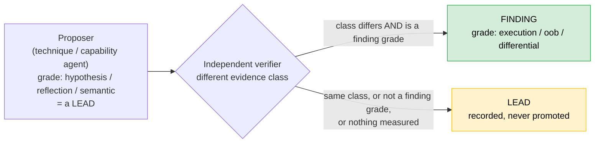

---

## 2. The one-line model

A technique proposes candidates. A probe spec passes through the **PolicyGate** —
the only network door. Observations come back. The technique's `interpret()`
derives candidates. An **independent verifier in a different evidence class**
executes the confirmation. Everything is recorded in an append-only JSONL
ledger, and every report is a *derived view* recomputed from that ledger. The
LLM junctions are quarantined and advisory-only.

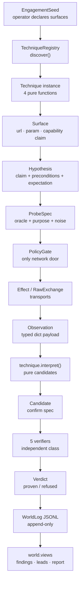

---

## 3. The five invariants

Everything else in this document is implementation. These five are the design.
Each is enforced structurally (by a type, an import graph, a test), not by
convention.

### Invariant 1 — The chokepoint

Every packet that leaves the engine passes through `policy/gate.py`
(`PolicyGate`). Techniques hold no transports, verifiers go back through the
gate for their fresh measurements, and the model has no tools at all. The
import graph enforces this: nothing outside `policy/` imports a transport.

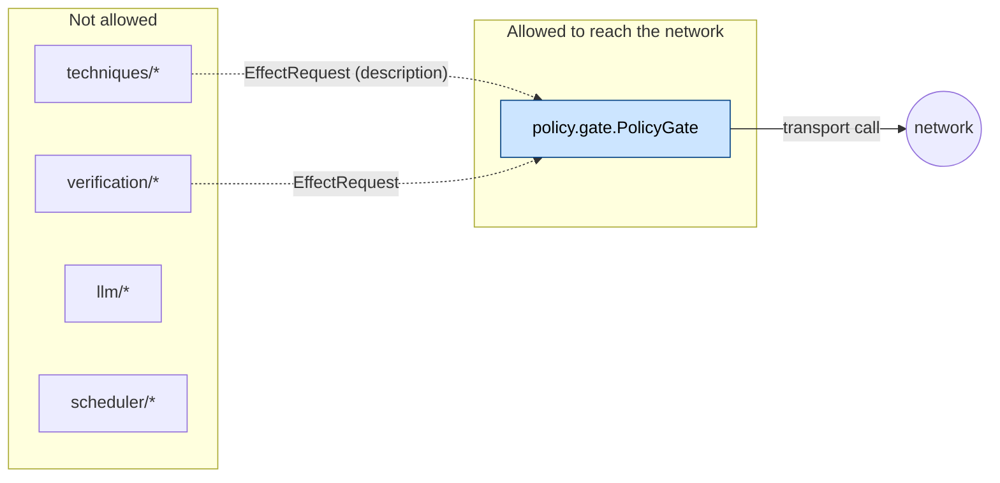

`tests/vuln_engine/test_invariants.py` asserts that no module outside
`policy/` imports any transport module.

### Invariant 2 — Evidence classes, not confidence

`kernel/evidence.py` grades evidence
`hypothesis < reflection < semantic < execution < oob < differential`. Only
`execution`, `oob` and `differential` may support a finding (`FINDING_GRADES`).
"An LLM saying *looks like XSS*" is a lead; "a browser recorded the script ran"
is a finding.

### Invariant 3 — Verification is a different measurement in kind

A verifier may not read the proposer's evidence — only the candidate's
*confirmation spec* (which URL, which payload, which oracle). It re-measures
fresh, through the gate, in a different order or class than the proposer used.
`Verdict.check_independence` **raises** if the verifier's grade equals the
proposer's.

### Invariant 4 — One log

The report cannot claim anything the world log does not contain.
`world/views.py` derives findings, receipts, leads and report lines from
`world.jsonl` (or `twogate.jsonl`); `--replay` recomputes a finished run offline
with sockets disabled. "Balance is derived; the ledger wins."

### Invariant 5 — The model is quarantined and advisory

Junctions see typed structural fields, never target response bodies. Answers
are validated against fixed shapes; a drifted answer is a *degraded opinion*,
not an exception. With no `VULN_ENGINE_LLM_API_KEY` configured the engine runs
byte-for-byte deterministically.

---

## 4. Repository map and entrypoints

### 4.1 Layout

```
run_engine.py          # classic single-pass / campaign CLI
run_twogate.py         # two-gate flow CLI (measured capabilities)
run_recon.py           # the recon half (upstream; produces graph_state.json)
service/
  vuln_engine/         # <-- this document
  recon_pipeline/      # the recon platform the gate wraps (dispatch, scope, receipt)
  ui/                  # the read-only operator UI over all of it
  oob_collaborator/    # our own out-of-band listener (docker service)
tests/
  vuln_engine/         # the engine's hermetic tests
  ui/                  # the UI's hermetic tests
docs/vuln_engine_docs/ # the documents (this one and its companions)
output/vuln_engine/    # one directory per run: world.jsonl / twogate.jsonl + reports
```

### 4.2 The two runtimes

There are **two** flows that share policy, transports, the world log, and the
verification vocabulary:

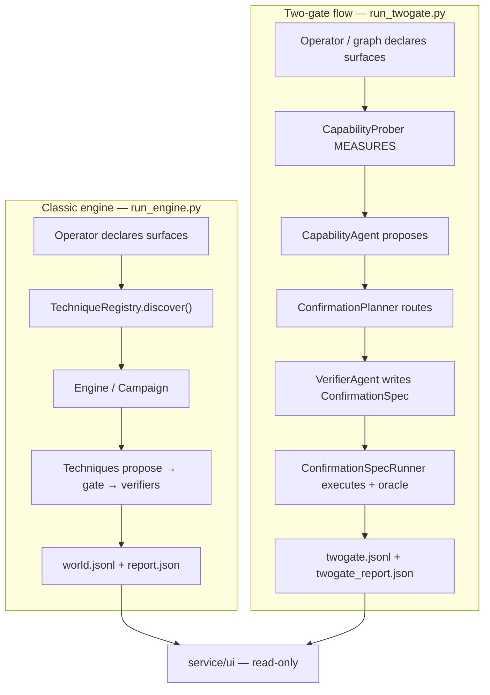

Both write the *same kind* of append-only ledger, which is why the UI classifies
a run directory by **which ledger file it holds**, not by where it lives:

| Ledger file | Flow | Report file |
|---|---|---|
| `world.jsonl` | classic | `report.json` |
| `twogate.jsonl` | two-gate | `twogate_report.json` |

### 4.3 `run_engine.py`

The classic CLI. It wires the pieces and prints only what the world log
supports. Key flags (see [§22](#22-appendices--vocabularies-tables-flags-env)):

| Flag | Effect |
|---|---|
| `--fixture` | run the Phase-1 exit criteria against the compose fixture |
| `-t/--target` | declared target domain; refused at option-parse time unless it is one safe path component (`service/vuln_engine/paths.py::safe_component` — it becomes `output/vuln_engine/<target>` when `--output-dir` is absent, so `../x`, absolute paths and anything with a separator fail loudly before any work) |
| `--surface url=...;param=...;capability=...` | declare one surface (repeatable) |
| `--from-graph [PATH]` | derive surfaces from the recon graph |
| `--graph-neo4j` | use Neo4j as the graph backend |
| `--declare` | extra declared domain/CIDR |
| `--cookie NAME=VALUE` | session shim (repeatable) |
| `--session-b-cookie NAME=VALUE` | the second identity (authorization differentials) |
| `--campaign N` | run N UCB rounds instead of one pass |
| `--attack-tree JSON` | constrain the campaign's spending to an AND/OR attack tree; a parked subtree spends nothing |
| `--graph-include-historical` | let `--from-graph` surface URLs whose evidence state is `historical` (dead evidence is never surfaced) |
| `--replay LOG` | recompute a finished run offline |
| `--hypothesize-from-recon` | let the model widen the seed from recon artifacts |
| `--graph-agent` | let the model navigate the recon graph tool-by-tool |
| `--llm-draft` | model prose beside the canonical report lines |
| `--remember` | write the findings-memory distillate (`memory.json`: per-arm receipts, contexts, timing medians) for a later run's `--hypothesize-from-recon` |
| `--force` | ignore the receipts ledger and re-probe |
| `--elicit` | Capability Closure: before the pass, measure the preconditions techniques gate on (`reflection`, `remote_fetch`, `timing`, `sessions`, `storage`, `public_param`) with the elicitor corpus, and let the measured facts open gates a declared claim alone used to open. **Opt-in by design** — elicitation sends live requests against the target (timing doses, second-identity reads), so it never runs by accident |
| `--json` | machine report |

The run directory holds: `world.jsonl`, `report.json`,
`report.draft.json` (model prose, flagged), `receipts.jsonl`, `memory.json`
(with `--remember`).

### 4.4 `run_twogate.py`

The measured-capability CLI. Same gate, same transports, same ledger
discipline; the eligibility question is *measured* (the prober) rather than
*claimed*, and confirmation is a declarative spec run by a deterministic
oracle. Flags include `--fixture`, `-t`, `--surface`, `--from-graph`,
`--max-rounds`, `--llm` (advisors), `--json`, `--output-dir`.

### 4.5 `service/ui/`

A read-only stdlib web app over the artifacts the pipelines and engine already
write. It can start the same CLIs the operator runs, as subprocesses built from
a flag whitelist — never a shell. Binds loopback only unless `--expose` is
passed, and refuses any POST that does not carry the `X-Requested-With:
vuln-engine` guard header (§20.1). See [§20](#20-the-ui).

---

## 5. Module inventory

Every Python module in `service/vuln_engine/`, with its role. Reading order for
a newcomer is noted at the end.

### `kernel/` — contracts only, no logic

| File | What it defines |
|---|---|
| `kernel/__init__.py` | package docstring: the six contracts |
| `kernel/evidence.py` | `Evidence`, the six `EVIDENCE_*` grades, `EVIDENCE_ORDER`, `FINDING_GRADES`, `weaker_than`, `is_evidence_class`, `DIFFERENTIAL_SESSIONS` |
| `kernel/exchange.py` | `RawHttpExchange`, `RawBrowserRun`, `RawOobFetch`, `RawOobInteraction` — the only place raw bytes live (for one hop) |
| `kernel/observation.py` | `Observation`, `OBS_*` kinds, `CONTEXT_*` reflection/DOM contexts, executable-context sets, `context_for_content_type` |
| `kernel/technique.py` | `Surface`, `EngagementSeed`, `Hypothesis`, `ProbeSpec`, `ProbeGrammar`, `Technique` protocol, `CAP_*`, `KIND_*`, `ORACLE_*`, `PURPOSE_*`, `oob_sentinel` |
| `kernel/manifest.py` | `TechniqueManifest`, `NoiseProfile` (+ its frozen `cost`) |
| `kernel/verdict.py` | `Candidate`, `Verdict` (+ `check_independence`), `refuse` |
| `kernel/claim.py` | `CLAIM_OBJECT_READ`, `CLAIM_STATE_CHANGE`, `CLAIM_SHAPES`, `DIFFERENTIAL_PROVABLE`, `is_differential_provable`, `STATE_CHANGE_MISROUTE_REASON` |
| `kernel/plan.py` | canonical plan serialization + digest (`canonical`, `plan_digest`, `canonical_plan`) |
| `kernel/prediction.py` | `ExpectedObservation`, `Expectation`, `Deviation`, `evaluate` |
| `kernel/anomaly.py` | `Anomaly`, `ANOMALY_*` statuses, `anomaly_key` |
| `kernel/vuln_class.py` | canonical class vocabulary + `normalize_vuln_class`, `vuln_class_status`, `canonicalize`, `cwe_of` |
| `kernel/capability.py` | `CapabilityFact`, `CapabilityFacts`, `declared_facts`, `EVENT_CAPABILITY_FACT` — a measured precondition carried like evidence |

### `techniques/` — the vuln-class corpus

`techniques/__init__.py` (empty namespace) and `techniques/common.py`
(shared pure helpers). Eight folders, each `manifest.py` + `hypothesis.py` +
`probes.py` + `interpret.py` + a thin `__init__.py` adapter:

`command_injection`, `generic_differential`, `idor_differential`, `oob_fetch`,
`sqli_blind_time`, `xss_dom`, `xss_reflected`, `xss_stored`.

### `policy/` — the only door

| File | What it defines |
|---|---|
| `policy/gate.py` | `PolicyGate`, `EffectRequest`, `GateOutcome`, `default_effects`, kinds, circuit breaker |
| `policy/eligibility.py` | `ProgramPolicy`, `Eligibility`, `assess`, `annotate_findings`, `policy_from_document` |

### `world/` — the ledger and its views

| File | What it defines |
|---|---|
| `world/log.py` | `WorldLog`, `WorldLogWindow`, all `EVENT_*` row types |
| `world/views.py` | `Finding`, `gate_audit`, `findings`, `leads`, `receipts_by_arm`, `report_lines`, `summary`, `arm_key` |
| `world/observe.py` | `classify_context`, `find_reflection`, `http_observations`, `browser_observations`, `oob_observations` |
| `world/novelty.py` | `NoveltyFacts`, `LEVEL_*`, `level_for`, `levels_for_log`, `summarize` |
| `world/anomalies.py` | `AnomalyLedger` |
| `world/holding_pen.py` | `HoldingPen` |
| `world/__init__.py` | package docstring |

### `scheduler/` — what runs next

| File | What it defines |
|---|---|
| `scheduler/driver.py` | `Engine`, `RunReport`, `ProbeRun`, `technique_probes`, outcomes |
| `scheduler/campaign.py` | `Campaign`, `Budget`, `CampaignReport`, `replay_round_order` |
| `scheduler/ucb.py` | `Arm`, `Pick`, `pick`, `arms_from_receipts`, novelty reward math |
| `scheduler/tree.py` | `OrNode`, `AndNode`, `Tree`, `decide`, `filter_arms` |
| `scheduler/pool.py` | `HypothesisPool`, `PoolEntry`, `novelty_cells_from_log` |
| `scheduler/replay.py` | `ReplayReport`, `replay` |

### `verification/` — independent confirmation

`verification/__init__.py` (`VerificationLayer`, `CONFIRM_VERIFIERS`),
`browser_runner.py`, `oob_verifier.py`, `timing_verifier.py`,
`authorization_verifier.py`, `stored_xss_runner.py`, `registry.py`
(the verifier-vocabulary registry).

### `transports/` — raw effects, no opinions

`http1.py` (`Http1Effect`, `Http1Capabilities`), `browser.py` (`BrowserEffect`,
capabilities, Playwright/CDP drivers), `oob.py` (`OobEffect`,
`RecordedCollaborator`).

### `llm/` — the quarantined advisory

`client.py` (one door, key-gated, digest-cached), `rank.py`, `synthesize.py`,
`write.py`, `hypothesize.py`, `reflect.py`, `abduce.py`, `graph_nav.py`
(pure halves) plus `runtime.py` (ask→validate→construct junctions) and
`wiring.py` (`Advisory`).

### `abduction/`

`proposal.py` (`Proposal`, `Validation`, verdicts), `deterministic.py`
(composition-rules abducer), `validator.py` (three-valued expressibility).

### `seed/`

`from_graph.py` (`derive_surfaces`, `collect_candidates`,
`graph_context_rows`, `candidates_for_nodes`, `merge_surfaces`).

### `memory/`

`anomaly.py` (`distill`, `read_memory`, `write_memory`).

### `twogate/` — the measured-capability flow

`spec.py` (features, oracles, `ConfirmationSpec`), `routines.py` (the routine
corpus), `capability.py` (`CapabilityProber`), `agents.py`
(`CapabilityAgent`, `VerifierAgent`, `ConfirmationPlanner`), `runner.py`
(`ConfirmationSpecRunner`), `loop.py` (`TwoGateLoop`), `advisor.py`
(`ModelAdvisor`).

### `elicit/` — Capability Closure (measured preconditions)

The classic engine used to trust an operator's `Surface.capability` string for
eligibility; `elicit/` is the corpus that **measures** it. One folder per
gated capability, the technologies' own folder-is-the-registration shape:

| File | What it defines |
|---|---|
| `elicit/__init__.py` | package docstring; exports `Elicitation` |
| `elicit/common.py` | `ELICITOR_CLASS`, `Elicitation` (fact/reason, `established`), `fact_for` |
| `elicit/base.py` | `Elicitor` — the four-function registration record (`applies`/`probes`/`interpret` + manifest) |
| `elicit/common_probe.py` | `request_detail(surface, param, payload)` — query-vs-body shaping shared by every elicitor probe |
| `elicit/registry.py` | `ElicitationRegistration`, `ElicitorRegistry.discover(strict=...)`, `ELICIT_PACKAGE` |
| `elicit/closure.py` | `observed_gates`, `ClosureReport`, `run_closure(...)` — the closure pass |

Six elicitor folders, each `manifest.py` + `__init__.py` exposing `MANIFEST`
and `ELICITOR` — one per capability a technique's gate can read (the kernel's
other two capability strings, `script_execution` and `cross_account_readable`,
are verifiers' postconditions, not gate inputs, so no elicitor exists for
them by design; the count is pinned by
`tests/vuln_engine/test_inventory_pins.py`):

| Folder | Establishes | Grade | Measurement |
|---|---|---|---|
| `public_param/` | `public_param` | `differential` | paired request: canary-carrying param vs an ignored name (`ve-elicitor-absent`) |
| `reflection/` | `http_response_reflects_input` | `reflection` | one canary GET (`ve-elicitor-<>"'`) |
| `remote_fetch/` | `can_influence_remote_fetch` | `oob` | collaborator URL in the param, read back |
| `timing/` | `delayed_response` | `differential` | quiet/sleep + a short/long dose-response pair |
| `sessions/` | `access_differs_by_session` | `differential` | one read per identity, status then body-length |
| `storage/` | `server_stores_input` | `reflection` | submit canary, read the surface back |

### Suggested reading order

1. `kernel/technique.py` and `kernel/evidence.py` — the vocabulary every later
   file speaks.
2. `scheduler/driver.py` — `_run_surface` is the heartbeat; the code is §6.2.
3. `policy/gate.py` — the one door.
4. `verification/__init__.py` — the dispatch.
5. `world/log.py` + `world/views.py` — why the report cannot lie.
6. `llm/client.py` and the smallest junction, then any technique folder.
7. `elicit/closure.py` — how a technique's precondition stops being the
   operator's word (§12.10).

---

## 6. End-to-end flows (diagrams)

### 6.1 The classic pass

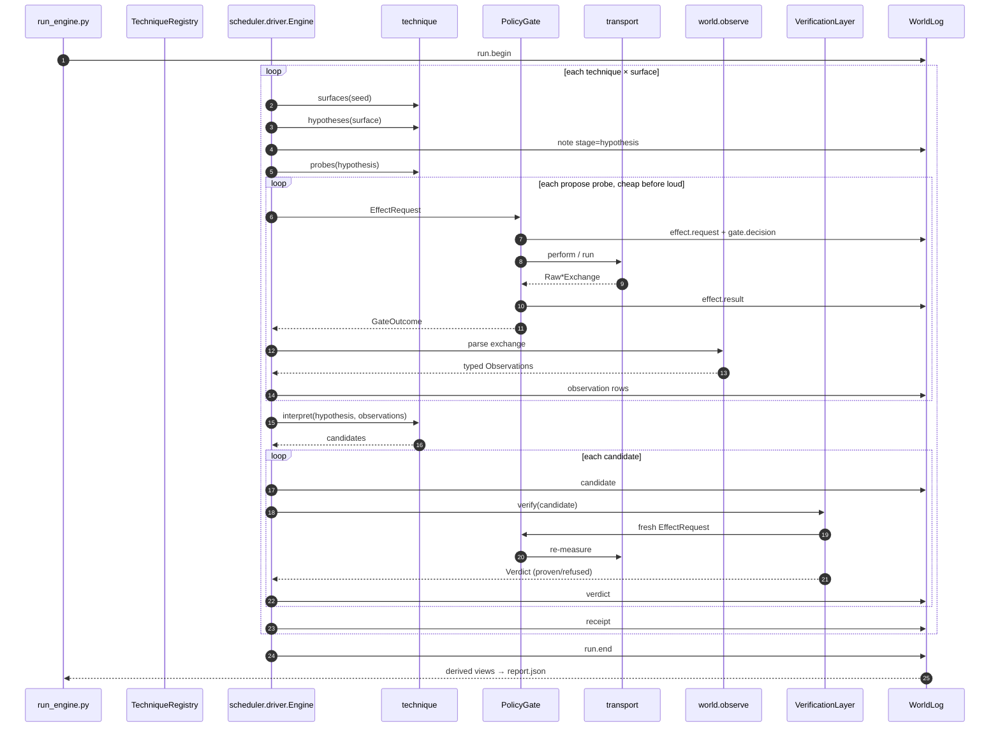

### 6.2 `_run_surface` — the heartbeat

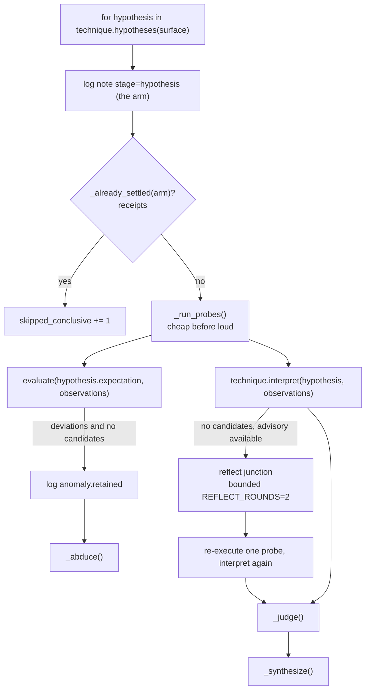

### 6.3 The campaign (UCB rounds)

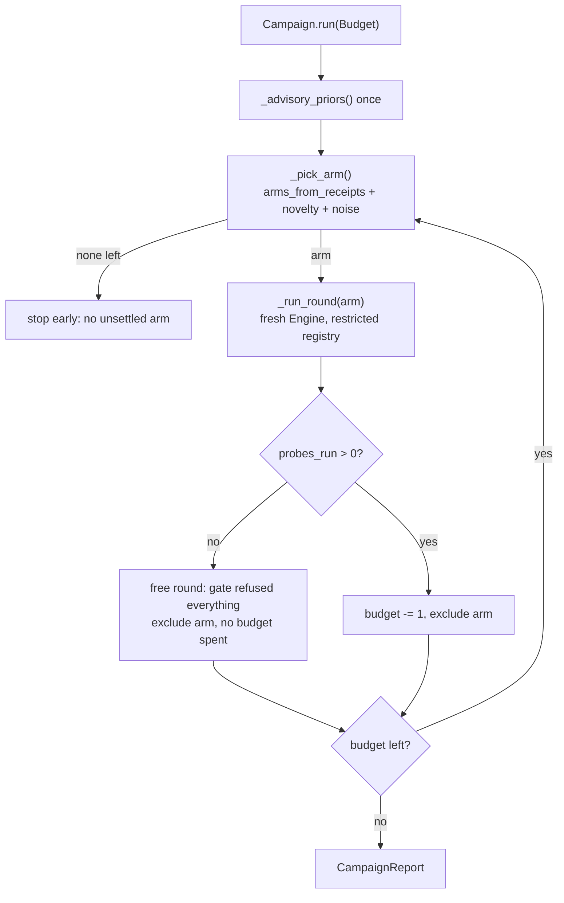

### 6.4 The abductive loop

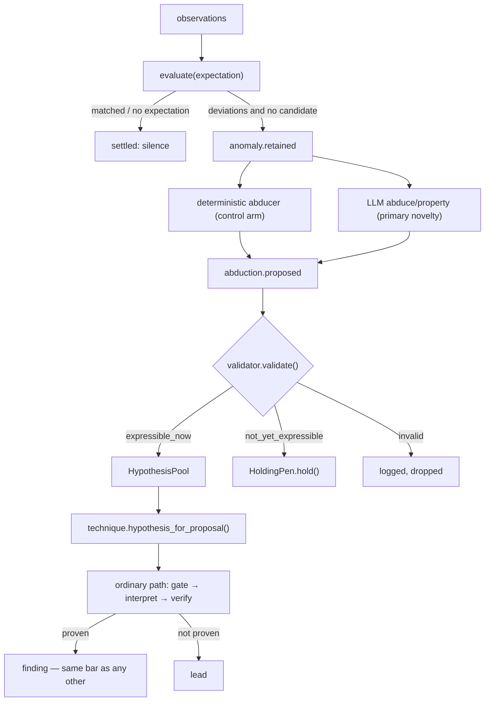

### 6.5 Replay

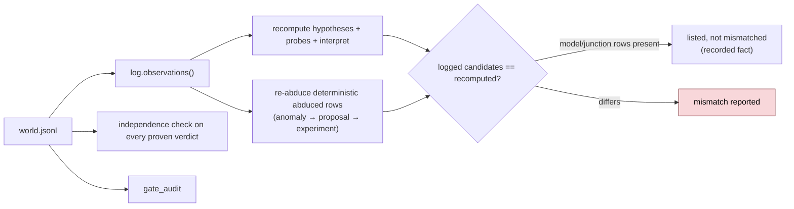

- **Recomputed:** hypotheses, probes, candidates, report lines — all pure
  functions of the log.
- **Checked:** every logged verdict's independence.
- **Not recomputed:** the verifier's *evidence* (an effect's result is a
  recorded fact). A replay that re-ran effects would not be a replay.
- **Listed separately:** junction candidates (`candidate.junction`) and the
  abduced rounds a *model* sourced (`rule=llm_abduction`) — recorded fact, not
  derivation. A deterministic abduced row is no longer listed: it is recomputed,
  its anomaly re-abduced and its candidate diffed like any other (§11.6).
---

## 7. The kernel — contracts only

`kernel/` contains **data shapes the rest of the engine agrees on** and nothing
that decides anything. It imports no transport, reads no clock, and contains no
logic that could be replaced without touching the engine. This is what lets
every other module be tested against the contracts, and it is why `world/`
can parse exchanges without importing a transport.

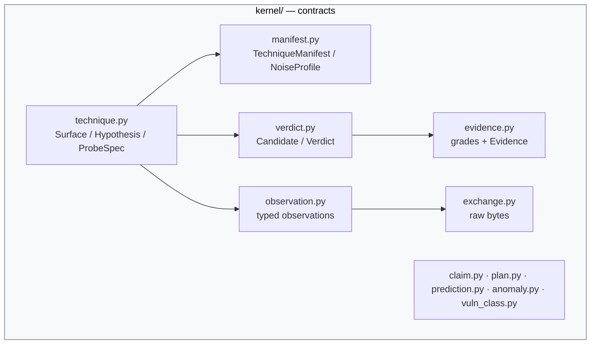

### 7.1 `kernel/evidence.py`

The module's whole rule, in one line (quoted from its docstring):

> An LLM saying "that looks like XSS" is a lead. A browser recording that the
> script ran is a finding.

Both are useful; they are *not the same category*, and blurring them is the
failure mode of every automated scanner.

#### The six grades

| Constant | Value | Meaning | Finding grade? |
|---|---|---|---|
| `EVIDENCE_HYPOTHESIS` | `hypothesis` | An LLM or a rule said so | ❌ |
| `EVIDENCE_REFLECTION` | `reflection` | Bytes came back containing our input; context unknown | ❌ |
| `EVIDENCE_SEMANTIC` | `semantic` | The reflection's context was parsed and mapped | ❌ |
| `EVIDENCE_EXECUTION` | `execution` | A browser ran the script | ✅ |
| `EVIDENCE_OOB` | `oob` | Our own collaborator saw the interaction | ✅ |
| `EVIDENCE_DIFFERENTIAL` | `differential` | Two authenticated states differed | ✅ |

`EVIDENCE_ORDER` orders them weakest-to-strongest **for the purpose "did the
thing actually happen?" — which is not severity**. A reflection is not "worse"
than an execution; it is weaker as proof.

`FINDING_GRADES = frozenset({execution, oob, differential})`.

`DIFFERENTIAL_SESSIONS = "two_sessions_one_object"` is the shared oracle
spelling the authorization technique and verifier both use, so a test can pin
them together.

#### Functions

- `is_evidence_class(grade)` — membership test against `EVIDENCE_CLASSES`.
- `weaker_than(left, right)` — total order; **unknown grades sort weakest**
  (an unrecognized grade must never outrank a known one).

#### `Evidence` (frozen dataclass)

| Field | Type | Meaning |
|---|---|---|
| `kind` | `str` | An `OBS_*` observation kind |
| `grade` | `str` | One of the `EVIDENCE_*` constants |
| `payload` | `dict` | Typed fields — never raw bytes, never a text blob |
| `at` | `float` | Passed in by the caller; modules stay clock-free |
| `probe` | `str` | Which probe produced it (correlates OOB back to a request) |

`__post_init__` rejects an unknown grade and a non-dict payload (raising
`ValueError`/`TypeError`), and **copies** the payload by value — a payload that
could be edited after recording is not evidence. `sufficient_for_finding` is
`grade in FINDING_GRADES`.

### 7.2 `kernel/exchange.py`

The only module that holds raw bytes, for exactly one hop:

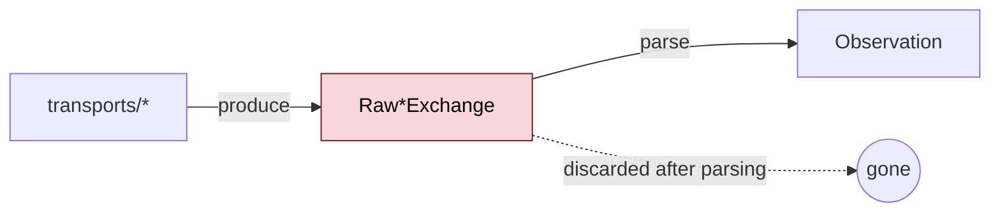

The raw shapes live in `kernel/` (not beside the transport) because
`world/observe.py` needs the type and must not import a transport. "No module
outside `policy/` imports a transport" is an invariant with a test; putting the
shape in the transport module would have made the observation layer the first
exception.

- **`RawHttpExchange`** — `url`, `method`, `status: int | None`, lowercased
  `headers`, `body: bytes`, `final_url`, `elapsed`, `error`, `transport`.
  `ok` is `status is not None`; `text` decodes the body *for parsing only —
  never to be stored*.
- **`RawBrowserRun`** — `url`, `driver` (`playwright`/`cdp`), `ok`, `status`,
  `final_url`, `error`, `dialogs: tuple[tuple[str, str], ...]`, `markers:
  dict[str, bool]`, `mutations: int`, `console_errors`, `elapsed`. Narrowed to
  the three facts the evidence bar needs: script execution, dialogs, DOM
  mutation.
- **`RawOobInteraction`** — `probe`, `path`, `method`, `source_ip`,
  `user_agent`, `at`. The strongest evidence class the engine owns for blind
  classes: something we control *saw* the target's request.
- **`RawOobFetch`** — `probe`, `interactions`, `error`; `seen` is
  `bool(interactions)`.

### 7.3 `kernel/observation.py`

The rule: **no observation payload is a string.** A doctor does not hand you a
photograph of the swamp the nurse scooped out of your arm; the lab returns
numbers with units and labels.

#### Observation kinds

| Constant | Value | Payload |
|---|---|---|
| `OBS_HTTP_RESPONSE` | `observation.http` | status, bytes, elapsed, final_url, error |
| `OBS_REFLECTION` | `observation.reflection` | context, occurrences, offsets, prefix/suffix |
| `OBS_BROWSER` | `observation.browser` | driver, status, markers, mutations |
| `OBS_SCRIPT_EXECUTION` | `observation.script_execution` | marker, executed |
| `OBS_DIALOG` | `observation.dialog` | dialog, message |
| `OBS_OOB_INTERACTION` | `observation.oob` | method, path, source_ip, user_agent |
| `OBS_DOM_PLACEMENT` | `observation.dom_placement` | context, question |

#### Reflection / DOM contexts

The context enum is what turns "the parameter reflects" (a lead) into "the
parameter reflects inside a double-quoted attribute value" (a fact). The
contexts split into wire-lens contexts and DOM-lens contexts.

**Wire-lens (markup scanner) contexts:**

| Constant | Value | Notes |
|---|---|---|
| `CONTEXT_DOUBLE_QUOTED_ATTRIBUTE` | `double_quoted_attribute` | executable |
| `CONTEXT_SINGLE_QUOTED_ATTRIBUTE` | `single_quoted_attribute` | executable |
| `CONTEXT_UNQUOTED_ATTRIBUTE` | `unquoted_attribute` | executable |
| `CONTEXT_IN_TAG` | `in_tag` | between attributes — **not** executable |
| `CONTEXT_JS_STRING` | `js_string` | executable (no tag break-out needed) |
| `CONTEXT_JS_CODE` | `js_code` | executable |
| `CONTEXT_CSS` | `css` | not executable here |
| `CONTEXT_RAW_HTML` | `raw_html` | executable |
| `CONTEXT_COMMENT` | `comment` | not executable |
| `CONTEXT_JSON_VALUE` | `json_value` | deliberately **not** executable |
| `CONTEXT_UNKNOWN` | `unknown` | honest ignorance — never "safe" |

**DOM-lens (browser) contexts:**

| Constant | Value | Notes |
|---|---|---|
| `CONTEXT_DOM_URL_ATTRIBUTE` | `dom_url_attribute` | URL-parsed attribute; executes on interaction |
| `CONTEXT_DOM_ATTRIBUTE` | `dom_attribute` | unclassified attribute value |
| `CONTEXT_DOM_TEXT` | `dom_text` | landed as text (escaped/text-node) |
| `CONTEXT_DOM_ABSENT` | `dom_absent` | value reached page, no live placement |
| `CONTEXT_DOM_UNKNOWN` | `dom_unknown` | instrument could not answer |

Key derived sets and functions:

- `SCRIPT_EXECUTABLE_CONTEXTS` = the three attribute contexts + `raw_html`.
  Deliberately **absent**: `dom_url_attribute` (needs user interaction the
  verifier does not simulate).
- `JS_EXECUTABLE_CONTEXTS` = `{js_string, js_code}`.
- `is_executable_context(value)` — `value in SCRIPT_EXECUTABLE_CONTEXTS or value
  in JS_EXECUTABLE_CONTEXTS`.
- `context_for_content_type(content_type)` — the response-shape gate. Declared
  type, never sniffed bytes. The header is **normalized first** —
  `split(";", 1)[0].strip().lower()` — so `text/html; charset=utf-8` and
  `Application/JSON ` are the declared types they declare (pinned by
  `tests/vuln_engine/world/test_observe.py`). Markup types (`text/html`,
  `application/xhtml`, `text/xml`, `application/xml`) return `None` ("the HTML
  state machine may run"); JSON types (`application/json`,
  `application/ld+json`, `text/json`) return `CONTEXT_JSON_VALUE`; any other
  declared type returns `CONTEXT_UNKNOWN`; an absent header returns `None`
  (too many real servers omit it on HTML).

`DOM_ONLY_CONTEXTS` collects the five DOM contexts. `DANGEROUS_UNKNOWN =
CONTEXT_UNKNOWN`, so "unknown" is never confused with "safe".

#### `Observation` (frozen dataclass)

`kind`, `payload: dict`, `probe`, `at`. `__post_init__` rejects a non-dict
payload and copies it by value. `context` property returns the payload's
`context` or `""`. `from_dict` rebuilds from a world-log row (the replay path).

### 7.4 `kernel/technique.py`

This is the vocabulary every later file speaks.

#### Effect kinds and purposes

- `KIND_HTTP = "http.request"`, `KIND_BROWSER = "browser.run"`.
- `PURPOSE_PROPOSE = "propose"` (the driver runs it) vs
  `PURPOSE_CONFIRM = "confirm"` (the verifier runs it). The distinction lives
  here because the technique knows which of its probes would constitute its own
  proof — and a technique that ran its own confirmation would be a closed loop.

#### Oracles

An oracle is a *boolean question*, not an adjective.

| Constant | Value |
|---|---|
| `ORACLE_REFLECTION` | `reflection_at_least_once` |
| `ORACLE_CONTEXT` | `reflection_context_known` |
| `ORACLE_SCRIPT_EXECUTION` | `script_execution` |
| `ORACLE_OOB_INTERACTION` | `oob_interaction` |
| `ORACLE_TIMING_DIFFERENTIAL` | `timing_differential` |

`CONFIRM_STORED_EXECUTE = "xss_stored.execute"` is a *sequence* confirm kind
(HTTP inject, then browser read-back), named here with the other cross-layer
vocabulary.

#### Capabilities (the eight claims)

| Constant | Value | Role |
|---|---|---|
| `CAP_PUBLIC_PARAM` | `public_param` | a client-settable parameter |
| `CAP_RESPONSE_REFLECTS_INPUT` | `http_response_reflects_input` | response contains our input |
| `CAP_INFLUENCE_REMOTE_FETCH` | `can_influence_remote_fetch` | server fetches a supplied URL |
| `CAP_DELAYED_RESPONSE` | `delayed_response` | processing time depends on the value |
| `CAP_PERSISTENT_STORAGE` | `server_stores_input` | input is stored and served back |
| `CAP_ACCESS_DIFFERS_BY_SESSION` | `access_differs_by_session` | two identities see different content |
| `CAP_SCRIPT_EXECUTION` | `script_execution` | postcondition: script executes |
| `CAP_CROSS_ACCOUNT_READ` | `cross_account_readable` | postcondition: object served across boundary |

`CAPABILITIES` is the tuple of all eight. Note the last two are
**postconditions** — what a technique establishes, not what it needs — carried
in the same vocabulary so chaining is a plain lookup.

#### The OOB sentinel

A pure technique cannot ask the OOB transport for a URL, so it emits a
*sentinel* the driver replaces:

```python
OOB_URL_SENTINEL_PREFIX = "ooburlsentinel"
def oob_sentinel(probe_id: str) -> str:
    cleaned = "".join(char if char.isalnum() else "_" for char in probe_id)
    return f"{OOB_URL_SENTINEL_PREFIX}_{cleaned.lower()}"
```

Alphanumeric-only on purpose: it travels through percent-encoding, and a
sentinel URL-encoding rewrote would never be found again.

#### `Surface` (frozen dataclass)

| Field | Type | Meaning |
|---|---|---|
| `url` | `str` | Target URL |
| `host` | `str` | Host |
| `param` | `str` | Parameter name |
| `where` | `query \| body \| path \| header \| url` | Which part of the request carries the value |
| `capability` | `str` | Operator's claim (strongest-wins) |
| `label` | `str` | Free-form label for reports/provenance |
| `companions` | `dict[str, str]` | Fixed form fields every body submission must carry |
| `read_back` | `str` | Where stored input renders back (surface URL if empty) |
| `capabilities` | `frozenset[str]` | Every capability *established* for the surface — the declared claim plus whatever the elicitors measured; `NO_CAPABILITIES` (empty) when none |

`key` is `f"{url}#{param}"` when a param exists, else `url`.
`claims(capability)` is `capability == self.capability or capability in
self.capabilities` — the one accessor a gate uses to read both sources.
`NO_CAPABILITIES` is the shared empty set. `to_dict` emits `capabilities` only
when non-empty, so the declared-claim shape is byte-identical to what it was.

#### `EngagementSeed` (frozen dataclass)

`target` and `surfaces: tuple[Surface, ...]`. Methods:

- `for_capability(capability)` — surfaces claiming *exactly* that capability.
- `with_param()` — surfaces with a param in `query/body/path`.

#### `Hypothesis` (frozen dataclass)

`id`, `technique`, `surface`, `claim`, `rests_on`, `preconditions`,
`expectation: Expectation | None`, `plan: dict`. `to_dict` serializes the plan
canonically with a digest (`canonical_plan` + `plan_digest`).

#### `ProbeSpec` (frozen dataclass)

| Field | Meaning |
|---|---|
| `id` | Stable id |
| `kind` | `http.request` or `browser.run` |
| `host` | Host |
| `detail` | Transport parameters (url, method, markers, …) |
| `oracle` | Boolean predicate |
| `canary` | String to look for (reflection oracles) |
| `mark` | Distinctive part of the canary for transformed-reflection detection |
| `noise` | Declared cost in visibility |
| `requires_context` | Contexts the probe is only meaningful in |
| `produces` | Evidence class an answer can produce |
| `purpose` | `propose` or `confirm` |
| `payload` | Payload when the probe carries one |

#### `ProbeGrammar` and the `Technique` protocol

`ProbeGrammar` is what the Phase-3 synthesis junction may reuse of a technique's
grammar — passed **as an argument**, so the junction never imports the
technique (which keeps the folder removable). It carries `technique_name`,
`mark`, and three callables `script_body_for`, `breakout_prefix_for`,
`stock_payload_for`, each `(hypothesis, context) -> str`.

```python
@runtime_checkable
class Technique(Protocol):
    manifest: TechniqueManifest
    def surfaces(self, seed: EngagementSeed) -> list[Surface]: ...
    def hypotheses(self, surface: Surface) -> list[Hypothesis]: ...
    def probes(self, hypothesis: Hypothesis) -> list[ProbeSpec]: ...
    def interpret(self, hypothesis: Hypothesis, observations: list[Observation]) -> list[Candidate]: ...
```

Optional methods read with `getattr`: `synthesis_grammar()` and
`hypothesis_for_proposal(proposal)`. The Protocol is deliberately *not*
extended for these — an optional method on a `runtime_checkable` Protocol would
make existing techniques fail `isinstance` checks.

### 7.5 `kernel/manifest.py`

#### `NoiseProfile` (frozen)

`requests_per_surface`, `burstiness` (0..1), `fingerprint_distance` (0..1),
`requires_browser`. `__post_init__` bounds the two floats.

The frozen cost scalar, multiplicative on purpose (components compound, they do
not average):

```python
cost = requests_per_surface
     * (1.0 + burstiness)
     * (1.0 + fingerprint_distance)
     * (3.0 if requires_browser else 1.0)
```

The scheduler divides UCB's optimistic reward by `cost`, so a technique's
declared footprint directly sets how good its expected news must be before it
is worth the noise. A browser is the loudest thing the engine owns (`×3`).

#### `TechniqueManifest` (frozen)

`name` (must equal folder name), `vuln_class`, `preconditions`,
`postconditions`, `produces`, `verification_needs`, `noise`, `transports`,
`title`, `description`.

`validate()` returns the reasons the manifest is unusable; it is **loud on
purpose**:

- `name` and `vuln_class` required;
- `postconditions` **required** — a technique without them could never be
  chained, and "the chain query returned nothing" would be a silent wrong
  answer;
- `produces` required and every entry a known evidence class;
- `verification_needs` required, a known evidence class, and **must NOT be in
  `produces`** — a verifier must use a class the proposer did not.

### 7.6 `kernel/verdict.py`

The rule:

> The thing that proposes cannot be the thing that confirms.

#### `Candidate` (frozen)

`id`, `technique`, `vuln_class`, `surface: dict`, `summary`, `evidence:
Evidence | None`, `confirm: dict` (the request spec: what a verifier should
do), `payload`, `repro_url`, `origin` (`""` for grammar, or
`world.log.EVENT_CANDIDATE_JUNCTION` for the synthesize junction).

`proposer_grade` = `evidence.grade` if evidence else `EVIDENCE_HYPOTHESIS`.

`Candidate` lives here (not its own module) because it carries the proposer's
evidence *class* — the exact field `Verdict.check_independence` compares.

#### `Verdict` (frozen) and `check_independence`

`candidate_id`, `proven`, `evidence` (the verifier's), `reason`,
`proposer_grade`. `grade` is the evidence grade when proven, else `""`.

```python
@staticmethod
def check_independence(candidate_grade, evidence):
    if evidence.grade == candidate_grade:
        raise ValueError(...)          # reused the proposer's class
    if evidence.grade not in FINDING_GRADES:
        raise ValueError(...)          # cannot support a finding
```

It **raises** rather than returning a boolean: there is no correct behaviour
for a non-independent verdict, and silently downgrading it to a lead would hide
the bug that produced it. `refuse(candidate, reason)` is the uniform
"not proven" shape.

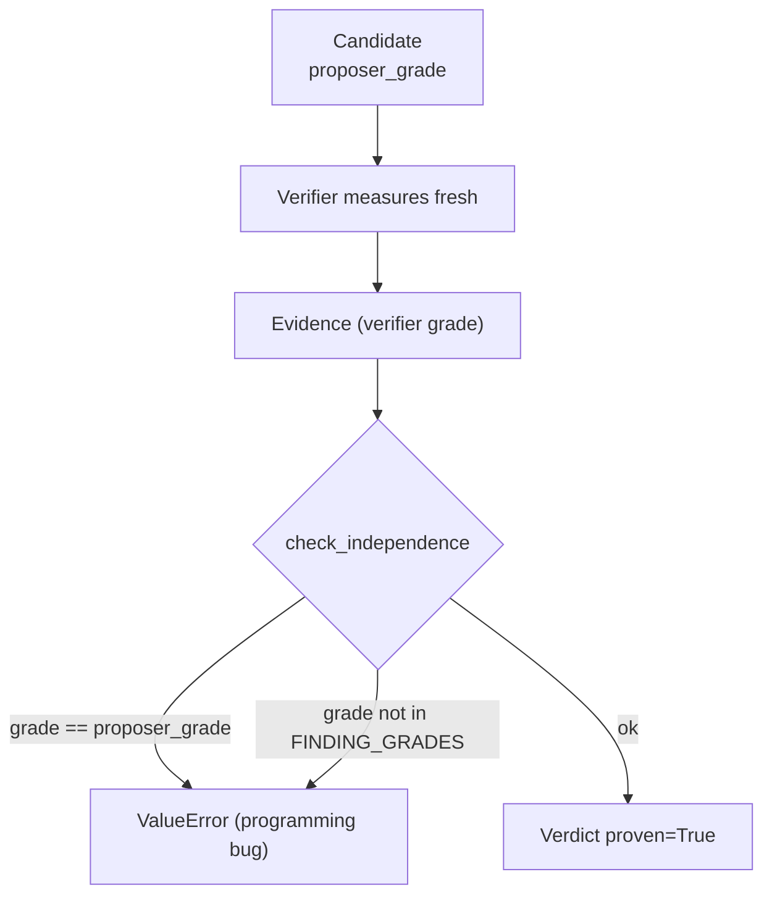

### 7.7 `kernel/claim.py`

Claim shapes — what *kind* of claim a differential candidate makes. The scar
this module answers: the same `authorization.differential` confirm spec used to
be emitted for both plan shapes, and the verifier proves whatever URL the spec
names under both sessions. For an object-read plan that re-measure *is* the
claim; for a state-change plan the claim is "the change at T reaches V", and
the verifier never re-executes the change — so a proof of "B can read V" would
be scored `differential` while proving the weaker, often-legitimate claim that
V is readable. A false finding at the strongest grade is exactly the failure
the evidence lattice exists to prevent.

| Constant | Value | Meaning |
|---|---|---|
| `CLAIM_OBJECT_READ` | `object_read` | classic two-session object read — provable |
| `CLAIM_STATE_CHANGE` | `state_change` | change at T reaches V — provable by re-execution |
| `CLAIM_SHAPES` | `(object_read, state_change)` | every shape the engine speaks |
| `DIFFERENTIAL_PROVABLE` | `frozenset({object_read, state_change})` | shapes a differential verifier may prove |
| `STATE_CHANGE_MISROUTE_REASON` | a fixed sentence | the reason a misrouted refusal carries |

`is_differential_provable(claim_shape)` is `claim_shape in
DIFFERENTIAL_PROVABLE`. The cap lifted when `verification/state_change_verifier.py`
landed: it re-executes the actor's change fresh between two unchanged victim
reads, so `state_change` is provable *as stated*. `STATE_CHANGE_CAP_REASON` is
kept as an alias for `STATE_CHANGE_MISROUTE_REASON` — the sentence the
authorization verifier answers with when a `state_change` spec is misrouted to
it instead of the re-executing verifier.

### 7.8 `kernel/plan.py`

Plan serialization: an experiment the log can *explain*, not just replay.

- `canonical(value)` — deterministic, JSON-safe form: dict keys sorted,
  floats rounded to 6, non-JSON falls back to `str`.
- `serialize_plan(plan)` — canonical JSON, `sort_keys=True`.
- `plan_digest(plan)` — SHA-256 of `serialize_plan`.
- `canonical_plan(plan)` — the plan as a canonical dict.
- `PLAN_EVENT_FIELD = "plan"`, `PLAN_DIGEST_FIELD = "plan_digest"`.

"Canonically" is the whole discipline: the same plan always serializes to the
same bytes, so the digest is stable across dict ordering and float formatting,
mirroring `llm.client.opinion_digest`'s content-addressing.

### 7.9 `kernel/prediction.py`

The prediction layer: what a hypothesis expected, and what deviated. Before
this module, `interpret` had two answers — candidate or honest zero — and
everything that did not match a predicate was discarded. But **a discarded
surprise is exactly the material abduction needs.**

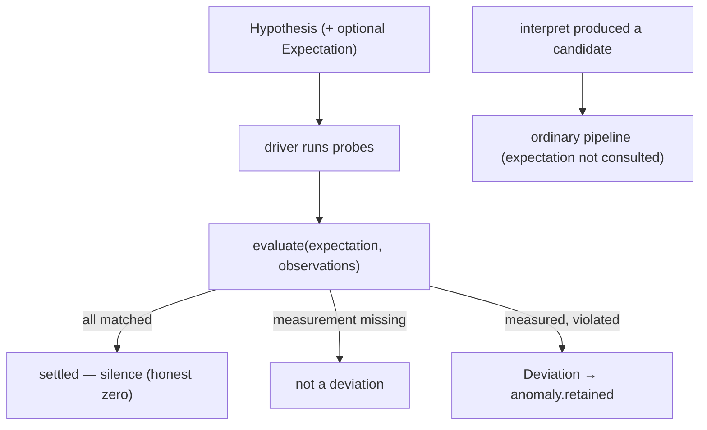

- **`ExpectedObservation`** — `probe_suffix` (matches the *tail* of a probe
  id), `field`, `within: frozenset`, `kind` (default `observation.http`).
  Constructor refuses an empty `within` — "a predicate that accepts everything
  is not a prediction".
- **`Expectation`** — `description` + `expected: tuple[ExpectedObservation, ...]`;
  refuses an empty predicate list.
- **`Deviation`** — `kind` (only `DEVIATION_OUTSIDE_EXPECTED`), `expected`,
  `observed`, `description`. A deviation is **never evidence** — it is the
  question the abducer later turns into a hypothesis.
- **`evaluate(expectation, observations)`** — the fixed comparator. `None` in,
  empty list out. A missing measurement is *not* a deviation. `_contains`
  tolerates unhashable values.

### 7.10 `kernel/anomaly.py`

A retained surprise and its lifecycle. Two ideas:

- **the key is the predicate, not the value.** `anomaly_key(technique, arm,
  deviation)` joins `technique | arm | kind | expected.kind |
  expected.probe_suffix | expected.field`. Two runs that violate the same
  predicate on the same surface are the same anomaly seen twice.
- **status is a lifecycle, and only four states exist.**

| Constant | Value | Meaning |
|---|---|---|
| `ANOMALY_OPEN` | `open` | the abducer's inbox |
| `ANOMALY_ABDUCED` | `abduced` | an abducer produced an explanation |
| `ANOMALY_RESOLVED` | `resolved` | a proof settled it |
| `ANOMALY_DEMOTED` | `demoted` | process declined to pursue it |

`Anomaly` carries `key`, `technique`, `arm`, `deviation`, `status`, `at`,
`note`; it is advisory by construction (no grade, never evidence).

### 7.11 `kernel/vuln_class.py`

One spelling convention, canonical names, variants. `vuln_class` is a free
string downstream of everything, so fragmentation (`OBJECT-ACCESS` vs
`object-access`) is one sloppy generator away.

- **Normalization** (`normalize_vuln_class`) — fold to lowercase-hyphen:
  whitespace/underscores → single hyphens, case folded, separators stripped.
- **The canonical set** (`CANONICAL_VULN_CLASSES`) — the classes the engine has
  named, each CWE-anchored. `canonicalize` is strict (raises outside the set)
  for code-authored spots; plan rows and generated claims *normalize and report
  status* instead, so the novel-class lane stays open.

| Constant | Value | CWE |
|---|---|---|
| `VULN_CLASS_IDOR` | `idor` | CWE-639 |
| `VULN_CLASS_XSS` | `xss` | CWE-79 |
| `VULN_CLASS_SQLI` | `sqli` | CWE-89 |
| `VULN_CLASS_SSRF` | `ssrf` | CWE-918 |
| `VULN_CLASS_OBJECT_ACCESS` | `object-access` | CWE-285 |
| `VULN_CLASS_COMMAND_INJECTION` | `command-injection` | CWE-78 |
| `VULN_CLASS_METHOD_CONFUSION` | `method-confusion` | CWE-436 |

`VULN_CLASS_PATTERN = ^[a-z][a-z0-9]*(-[a-z0-9]+)*$`. `UnknownVulnClass` is
raised by `canonicalize` and `vuln_class_status` when a string is not
well-formed. `vuln_class_status` returns `"canonical"` or `"novel"` — novel is
a **status, not an error**. `cwe_of` returns `""` for a novel class rather
than guessing.

### 7.12 `kernel/capability.py`

The record type behind Capability Closure (§12.10). It changes the *direction
of supply* for a technique's precondition: instead of only the operator
declaring a `Surface.capability`, an elicitor measures the target and produces a
`CapabilityFact` the technique's gate reads like any other claim.

> **A fact is not a finding.** Establishing `http_response_reflects_input` at
> `reflection` grade does not make an XSS finding — it makes a surface
> *eligible* for `xss_reflected`, which still has to propose a candidate and
> pass an independent verifier in a different class. The evidence lattice is
> untouched; facts only decide which doors open.

- `EVENT_CAPABILITY_FACT = "capability.measured"` — one spelling, shared with
the two-gate prober's rows, so either ledger reads the same fact the same way.
- **`CapabilityFact`** (frozen) — `surface_key`, `capability`, `grade`,
`probe`, `at`. `__post_init__` refuses an empty surface key, an empty
capability, and a capability outside `CAPABILITIES`. `declared` is `not grade`
(a claim nobody measured); `evidence_grade` renders a declared claim as
`EVIDENCE_HYPOTHESIS` and a measured one as the class that measured it
(`reflection`, `oob` or `differential`). `to_dict` carries
`{surface_key, capability, grade, declared, probe, at}`.
- **`CapabilityFacts`** (frozen) — `declared` + `elicited` tuples, pre-indexed
by `surface_key` in `__post_init__`. `capabilities_for(surface_key)` returns
the frozenset of capabilities, `facts_for` the per-surface facts,
`all_facts()` declared-first-then-elicited.
- **`declared_facts(seed)`** — the seed's own claims as facts, one per surface
and only when a capability is actually claimed (absence of a claim is not a
fact about the target).

The grade is an ordinary `EVIDENCE_*` constant so a reader of the log can see
*how* a precondition came to be established — the evidence lattice is unchanged
and facts never grade a finding upward.
---

## 8. The registry — discovery

`service/vuln_engine/registry.py` implements the "add a folder, get a
technique" contract borrowed wholesale from the recon side's
`platform/registry.py`.

### Discovery rules

1. Every subdirectory of `techniques/` is a candidate (`_iter_folders` skips
   names starting with `_` or `.`, and sorts for determinism).
2. The registry imports the folder and looks for module-level `MANIFEST` and
   `TECHNIQUE`.
3. A folder missing either is **skipped with a logged reason** — a half-built
   technique directory is safe to keep in the tree.
4. A manifest whose `name` disagrees with its folder name is skipped (one name,
   everywhere, is how artifacts stay findable).
5. `manifest.validate()` returning problems raises `ManifestError`:
   - `discover(strict=False)` logs ERROR and skips — what a long-running
     engagement wants.
   - `discover(strict=True)` raises — what a test and a CI run want.

The deliberate difference from the recon side: **an invalid manifest is loud.**
Tolerating a manifest missing `postconditions` produces a silent wrong answer
from a chain query that returned nothing.

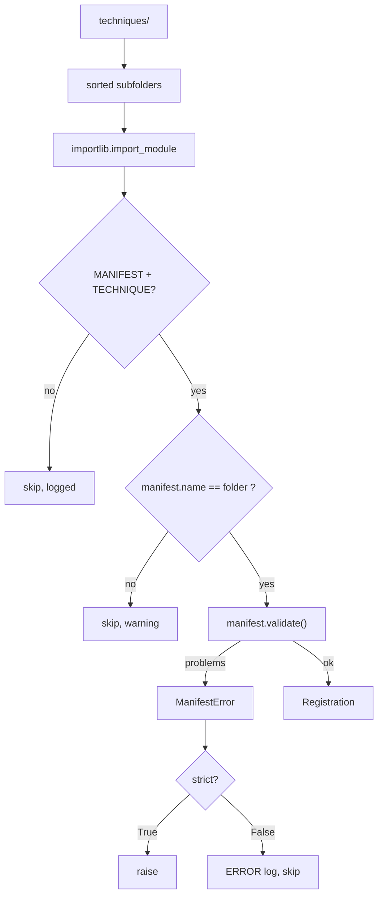

`_try_register` catches ordinary import failures (`# noqa: BLE001`) so one
broken folder cannot stop discovery — but a *manifest* failure is different and
propagates.

### Public surface

- `Registration` — `name`, `manifest`, `technique`, `module`, `arm` (=
  `name`).
- `TechniqueRegistry` — `names()` (sorted), `get(name)`, `all()` (deterministic
  by name), `__len__`, `describe()` (the manifest table a report embeds),
  `problems`.
- `ManifestError` — carries `folder` and `problems`.

The **acid test** (from `engine_principles.md` §5): adding SSTI must never
require editing anything outside `techniques/ssti/`. The folder *is* the
registration. Deleting a technique folder cannot break the engine.

---

## 9. The policy layer — the one door to the network

`policy/` is the only package that may call a transport. The import graph
enforces it: techniques describe what they want as an `EffectRequest`, and the
gate decides, logs, and — only on `ALLOW` — executes.

### 9.1 `policy/gate.py`

Three properties it is responsible for, each checkable:

1. **Reuse, don't rebuild.** The decision is
   `platform.dispatch.Dispatcher.decide()` verbatim — scope first, then the
   escalation policy's eligibility vocabulary, then budgets. The engine adds
   nothing to the policy and takes nothing away; it wraps.
2. **A refusal is an observation, not an error.** `DENY`/`DEFER` append a
   `gate.decision` row with the reason and return without executing.
3. **Nothing runs uncleared.** The effect executes inside the `ALLOW` branch and
   nowhere else, so `uncleared_effects` is zero by construction — and computed
   anyway, so a future refactor that broke it produces a number instead of
   silence.

Internal effects (allocating/reading a collaborator URL) are the one documented
exception, labelled as such: our own listener is not the target, so there is no
scope question to ask. They are still logged.

#### Kinds and the operation table

| Constant | Value | Target? |
|---|---|---|
| `KIND_HTTP_REQUEST` | `http.request` | yes |
| `KIND_BROWSER_RUN` | `browser.run` | yes |
| `KIND_OOB_READ` | `oob.read` | no (internal) |
| `KIND_OOB_ALLOCATE` | `oob.allocate` | no (internal) |

`TARGET_KINDS = {http.request, browser.run}`. `KIND_OPERATIONS` maps both
target kinds to the platform operation `url_validation` — a URL probe and a
browser run are both asking a question of the same host, which is exactly why
the gate has to see the browser.

`CIRCUIT_FAILURE_LIMIT = 5` consecutive transport-level failures to one host
opens a per-host breaker that `DEFER`s the rest of the run's requests there
(target etiquette, not scope).

#### `EffectRequest` (frozen)

`kind`, `host`, `operation` (`""` = policy default for the kind), `detail`,
`technique`, `probe`, `noise`, `evidence_state`, `has_service_evidence`. The
`url` property reads `detail["url"]`.

#### `GateOutcome` (frozen)

`verb`, `reason`, `effect`, `internal`. `allowed` is `verb == "ALLOW"`;
`executed` is `effect is not None`.

#### `PolicyGate.run(request)` — the decision

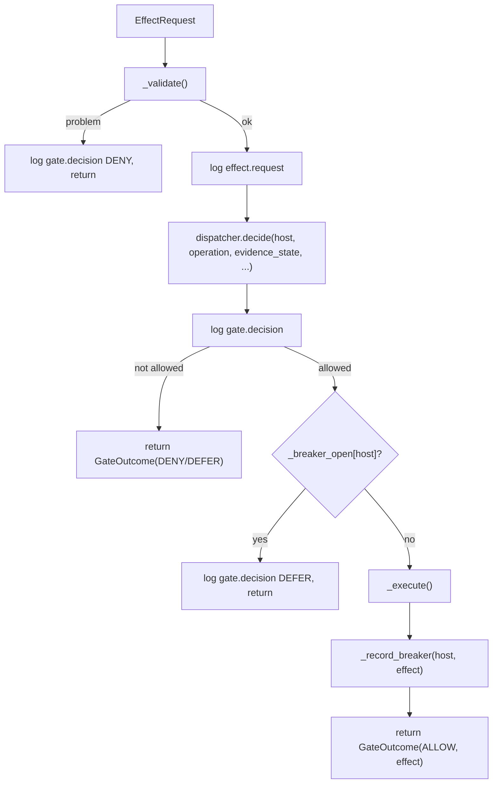

`_validate` rejects: empty host; unknown kind; missing http/browser transport;
a session-B request with no session-B headers wired; an empty URL; and — the
one piece of arithmetic worth doing — **URL/host disagreement**
(`urlsplit(url).hostname != request.host`). A probe that says it is about one
host while carrying a URL for another would be decided on one host and sent to
another: a real bypass produced by a typo.

`_execute` handles the session shim: it pops `_session` out of the detail; if
`"b"`, it merges `session_b_headers` **over** any per-request headers of the
same name (session-B wins, one authority for who the request is from). Then it
calls `self._http.perform(**detail)` or
`self._browser.run(**{**detail, "at": now})` and logs `effect.result` metadata.

`_record_breaker` counts a transport-level failure (a `RawHttpExchange` with
`not ok`) toward the consecutive count; an HTTP 5xx is deliberately *not*
counted — a 5xx is the server speaking. Any answered exchange resets the count.
Reset by explicit success, never by time, so a frozen clock cannot silently
reopen a breaker.

`allocate_oob(probe)` and `read_oob(probe, wait=True)` are the internal
effects; both log `effect.internal`.

`_loggable_detail` keeps only `url`, `method`, `params`, and sorted `markers` —
the payload is the interesting part of a probe and the part most likely to be
enormous or sensitive, so it never reaches the log. `_result_summary` is a
compact, byte-free summary.

`default_effects(...)` lazily builds the standard transports and is kept in
`policy/` so `policy/` remains the only package that knows the concrete
transport classes exist. It accepts plain values (base URLs, driver name,
`cookies`, `session_b_cookie`) — never transport objects — so a caller outside
`policy/` never names a transport class. `cookies` is the engagement's session
shim (a raw `Cookie` header applied to every HTTP request and browser page
load); `session_b_cookie` becomes `session_b_headers` (the authorization
differential's second identity).

`capabilities()` asks each transport what it can do (never assumes): for each of
http1/browser/oob it returns the transport's `capabilities.to_dict()` or an
`{available: False, reason: "not wired"}`.

### 9.2 `policy/eligibility.py`

Bounty eligibility: does a *proven* finding fall inside what the program pays
for? Pure and deterministic — eligibility is a published rule, not a judgement
call.

Three answers, and the middle one matters:

| State | Meaning |
|---|---|
| `POTENTIALLY_ELIGIBLE` | the program's accepted list contains a matching class |
| `INELIGIBLE` | asset out of scope, or the class is on a published exclusion |
| `UNKNOWN` | nothing published matches — **not** a refusal |

The module never claims `ELIGIBLE`. Only the program can decide that, on
submission.

`CLASS_FRAGMENTS` is the deterministic bridge from the engine's canonical
classes (`kernel/vuln_class.py`, all seven) to a program's prose — a class
added to the canonical set without fragments here is a loud test failure, not
a silent eligibility hole:

| Engine class | lowercased fragments matched |
|---|---|
| `xss` | `cross-site scripting`, `cross site scripting`, `xss` |
| `sqli` | `sql injection`, `sqli` |
| `ssrf` | `server-side request forgery`, `server side request forgery`, `ssrf` |
| `idor` | `insecure direct object reference`, `idor`, `broken object level authorization`, `object level authorization`, `bola` |
| `object-access` | `object level authorization`, `broken object level authorization`, `bola`, `improper authorization`, `improper access control`, `broken access control`, `access control`, `authorization bypass` |
| `command-injection` | `command injection`, `os command injection`, `command execution` |
| `method-confusion` | `request smuggling`, `http request smuggling`, `method confusion`, `interpretation conflict` |

The `idor`/`object-access` split is deliberate: `object-access` (CWE-285) is
the *family* and `idor` (CWE-639) its named instance. The family claim
matches the family's generic authorization prose; the instance claim stays
narrower (IDOR's own words plus the BOLA wording programs use for exactly
this bug). A program publishing only "Improper Authorization" yields UNKNOWN
for an `idor` finding — the source did not say it pays for the named
instance, and eligibility never defaults to yes.

`ProgramPolicy` holds `handle`, `eligible_classes`, `ineligible_classes`,
`exclusions`, `max_severity`. `assess(vuln_class, scope_state, policy)` checks
scope, then published exclusion, then published acceptance, then honest
unknown — cheapest-and-most-fundamental first. `annotate_findings` attaches
`scope_state`/`eligibility`/`eligibility_reason` without mutating the input.
`policy_from_document` reuses the `program_graph` document shape so the policy
the engine reasons about and the policy in Neo4j cannot drift.

A table rather than a fuzzy matcher, so every decision is explainable: a
fragment either appeared in the program's text or it did not.

---

## 10. The world model — the ledger and its views

### 10.1 `world/log.py`

Append-only JSONL, and the only place truth lives. The bank-ledger rule:

> Balance is derived; the ledger wins. Nothing else holds state.

There is no `set`, no `update`, no rewrite. `WorldLog` appends; `world/views.py`
derives. Two consequences:

- **an engagement can pause for a week and resume coherently** — a run is a log,
  not a session;
- **a refusal is an observation, not an error** — a `gate.decision` row with
  `verb=DENY` and a reason is data, and it replays like any other fact.

#### Row types

| Constant | `type` |
|---|---|
| `EVENT_BEGIN` | `run.begin` |
| `EVENT_EFFECT_REQUEST` | `effect.request` |
| `EVENT_EFFECT_RESULT` | `effect.result` |
| `EVENT_INTERNAL` | `effect.internal` |
| `EVENT_GATE_DECISION` | `gate.decision` |
| `EVENT_CANDIDATE` | `candidate` |
| `EVENT_CANDIDATE_JUNCTION` | `candidate.junction` |
| `EVENT_VERDICT` | `verdict` |
| `EVENT_RECEIPT` | `receipt` |
| `EVENT_NOTE` | `note` |
| `EVENT_ANOMALY_RETAINED` | `anomaly.retained` |
| `EVENT_ABDUCTION_PROPOSED` | `abduction.proposed` |
| `EVENT_ABDUCTION_VALIDATED` | `abduction.validated` |
| `EVENT_HOLDING_PEN_ENTRY` | `holding_pen.entry` |
| `EVENT_END` | `run.end` |

Observations are the one non-"event" row type: `_OBSERVATION = "observation"`.

#### `WorldLog`

- `__init__(path=None)` — `None` builds an in-memory log (tests, dry runs). If
  the path is an existing file, it reads the rows — the file is a ledger that
  may span many runs.
- `since(at)` — a read-only `WorldLogWindow` over rows at/after `at`. A cheap
  wrapper holding a reference to the live row list, so rows appended after the
  call are part of the window too. **Reporting through the window is what keeps
  a run's report about its own work** when the file already holds earlier runs.
- `append(event_type, *, at, **fields)` — one row. `at` is required and supplied
  by the caller: passing the timestamp in is what makes a run reproducible. A row
  that will not serialize raises `TypeError` rather than being escaped into a
  string.
- `observation(observation)` — append a typed observation row.
- `read(path)` (static) — every readable row; a missing file is an empty log; a
  corrupt line costs one record rather than the file.
- `path`, `__len__`, `__iter__`, `rows` (copies), `events(*types)`,
  `observations()` (rebuild typed observations — the replay entry point),
  `observations_by_probe()`, `summary()` (`{type: count}`).

#### `WorldLogWindow`

`_EPSILON = 0.0005` — rows are stored with `at` rounded to 3 decimals, so
membership is tested with half a rounding unit of slack: a row appended exactly
at the window's start (the run's own `begin` row) must never round out of its
own window. It forwards the read API (`rows`, `events`, `observations`,
`summary`, `path`, `__len__`, `__iter__`) and exposes no way to write.

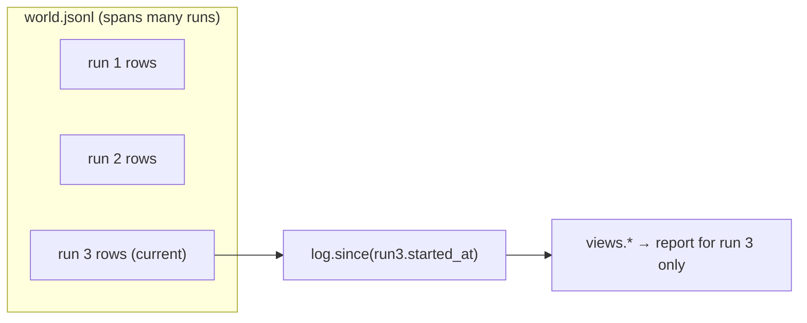

### 10.2 `world/views.py`

Every consumer's view, recomputed from the log. Nothing holds state, nothing
writes, every function takes a `LogView` (structurally: `WorldLog` or
`WorldLogWindow`) and returns plain data.

| View | What it computes |
|---|---|
| `gate_audit` | decisions by verb; `uncleared_effects = max(0, executed - allowed)` (zero by construction); out-of-scope count; internals; refusals list |
| `candidates` | every `candidate` row in order |
| `verdicts` | every `verdict` row |
| `findings` | proven candidates joined to their source rows → `Finding` objects |
| `leads` | candidates proposed but not proven |
| `receipts_by_arm` | `{arm: {outcome: count}}` — the punch card |
| `report_lines` | the canonical prose lines |
| `session_b_refusals` | every `gate.decision` refusal whose only cause is a missing second session |
| `blocked_on_session_b` | the count of those refusals |
| `blocked_on_session_b_split` | that count split into `capability_checks` vs `candidates` |
| `holding_pen_summary` | held hypotheses grouped by `(needs_verifier, vuln_class or claim_shape)`, **descending by count**; takes the pen optionally so a promoted/demoted entry is excluded; reports `held` and `lifetime` |
| `summary` | machine summary: rows, by_type, gate, candidates, findings, leads, receipts, `blocked_on_session_b`, `holding_pen` |

**Session-B refusals, split.** `SESSION_B_REFUSAL_MARKER` ("no second session
is wired") is the substring a `gate.decision` refusal carries when the only
thing between a request and the target is a missing `--session-b-cookie`.
`blocked_on_session_b` counts those rows; `blocked_on_session_b_split` splits
them by the refusing technique — `CAPABILITY_CHECK_TECHNIQUES` (the two-gate
prober and the six elicitors) is a capability check, everything else a
candidate. The marker is deliberately a substring, not the whole message, and a
test pins it to `policy.gate.SESSION_B_REFUSAL` (`world` cannot import `policy`;
the import graph is one-way).

**The holding-pen backlog.** `holding_pen_summary(log, *, pen=None)` groups the
log's `holding_pen.entry` rows by `(needs_verifier, vuln_class or claim_shape)` —
the driver now logs `claim_shape` and `vuln_class` on each entry — and sorts the
groups **descending by count** (ties broken by name), so the group a single new
verifier would unlock first is the one at the top. Promotion and demotion are
transitions in the pen's own ledger, not the world log, so a caller that has the
pen passes it and every entry whose key has since left is excluded; `held` counts
what is still waiting and `lifetime` keeps the all-time figure. `RunReport`
carries the view under the `holding_pen` key of `report.json`/`--json`, and
`run_engine.py` prints the groups when anything is waiting.

`GRADE_PROSE` maps classes to prose: `execution → "browser execution"`,
`oob → "an out-of-band interaction with our own collaborator"`,
`differential → "a difference between two authenticated states"`.

`arm_key(technique, surface)` produces `technique@url#param` (or
`technique@url` without a param).

`Finding` carries `candidate_id`, `technique`, `vuln_class`, `summary`, `grade`,
`proposer_grade`, `repro_url`, `payload`, `arm`, `surface`, `evidence`,
`reason`. `independent` is `bool(grade) and grade != proposer_grade` — the gap
made visible.

`report_lines` builds the §10 prose from a finding:

```
**VULN_CLASS in `param`** — summary. Confirmed by <grade prose><detail>.
Reproducible: <repro_url>. Evidence class: <grade> (proposed on <proposer_grade>).
```

The `detail` is grade-specific: execution findings note markers/dialogs/context;
oob findings note method/path/source. The canonical lines are pure derivations
of the log.

### 10.3 `world/observe.py`

Raw bytes in, typed structure out, bytes discarded. Pure — no I/O, no clock,
imports only the kernel and `techniques.common`.

#### The HTML state machine

`classify_context(html, index)` walks the document up to the reflection offset
and answers one structural question. It never raises on a malformed document —
a parse failure returns `CONTEXT_UNKNOWN` (our ignorance, not the target's
safety).

`_walk` tracks: text state, in-tag, tag name, quote, `seen_equals`, in-script,
in-style, in-comment, JS quote, JS comment. It skips `//` and `/* */` comments
inside script, honors string escapes, and handles `</script>` / `</style>`
termination. It is a small scanner rather than a full parser on purpose: a full
parser would be more correct in the corners and much harder to reason about
when it disagrees with what a browser actually did — and the browser is the
arbiter.

#### Reflection

- **`Reflection`** (frozen) — `reflected`, `occurrences`, `context`, `contexts`,
  `offsets`, `transformed`, `prefix`, `suffix`. `executable_context` is
  `reflected and is_executable_context(context)`. `_NEIGHBOURHOOD = 40`: the
  one place a small amount of surrounding text is kept, because a context with
  no neighbourhood is not reviewable by a human.
- **`find_reflection(html, canary, mark, forced_context)`** — locate the canary
  and place it. `mark` detects the transformed case (the mark is present, the
  canary is not). `forced_context` is the response-shape gate: when the declared
  Content-Type is not markup, the HTML state machine must not speak about the
  body at all.
- **`is_escaped_verbatim(html, canary)`** — true when the canary is present only
  in escaped form. A separate question: a server that HTML-escapes its output is
  *safe* for this class, and recording that as "reflected" would be the single
  most common false lead in the engine. Two entity tables (`_ENTITY_NAMED`,
  `_ENTITY_NUMERIC`) because targets disagree on form, applied one character at
  a time so entities are not re-escaped.

#### Exchange → observations

- **`http_observations(exchange, probe, canary, mark, at, timing_class)`** — the
  response observation always exists (even a transport failure is a fact); the
  reflection observation exists only when there is something to say. `timing_class`
  labels the response with its population (`baseline`/`injected`) — a label, not
  a separate kind, because timing is the same response fact with a grouping key.
- **`_dom_placement_question_table()`** — the placement-producing question →
  context mapping, shared with `techniques.common` (via `DOM_Q_*`), exposed so
  an invariant test proves the two never drift.
- **`_dom_placement_observations(run, probe, at)`** — reads `dom:`-prefixed
  markers as boolean predicates. A true `present` with no placement beside it
  becomes a single `dom_absent` row (a recorded negative, not a silence). An
  unknown `dom:` marker becomes `dom_unknown`.
- **`browser_observations(run, probe, at)`** — the run observation always; a
  marker only becomes `script_execution` when true; `dom:` markers become
  placement rows, never execution rows; dialogs become `dialog` rows.
- **`oob_observations(fetch, at)`** — one `oob` row per interaction; the
  collaborator's own clock is carried as data (`interaction_seconds`), not used
  as a timestamp.

### 10.4 `world/novelty.py`

Novelty levels L0–L4 computed, not asserted. An ordered decision tree reads
provenance, not prose.

| Level | Name | Meaning |
|---|---|---|
| `L0` | duplicate | same experiment already in registry or log |
| `L1` | probe novelty | known structural hypothesis with a new probe |
| `L2` | composition novelty | known primitives combined into a previously absent experiment (plan table) |
| `L3` | structural novelty | a previously unseen relationship through a model channel |
| `L4` | new security property | same, naming a class with no representation in the hypothesis library |

`REGISTRY_EXPERIMENTS = {"object_read"}` — a model channel proposing one is L3
(structural novelty in the channel), never L4.

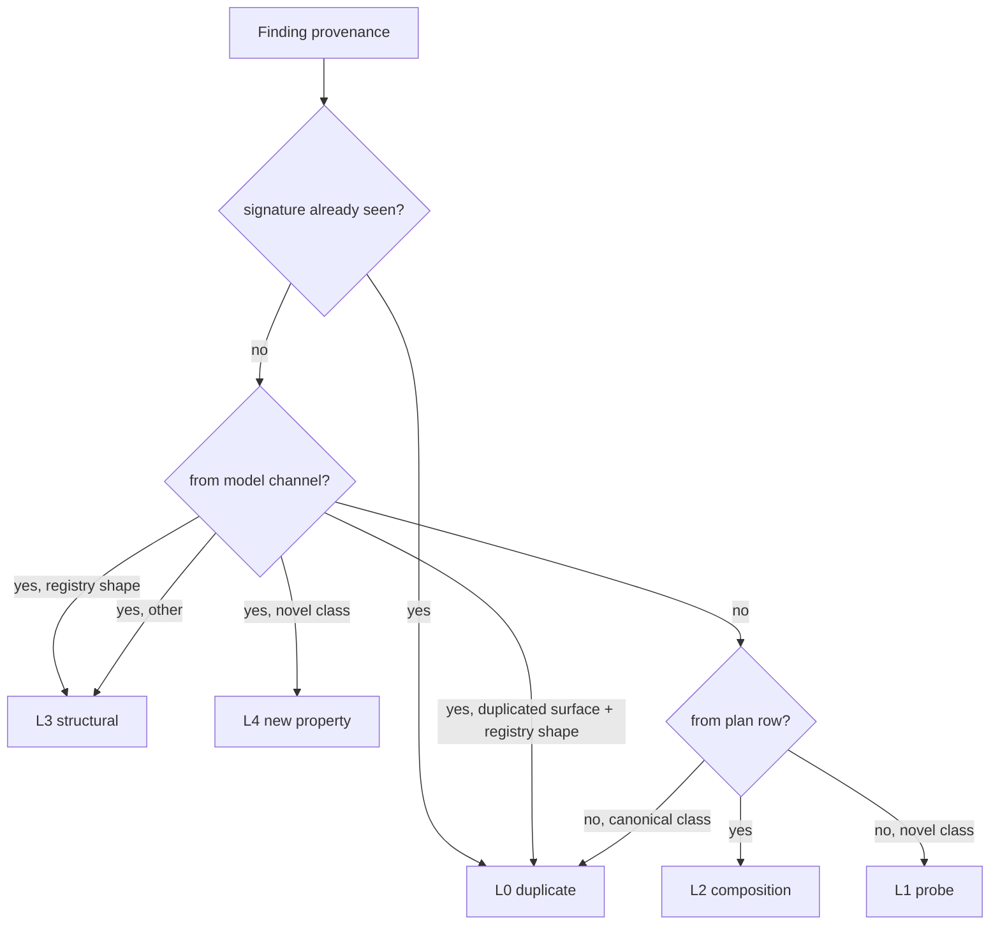

`facts_for_finding` derives provenance from the log's own rows, using the
**arm** to disambiguate a model proposal from the plan table's own row (both
build `object_read:{key}`, so the plan id alone cannot say which channel proved
the finding; the arm — surface-keyed for the ordinary pass, plan-id-keyed for
the abduced round — does). `levels_for_log` computes `{candidate_id: level}` for
every proven finding, first-occurrence-wins so a forced campaign's re-proof does
not overwrite the genuine level. `summarize` counts by level.

### 10.5 `world/anomalies.py`

The anomaly ledger: retained surprises, append-only, status derived. Two row
types: `anomaly.retained` (mirrors the world log's row; `ingest` copies them
idempotently) and `anomaly.status`. The current status is the last status row
for a key, recomputed by `entries()`.

`AnomalyLedger` — `retain(...)`, `ingest(log)` (idempotent by key),
`set_status(key, status, at, note)`, `retained_rows()`, `status_rows()`,
`entries()` (sorted by key), `get(key)`, `open_entries()` (the abducer's
inbox). `DEFAULT_NAME = "world/anomalies.jsonl"`.

### 10.6 `world/holding_pen.py`

Hypotheses the verifier vocabulary cannot confirm yet. A hypothesis that is
*expressible* but whose claim needs a confirm kind the engine does not have goes
here, with the verifier it would need named on the entry — the backlog of the
verifier vocabulary, made explicit instead of lost.

Three row types: `holding_pen.entry`, `holding_pen.promoted`,
`holding_pen.demoted`. Statuses: `held`, `promoted`, `demoted`.

`HoldingPen` — `hold(key, hypothesis, claim_shape, needs_verifier, at)` (refuses
an unknown claim shape and an unnamed need; idempotent while held; refuses
re-holding an entry that already left), `promote(key, at, note)`
(the code change that landed its confirm kind — A4: there is no schedule or
metric path, the caller is the PR), `demote(key, at, note)`, `entries()`,
`get(key)`, `held()`. A held hypothesis leaves exactly once, by one of those two
doors, and never by a grade change. When the driver holds one it also appends a
`holding_pen.entry` row to the world log carrying `needs_verifier`,
`claim_shape` and `vuln_class`, so `views.holding_pen_summary` (§10.2) derives
the backlog from the ledger; it reads *this* file only to exclude an entry that
has since been promoted or demoted, which the world log cannot know.

---

## 11. The scheduler — driver, campaign, UCB, tree, replay

### 11.1 `scheduler/driver.py`

The Phase-1 run loop: enumerate, gate, observe, interpret, verify, record. The
order is the design's one hard nod to cost: **cheap probes before loud ones** —
requests first (one canary per surface, no browser), and a browser probe runs
only when a probe that already ran established the context it declared a
requirement for.

What the driver owns, and what it deliberately leaves alone:

- it owns the clock — every `at` comes from one callable;
- it owns the receipts ledger — a probe whose answer is conclusive is not paid
  for twice, a probe that *errored* is not recorded as an answer at all
  (`failed` is distinct and retried next run), and a probe the gate *refused*
  files no attempt whatsoever;
- it owns nothing about vulnerability classes — it never looks inside a
  hypothesis, a probe or a candidate.

#### Outcomes

| Token | Meaning |
|---|---|
| `OUTCOME_NONE = "none"` | conclusive, no match |
| `OUTCOME_FOUND = "found"` | conclusive, match |
| `OUTCOME_FAILED = "failed"` | probe errored (not conclusive; retried next run) |
| `OUTCOME_REFUSED = "refused"` | gate refused (not counted as run, no receipt) |
| `OUTCOME_GATED = "gated"` | context not yet observed |

`REFLECT_ROUNDS = 2` (duplicated from `llm/reflect.py`'s `MAX_REFLECT_ROUNDS`
deliberately — the driver cannot import the llm layer at module level, and the
two are pinned by a test). `_LENS_CONTEXTS = (dom_absent, dom_unknown)` are
answers about the lens, not placements, so they never enter a context gate.

#### `Engine.__init__`

Holds `seed`, `gate`, `registry`, `log`, `verification`, `receipt`, `clock`,
`force`, `advisory`, `abducer`, `validator`, `pen`, `pool`.

#### `Engine.run()`

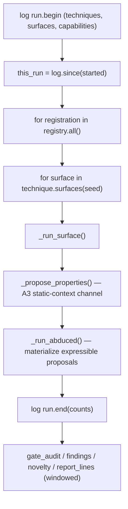

Counting through `this_run = self.log.since(started)` is the detail that stops a
second run selling the first run's findings.

#### `_run_surface`

For each hypothesis: increment arm/hypothesis counts; log
`note stage=hypothesis`; if `_already_settled(arm)` skip; run probes; evaluate
the expectation *before* reading the technique's candidates (candidates take
priority — an explained surprise is not an unexplained one); if deviations and
no candidates and observations exist, log `anomaly.retained` and `_abduce`; if
no candidates and observations and an advisory is available, run the bounded
reflect loop; then `_judge` and `_synthesize`.

The arm names the **hypothesis's** surface, not the loop's:
`f"{registration.name}@{hypothesis.surface.key}"`. An adapter may emit seed-level
plans from one call (`generic_differential` does), and labelling a
report-surface hypothesis with the invoice surface's arm would file the wrong
receipt.

#### `_run_probes`

Sorts specs (`technique_probes`): cheap before loud — `key=(0 if KIND_HTTP else
1, spec.id)`. Confirmation-purpose probes are recorded as `probe.confirm.deferred`
and **not** executed. Gated probes (`_gated`) are skipped with `probe.gated`.
Otherwise `_execute` → `ProbeRun`. Returns `(observations, failures, executed)`.

`_gated(spec, seen_contexts)` returns a reason when a probe declared a required
context the run has not observed. A browser run is the loudest thing the engine
owns, and running one without knowing the context would cost the most and prove
the least.

#### `_execute`

1. Replace the OOB sentinel in `url` or `content` with a real collaborator URL
   via `gate.allocate_oob(spec.id)` (logged as an internal effect).
2. Pop `timing_class` out of the detail (it is observation metadata, not a
   transport kwarg).
3. Build `EffectRequest`, call `gate.run()`.
4. Parse the effect:
   - HTTP: `http_observations(...)` with `canary`, `mark`, `timing_class`;
     `found` if any reflection is `reflected`/`transformed`.
   - Browser: `browser_observations(...)`; `failed` if not ok; `executed` if any
     `OBS_SCRIPT_EXECUTION` payload says so.
5. Log each observation.

#### `_judge`

Logs each candidate, verifies each one, records the verdict. If no candidates
and failures, outcome is `failed` (interrupted, not tested). If `executed == 0`
and no candidates, log `receipt.skipped` and return — **receipts are attempts,
not refusals**. Otherwise `_file_receipt(arm, operation, outcome)`.

`_record_verdict` logs the verdict and increments `findings`/`leads`; a proven
verdict whose grade is not in `FINDING_GRADES` raises (guarded).

#### `_synthesize` — the Phase-3 junction

Runs only when: an advisory is wired and available, the technique exposes a
synthesis grammar (`advisory.grammar_for(name)`), a reflection observation this
run actually saw (`payload["reflected"]`), and the model's synthesized answer
validates and does not duplicate the stock payload. Runs the synthesized spec
through the ordinary `_execute` path. Candidates it produces get
`origin=EVENT_CANDIDATE_JUNCTION` and are logged as `candidate.junction` — and
the verification layer refuses them on sight.

#### `_abduce`, `_propose_properties`, `_run_abduced`

- `_abduce(registration, arm, deviations, counts)` — for each deviation, build
  an `Anomaly` and get proposals from the deterministic abducer (control arm)
  and, if the model is available, the LLM abducer (primary novelty source).
  Both emit the same `Proposal` shape.
- `_consider(proposal, ...)` — log `abduction.proposed`, validate
  (`abduction.validated`), and route three-valued: expressible → pool; held →
  pen (`holding_pen.entry`); invalid → only the record.
- `_propose_properties(counts)` — A3's no-anomaly channel: ask the model for
  static-context properties. Degraded = no-op.
- `_run_abduced(counts)` — every expressible proposal is materialized through
  the *technique's own* `hypothesis_for_proposal()` hook into a hypothesis and
  run through the ordinary path. A **property** that merely re-proposes an
  experiment the ordinary pass already ran is skipped (digest check); an
  anomaly-driven abduction is exempt (a surprise is worth re-measuring). The
  abduced arm is keyed by the plan id, not the surface.

#### Receipts

The receipt operation is **hypothesis-scoped (G7, closed)**: `_run_surface`
builds `operation = f"{registration.name}:{hypothesis.id}"`, so a second
hypothesis on the same surface is not starved by the first one's conclusive
attempt — the ledger answers "was *this hypothesis* attempted?", not "was this
surface touched?". `_already_settled(arm, operation)` returns true when a
conclusive attempt for that operation is on file (unless `force`);
`_file_receipt` writes both an `EVENT_RECEIPT` log row and, if a receipt object
exists, `self.receipt.record(...)` — with `conclusive = outcome != "failed"`.

#### `technique_probes(registration, hypothesis)`

Every probe for one hypothesis in the driver's order: requests before browsers,
then by id. Confirmation probes are included (the grammar in full); the driver
skips them. The synthesize junction is deliberately not part of this function —
its input is the reflection the stock canary produces, so it can only run after.

### 11.2 `scheduler/campaign.py`

Rounds of UCB-driven selection over the Phase-1 engine. One round is one arm
executed through the ordinary `Engine` (fresh engine, same ledger, same gate).
The Engine is untouched: the chokepoint, the receipts rule and the world log
keep their Phase-1 semantics.

`Budget(rounds, window_seconds, started_at)` — either bound stops the campaign;
the window is checked *before* starting a round, never mid-round (interrupting a
round would leave an arm attempted-but-unrecorded).

`Campaign.run(budget)`:

- logs `campaign.widening` once if the seed was widened;
- loop until `rounds_run == rounds` or the window expires;
- `_pick_arm(excluded)` filters settled/excluded arms *before* the pick (a
  selector that picked a settled arm and then discarded it would log a decision
  the campaign never intended to honour);
- one arm per round, findings/leads accumulated;
- **a round in which nothing executed is free** — the gate refused, not the
  target — the arm is excluded and no budget is spent; a hard iteration cap
  stops a refuse-loop.

`_pick_arm` builds `noise` (from manifests), `receipts` (from the log), `priors`
(the advisory, once per campaign), `novelty` (from retained anomalies), and
`eligible` (from each technique's own `surfaces(seed)` — one authority). It logs
a `scheduler.pick` row with the score and reason.

`_run_round` builds a restricted registry containing only the picked technique
and a fresh `Engine` with a fresh `HypothesisPool` (the pool is per-run; the pen
is shared and persistent).

`replay_round_order(log_path)` reads the `scheduler.pick` rows — no engine, no
network.

### 11.3 `scheduler/ucb.py`

UCB selection over (technique × surface) arms. Three properties:
**pure** (a function of receipts, manifests and priors); **history from the
ledger** (`found` is conclusive reward, `none` is conclusive no-reward,
`failed` is *not an attempt* and never enters the math; a refusal is not an
attempt either); **the reward is divided by visibility**.

Reward constants: `REWARD_FOUND = 1.0`, `REWARD_NONE = 0.0`.
Novelty: `NOVELTY_REWARD_CAP = 0.9` (strictly below `REWARD_FOUND` — no pile of
"new territory" can add up to a measured answer), `NOVELTY_CELL_REWARD = 0.5`,
`NOVELTY_CELL_DECAY = 0.5`. `DEFAULT_EXPLORATION = 1.4` (the only knob).
`NONE_STREAK_DEMOTION = 2` consecutive conclusive `none` outcomes demote an arm.

`Arm.ucb(total_throws, c)`:

- an untried, never-demoted arm returns `inf` — it always wins once;
- `mean = (rewards + prior + novelty) / throws`;
- `optimism = c * sqrt(ln(max(total, 1)) / throws)`, halved after
  `NONE_STREAK_DEMOTION` none-streaks;
- returns `mean + optimism`.

The `prior` enters the mean and its influence is bounded by wiring (capped at
0.4 — below a single `found`). With no opinion wired, `prior = 0.0` and the math
is exactly Phase 2's.

`pick(arms, noise, c)` — the highest upper bound, adjusted for what the attempt
costs in visibility. If every arm is untried, `inf` cannot order itself, so the
pick falls to declared cost (**quiet first**). Otherwise
`score = ucb / cost`; ties go to the first arm.

`cell_novelty(times_entered)` — zero before the first entry, `NOVELTY_CELL_REWARD`
on the first, geometric decay after. `novelty_reward(cells)` sums and caps below
`REWARD_FOUND`.

`arms_from_receipts(eligible, receipts_by_arm, priors, novelty)` builds the arm
set: only conclusive outcomes enter `throws`; novelty is credited only to an arm
that actually ran (`throws > 0`), so an arm cannot farm the term.

### 11.4 `scheduler/tree.py`

AND/OR structure over arms with parking instead of spending: to prove impact you
need a foothold AND an evidence class; either can come from several techniques
(OR); some techniques need a precondition nobody has observed yet (AND edge).

- `OrNode(name, techniques)` — an objective any one of several arms could satisfy.
- `AndNode(name, requires, objective)` — unlocked only when every named
  precondition is satisfied.
- `Tree(root, nodes)` — `node(name)`, `to_dict`.
- `decide(tree, arms, proven_classes, observed_kinds)` — walks from the root to
  the first unlocked OR node. A name that is not a node is a *claim* satisfied by
  the log. While a precondition is unsatisfied the node is **parked** (its arms
  invisible to the selector). Returns a `TreeDecision(active, parked, reason)`.
- `filter_arms(active, arms)` — the arms the unlocked node may spend on.

The tree holds no state: satisfaction is computed from the log each time, so a
replayed campaign re-derives the same parking decisions. A tree with no AND
edges agrees with the flat pick (there is a test).

**Campaign wiring (G6, closed).** `Campaign` takes `tree: Tree | None`. Each
pick runs `decide(...)` with `proven_classes` (findings joined to vuln classes)
and the observed kinds read from the world log, appends the decision as a note
row (`stage="scheduler.tree"`), returns no pick when the root is parked (the
campaign then stops saying why), and otherwise filters the arms to
`decision.active.techniques` before the UCB selector ranks them. `run_engine.py`
loads a tree from `--attack-tree JSON` (`load_attack_tree`: `or`/`and` node
shapes, malformed files fail loudly). One contract pinned by test: an AndNode
carries its objective as a *value*, so `decide` descends into it directly — a
tree whose OR objective is nested only (the shape the JSON loader produces)
still unlocks; nothing must double-register the node.

### 11.5 `scheduler/pool.py`

- `PoolEntry` — `cell`, `arm`, `technique`, `claim_shape`, `verdict`, `source`
  (`abduction` vs `property`), `proposal`. `expressible` is
  `verdict == EXPRESSIBLE_NOW`.
- `HypothesisPool` — in-memory per run, keyed by cell; `add(proposal, arm,
  verdict, source)` is idempotent (first verdict wins); `entries()`,
  `expressible()`.
- `novelty_cells_from_log(log, technique=None)` — `{arm: novelty payout}` derived
  from a log's retained anomalies. Only `anomaly.retained` rows contribute; the
  count of prior entries decays each cell's payout.

### 11.6 `scheduler/replay.py`

Recomputes a run's decisions from its log, with nothing else.

`replay(log, seed, registry)` builds observations grouped by probe, recomputes
each technique's hypotheses/probes/interpret, compares recomputed candidate ids
with logged ones, and reports mismatches and independence violations.

The abduced round is recomputed too, when it is reproducible. For each
`note stage=hypothesis.abduced` row whose `rule` is one of the deterministic
abducer's (`DETERMINISTIC_RULES`), replay rebuilds the retained `Anomaly` from
its `anomaly.retained` row, re-abduces, matches the proposal by id, materializes
it through the technique's own `hypothesis_for_proposal`, and diffs the candidate
it implies — scoped to *that* experiment's own observations (the window between
this note row and the next), because an abduced plan can share probe ids with the
ordinary pass. A row the model sourced (`rule=llm_abduction`) or whose recorded
anomaly is missing stays listed as recorded fact, as does every
`candidate.junction` row. `ReplayReport` reports `abduced_recomputed`,
`abduced_listed`, `junction_candidates`, `candidates_logged`,
`candidates_recomputed`, `mismatches` and `independence_violations`; `clean` is
`not mismatches and not independence_violations`.
---

## 12. Techniques — the vuln-class corpus

A technique is **four pure functions and a manifest** — no I/O, no clock, no
model. The driver composes them.

| Function | Gets | Returns |
|---|---|---|
| `surfaces(seed)` | the seed | the surfaces it may consider, filtered by *capability claim* |
| `hypotheses(surface)` | one surface | testable claims |
| `probes(hypothesis)` | one hypothesis | probe specs — url, method, payload, oracle, noise |
| `interpret(hypothesis, observations)` | the pass's observations | candidates, or nothing |

The manifest is the identity card. `surfaces()` is the **gate** — the authority
on which surfaces a technique is actually offered — and it can legitimately
differ from `preconditions`. **Five of the eight techniques gate differently
from their manifest** (pinned by `tests/vuln_engine/test_inventory_pins.py`).
Since Capability Closure (§12.10) every gate reads the surface's *established*
`capabilities` set — the declared claim **or** a fact an elicitor measured —
so a precondition nobody declared is no longer a silent dead arm; `--elicit`
measures it.

| Technique | Class | Manifest `preconditions` | `surfaces()` gate | Confirmed by |
|---|---|---|---|---|
| `xss_reflected` | `xss` | `public_param` | `public_param` **or** measured `http_response_reflects_input` | browser (execution) |
| `xss_dom` | `xss` | `public_param` | `public_param` **or** measured `http_response_reflects_input` | browser (execution) |
| `xss_stored` | `xss` | `server_stores_input` | `claims(server_stores_input)` | stored runner (execution) |
| `oob_fetch` | `ssrf` | `can_influence_remote_fetch` | declared **or** measured `can_influence_remote_fetch` | collaborator (oob) |
| `idor_differential` | `idor` | `access_differs_by_session` | `claims(access_differs_by_session)` | authorization (differential) |
| `sqli_blind_time` | `sqli` | `public_param` | **`claims(delayed_response)`** | timing (differential) |
| `command_injection` | `command-injection` | `public_param` | **`claims(delayed_response)`** | timing (differential) |
| `generic_differential` | `method-confusion` | `public_param` **and** `access_differs_by_session` | **either, declared or measured** | differential |

Four operator-facing consequences:

1. To make a timing technique fire you either declare `delayed_response` on the
   surface — **not** `public_param`, which is what its manifest says — **or** run
   with `--elicit`, whose timing elicitor measures it.
2. The two timing techniques read the **same** `delayed_response` claim and
   compete to explain it — which one is right is measurement's job, not the
   operator's.
3. A surface declaring a claim no `surfaces()` gate accepts yields zero arms for
   every technique — silently, with no error. Capability strings must be the
   kernel's exact spellings. `--elicit` shrinks this silent set by measuring what
   it can; a capability no elicitor can establish is reported, not hidden.
4. Four techniques declare `gate_capabilities` — both XSS gates read
   `(public_param, http_response_reflects_input)` and both timing techniques
   read `(delayed_response,)` — and `generic_differential` derives its
   eligibility from the plan table (an OR where the manifest names both). The
   closure pass reads that attribute (falling back to the manifest's
   `preconditions`) to know which capabilities to measure — so a new technique
   that gates on a new capability widens the closure question by existing.

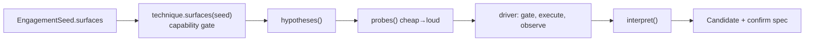

### 12.1 `techniques/common.py`

Shared pure helpers — not a home for technique logic.

- `JSON_CONTENT_TYPE = "application/json"`.
- DOM placement marker vocabulary: `DOM_MARKER_PREFIX = "dom:"`,
  `DOM_Q_PRESENT = "present"`, `DOM_Q_TEXT = "text"`, `DOM_Q_ATTR = "attr"`,
  `DOM_Q_URLATTR = "urlattr"`, `DOM_Q_HTML = "html"`, `DOM_Q_SCRIPT = "script"`.
  `dom_marker(mark, question)` builds `dom:<mark>:<question>`.
- `surface_id_prefix(name, surface)` — the candidate/hypothesis id prefix
  (`name:host:path?query:param`; host appears exactly once).
- `with_parameter(url, param, value)` — replaces the param, percent-encoding the
  value. This matters more than it looks: payloads are full of quotes and angle
  brackets, and a payload that arrives mangled is indistinguishable from a
  target that sanitised it.
- `json_body_request(surface, param, value)` — the API-program counterpart of
  `with_parameter`: returns `(url, headers, content)` carrying
  `{param: value}` (plus companions) as a JSON body. The URL is the surface's,
  verbatim.

### 12.2 `xss_reflected`

The canonical worked example. Folder: `manifest.py`, `hypothesis.py`,
`probes.py`, `interpret.py`, `__init__.py`.

**Manifest.** `produces = (reflection, semantic)` — neither a finding grade;
`verification_needs = execution`; `noise` = 1 request, no browser; `transports
= (http.request, browser.run)`; `postconditions = (script_execution,)`.

**`surfaces()`** — the gate is a declared contract: the folder sets
`gate_capabilities = (CAP_PUBLIC_PARAM, CAP_RESPONSE_REFLECTS_INPUT)` and gates
on `surface.claims(...)` (§7.4), so a surface whose `public_param` claim arrived
through the *capabilities set* — the graph bridge's derivation or Capability
Closure's measurement — opens the same door as a declared one. Before this
(gap G1) the gate read `surface.capability in ("", public_param)` alone and a
derived-or-measured precondition was invisible to it. `xss_dom` declares the
same pair.

**Hypothesis** — one per surface: *parameter `p` is reflected into the
response*, resting on `http_response_reflects_input`, preconditions
`(public_param,)`.

**Probes.**

- `canary_spec` — one quiet GET carrying `CANARY = "ab1c2d3\"'<>"`, mark
  `"ab1c2d3"`, oracle `reflection_at_least_once`, produces `reflection`.
- `execution_spec(hypothesis, context)` — one browser probe per executable
  context, with `purpose=PURPOSE_CONFIRM` and
  `requires_context=(context,)`. It is **emitted unconditionally and executed
  conditionally**: a browser run must never happen on a surface whose context
  nobody has established. Payload prefix table:

  | Context | Prefix |
  |---|---|
  | `double_quoted_attribute` | `">` |
  | `single_quoted_attribute` | `'>` |
  | `unquoted_attribute` | `>` |
  | `raw_html` | `` (empty) |

  The script body is `<script>{marker}=1;confirm('vuln-engine-xss')</script>`.
  `marker_identifier(context) = f"__ve_xss_{context}"`,
  `marker_expression(context) = f"{marker_identifier} === 1"`.

**Interpretation.** Three outcomes:

- no reflection → no candidate;
- reflection but a context no payload can confirm (comment, in-tag, unknown) →
  a **lead** with `confirm={}` (logged and visible, refused by the verifier);
- reflection in an executable context → a candidate with the execution spec's
  payload and a `browser.run` confirm spec (url, markers, context, dialog).

Grade is `semantic` when the context was parsed, `reflection` when it was not.
The execution class is reserved for the verifier by construction.

**Optional `synthesis_grammar()`** returns a `ProbeGrammar` over the folder's
own deterministic output.

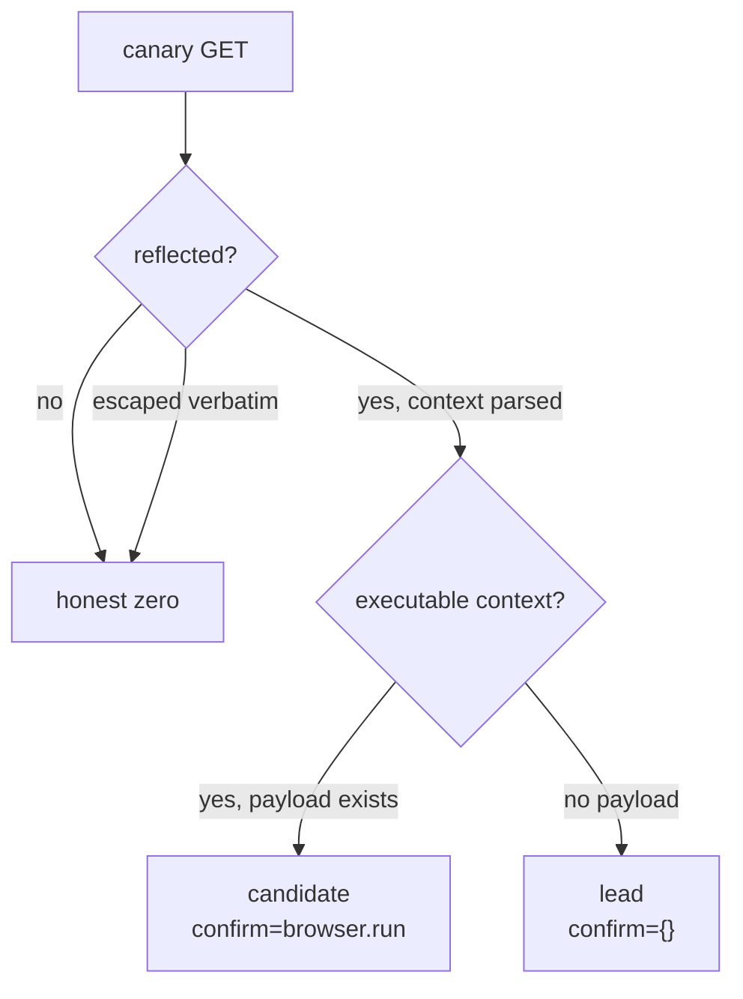

### 12.3 `xss_dom`

Same shape as `xss_reflected`, but the browser is the parser. `produces =
(semantic,)`; `verification_needs = execution`; `noise.requires_browser = True`
(the loud sibling of the cheap canary).

The technique reads **only** `observation.dom_placement` rows (the wire lens's
reflection rows belong to `xss_reflected`). `interpret` has five outcomes:
nothing to say; a recorded negative (`dom_absent`); a lead (a placement with no
confirmation payload, or `dom_url_attribute` whose execution needs a user
interaction the verifier does not simulate); a candidate worth a browser; and a
**duplicate** — if the wire lens already found an executable reflection here,
the same attack path means `xss_reflected` owns the candidate.

One id per *placement* (`...:<context>`), not per surface: a surface can yield
several candidates and a verdict row resolves its summary by candidate id.

### 12.4 `xss_stored`

The two-page technique. `preconditions = server_stores_input`;
`noise.requests_per_surface = 2` (inject + read-back); `produces = (reflection,
semantic)`; `verification_needs = execution` with the *sequence* confirm kind
`xss_stored.execute`.

`interpret` mirrors `xss_reflected`'s, with one structural difference: the
read-back page is a **shared** surface (a guestbook renders every entry ever
stored), so a previous round's canary can still be there. A candidate is a
*proposal*: the confirmation spec re-injects the payload and makes a browser
prove execution, so a stale entry can at worst shape a lead, never a finding.
An executable context produces a confirmation spec naming the inject (payload +
companions) and the read-back page; a non-breakout context is a lead.

### 12.5 `oob_fetch`

The blind technique. `preconditions = can_influence_remote_fetch`;
`postconditions = server_side_request_observed`; `produces = (reflection,
semantic)`; `verification_needs = oob`.

`surfaces()` — surfaces claiming `can_influence_remote_fetch`, with a param.

One probe carries **two things**: a per-probe collaborator URL (as a sentinel,
substituted by the driver) and an echo canary
(`vuln-engine-collaborator:<probe>`). The oracle is `reflection_at_least_once`
here and `oob_interaction` for the verifier — two oracles for one attempt, in
two different classes.

`interpret`: if the response contains the collaborator's per-probe answer, emit
a candidate with `confirm={kind: "oob.read", probe, path, token}`. The proposer's
evidence is weak on purpose and the summary says so. No payload is invented —
this candidate is not reproducible by hand the way an XSS one is.

### 12.6 `idor_differential`

`preconditions = access_differs_by_session`; `postconditions =
cross_account_readable`; `produces = (hypothesis,)`; `verification_needs =
differential`; `noise` = 4 requests/surface, burstiness 0.6, fingerprint 0.6.
`ORACLE = DIFFERENTIAL_SESSIONS`.

`surfaces()` — only surfaces claiming `access_differs_by_session`. `with_param()`
does **not** apply: an object reference lives in the path (`/api/invoices/4821`),
and requiring a param would silently exclude the technique's whole surface
class. Two declared sessions are the entire source of truth for what "should not
be readable" means.

Two paired probes: `:session-a` (the transport's default shim) and
`:session-b` (`_session="b"`, which the gate refuses outright when no second
cookie was declared). No payloads — the URL is the operator's declared surface
verbatim; a probe that mutated the object reference would test an object nobody
declared.

`interpret` compares status codes (the one field comparable across identities
without reading bodies):

```mermaid
flowchart TD
    A["status_a"] --> M{"both measured?"}
    M -->|no| ZERO["no candidate"]
    M -->|yes| AD{"A allowed (2xx)?"}
    AD -->|no| ZERO
    AD -->|yes| BD{"B status"}
    BD -->|"denied (30x/401/403/404)"| NONE["expected: silence, receipt none"]
    BD -->|"allowed 2xx"| CAND["candidate (grade hypothesis)<br/>confirm=authorization.differential"]
    BD -->|"5xx/transport zero"| ZERO
```

### 12.7 `sqli_blind_time`

The loudest probe set. `preconditions = public_param` (manifest) but
`surfaces()` gates on `delayed_response` — declared, or measured by the timing
elicitor (it declares `gate_capabilities = (delayed_response,)`, §12.10);
`produces = (semantic, reflection)`;
`verification_needs = differential`; `noise` = 6 requests/surface, burstiness
0.9, fingerprint 0.7.

**Populations.** `QUIET_PAYLOAD = "ve-noop0"` (baseline) and an injected family
defined by *interpolation shape*, not by target:

| Variant | Template |
|---|---|
| `numeric` | `1 AND SLEEP({d})` |
| `quote_closed` | `1' AND SLEEP({d}) AND 'a'='a` |
| `quote_paren` | `1') AND SLEEP({d}) AND ('a'='a` |
| `comment` | `1' AND SLEEP({d})-- -` |

`SLEEP_SECONDS = 4.0`, `SAMPLES_PER_POPULATION = 2`. Body-transport variants
(`json_numeric`, `json_quote_closed`, `json_quote_paren`, `json_comment`) are
declared *after* the query table so a query surface's grammar (ids, send order,
plan digests) is byte-identical to what it always was; the body table is
reachable only through a `where="body"` surface.

`probes()` interleaves: each round opens with one baseline sample and then one
sample of every variant, so baseline and injected requests interleave across the
whole run — a load spike hits both populations instead of posing as injection.

**`interpret`.** Three honesty rules: the margin is **declared** not discovered
(`MARGIN_SECONDS = 0.5`); an incomplete population proposes nothing
(`MIN_SAMPLES = 2`); the winner is the **variant**, not the family. The
candidate carries the winning variant and its payloads in the confirmation spec;
every losing shape's median is recorded as the control. The confirmation spec
asks for `timing.differential` with the winning payloads inline and `where`/`companions`
travelling so a body surface is re-measured with body-shaped requests.

### 12.8 `command_injection`

Structurally identical to `sqli_blind_time` — same manifest shape (`produces =
(semantic, reflection)`, `verification_needs = differential`, same noise), same
`surfaces()` gate on `delayed_response`, same population/variant/interpret
logic. The difference is the hypothesis: the value reaches a **shell** rather
than a SQL query. It is the third technique to share the timing grammar, and the
honest reading is that one declared timing claim has more than one possible
explanation. The operator declares the surface fact; the technique names one
hypothesis for *why*.

### 12.9 `generic_differential` — hypotheses as data

This technique answers one question: **can a hypothesis be data, not code?**

- `vuln_class = "method-confusion"` — deliberately not one of the canonical
  folder classes; the spike's question is whether a plan row can define a class
  the folder tree never named.
- `produces = (hypothesis,)`; `verification_needs = differential`;
  `postconditions = ("cross_behavior_readable",)`.
- `preconditions` (manifest) reads `public_param` + `access_differs_by_session`,
  but `surfaces()` is an **OR** — either claim admits a surface.

**The plan table** (`plan.py`) is the heart:

- `BehaviorPlan` — `name`, `url`, `method`, `expected_status`, `denies_status`,
  `requires_session_b`.
- `DifferentialPlan` — `plan_id`, `vuln_class`, `summary`, `actor`,
  `target`, `claim_shape`, `param`, `where`, `expectation`. `vuln_class` is free
  deliberately: a plan's class exists because someone wrote a row.
- `validate_plan` — refuses an unspeakable plan (no id/class, no claim_shape,
  overlapping status sets, an actor that IS its target).
- `object_read_plans(surfaces)` — the classic two-session object read as a row.
- `session_role_plans(targets, victims)` — composes role-declared surfaces
  (`method_role=target` / `method_role=victim`) into state-change plans. The
  probe order encodes the experiment: baseline the victim, run the actor's state
  change under session B, re-read the victim.
- `plan_from_dict` — the inverse, and the door the abduced round comes through.

`eligibility.py` **derives** the adapter's filter from the plan sources
(`plan_table_capabilities()` = `{public_param, access_differs_by_session}`).
`_refuse_to_load()` runs at import: a table that admits nothing, or names a
capability the kernel does not speak, fails loudly at discovery instead of
silently mid-run.

The adapter bends the contract twice, explicitly: `hypotheses()` is called per
surface but the plans are *seed-level*, so they are emitted from the first
eligible surface and the rest return empty (the dedup guard keeps the arm count
honest); and the seed is bound in `surfaces()` (the first contract call).

`hypothesis_for_proposal(proposal)` is the optional hook the abduced round uses:
it rebuilds a plan from `proposal.plan` as **data**, validates it, and returns a
runnable hypothesis (or `None` when unusable) — the driver never looks inside.

`interpret` is the one piece of fixed code and applies the same honesty rules
for every row: a missing measurement proposes nothing; the actor must have
succeeded; the target must have succeeded; anything ambiguous proposes nothing.
The candidate's confirm spec is `authorization.differential` with the plan's
`claim_shape` carried so the verifier knows what it is being asked to prove.

### 12.10 Capability Closure — measuring the preconditions

The scar this closes: a technique's `surfaces()` gate reads a capability claim,
and before Capability Closure that claim could only come from the operator's
flag or the graph's name-heuristic. **Nothing in the engine could raise one.** So
on a target where the operator had not guessed the precondition, a perfectly
correct technique — `sqli_blind_time`, `oob_fetch`, `idor_differential` — was an
inert arm, with no error and no signal. All three external reviews named this the
single biggest block on finding real bugs; the full analysis is in
`EXTERNAL_REVIEW_TRIAGE.md`, and the per-gap disposition of all external
reviews — implemented or rejected as stale — is in Appendix D.

The fix is backward chaining, as a bounded pass (`RND_dynamic_preconditions.md`):
**measure what the gates need, then re-offer the surfaces.** It turns an
elicitor into *a verifier with the candidate removed* — it asks a cheap,
low-noise question of a surface and records the answer as a
`kernel.capability.CapabilityFact`, never a finding. The fact opens the
technique's door; the technique still pays the full propose → verify pipeline
before anything becomes a finding.

```mermaid
flowchart TB
    SEED["EngagementSeed<br/>operator declares surfaces"] --> GATES["observed_gates(registry)<br/>what the gates actually read"]
    GATES --> LOOP{"per surface × unmet gated capability"}
    LOOP --> KNOWN{"already established?<br/>declared · measured · on file"}
    KNOWN -->|yes| SKIP["skipped_known += 1"]
    KNOWN -->|no| FIND["elicitor.for_capability(cap)"]
    FIND -->|none| NOTHING["reported, not silent"]
    FIND -->|found| RUN["run its probes through the PolicyGate"]
    RUN --> INTERP["Elicitation.positive / negative"]
    INTERP -->|positive| FACT["capability.measured row<br/>+ report.established"]
    INTERP -->|negative| NEG["report.negatives (reason named)"]
    FACT --> WIDEN["enrich surface.capabilities"]
    WIDEN --> PASS["ordinary pass runs unchanged"]
```

#### `elicit/registry.py` — discovery

Mirrors the techniques registry exactly: every subdirectory of `elicit/` is a
candidate, it must expose `MANIFEST` and `ELICITOR`, the manifest's `name` must
equal the folder name, and a manifest that validates badly is loud (`strict=True`
raises; otherwise logged and skipped). Two elicitor-specific checks: the
manifest's `preconditions[0]` **is** the capability the elicitor establishes, and
it must be a capability the kernel speaks (`CAPABILITIES`). Adding an elicitor is
adding a folder; deleting one leaves the engine running with one fewer measurable
claim. `ELICITOR_CLASS = "capability-elicitation"` fills the manifest's unused
`vuln_class` field so the shared validator passes.

#### `elicit/base.py` and `elicit/common.py`

`Elicitor` (frozen) is the four-function registration record — `name`,
`manifest`, `capability`, `applies`, `probes`, `interpret` — plus a
`measure(surface, observations)` convenience. `Elicitation` (frozen) is the
answer as data: `fact: CapabilityFact | None` and a `reason`; `established` is
`fact is not None`, with `positive(fact)` / `negative(reason)` constructors. A
negative is a *recorded answer*, never a silence — it is what stops the closure
pass from re-asking the same question of the same surface in the same run.

#### `elicit/public_param/` — the reachability elicitor

The elicitor the cheap web techniques gate on. One paired request per surface:
the parameter `ve-elicitor-<>"'` carrying the canary versus an `ve-elicitor-absent`
name that echoes nothing — the pair is the whole question, because a parameter
named `p` that the app ignores also reflects the canary back in some frameworks.
**Positive** when the pair differs in status or bytes (`EVIDENCE_DIFFERENTIAL`);
probes are suffixed `:present`/`:absent` so the ledger keeps the two halves
distinct. It is the elicitor whose measured fact opens the `xss_reflected`,
`xss_dom` and `generic_differential` doors on a target the operator did not
pre-declare.

#### `elicit/closure.py` — the pass

- **`observed_gates(registry)`** collects the capability strings the registered
techniques' gates actually read. It does **not** hardcode them: a technique may
declare `gate_capabilities` (the exact tuple its `surfaces()` reads) and that
declaration wins; otherwise the manifest's `preconditions` stands in. This is one
attribute read off the technique, not introspection.
- **`run_closure(seed, *, gate, registry, log, clock, elicit_registry=None)`**
returns `(enriched_seed, ClosureReport)`. For each surface it: seeds a `known`
set with the surface's declared claim and every `capability.measured` row already
on file (the ledger wins — a resumable engagement does not pay twice); for each
unmet gated capability, picks the first elicitor that can establish it and
applies to the surface, runs its probes through the ordinary `PolicyGate`,
interprets the observations, and on a positive appends a `capability.measured`
row. It then rebuilds the seed with each surface's `capabilities` widened by the
established facts.
- **`ClosureReport`** — `established: list[dict]`, `negatives: list[dict]`,
`skipped_known: int`, `refused: int`, with `to_dict()`.
- **`_run_probes`** is the one piece of driver-like machinery elicitation needs:
OOB sentinel substitution (the same rule the driver applies) and, for
`remote_fetch`, a collaborator read whose interactions become the observations
the elicitor interprets. Both are internal effects, logged as the driver logs
them. A refused probe increments `report.refused` and sends nothing.

Bounds: an elicitor runs at most once per surface per run for a capability it
already answered (established *or* measured-negative); a negative is not retried
within the run. Elicitation is traffic, so it obeys the ordinary gate, scope,
budget and receipts rules — nothing about it bypasses the chokepoint.

#### The six elicitors

| Folder | Establishes (grade) | Honesty rule |
|---|---|---|
| `public_param` | `public_param` (`differential`) | a *pair*: canary `ve-elicitor-<>"'` in the parameter versus an ignored name (`ve-elicitor-absent`) — a parameter named `p` that the app ignores also reflects the canary back in some frameworks; positive only when the pair differs in status or bytes |
| `reflection` | `http_response_reflects_input` (`reflection`) | its own canary `ve-elicitor-<>"'`, distinct from the XSS techniques' so the two questions never answer each other |
| `remote_fetch` | `can_influence_remote_fetch` (`oob`) | an interaction record on *our* collaborator; no arrival is a negative, and a refused/unreadable collaborator is inconclusive |
| `timing` | `delayed_response` (`differential`) | quiet (`ve-noop0`) vs `SLEEP(6.0)` **plus a dose-response pair** (`SLEEP(2.0)` vs `SLEEP(6.0)`); the delay must track the dose, not just separate once |
| `sessions` | `access_differs_by_session` (`differential`) | one read per identity; a status difference, or a body-length difference ≥ `LENGTH_DELTA_FRACTION = 0.5` |
| `storage` | `server_stores_input` (`reflection`) | canary `ve-store-7c31` must return on the **read-back** request, not the submit's own echo — same-request reflection is not storage |

The `timing` elicitor's constants: `QUIET_PAYLOAD = "ve-noop0"`,
`SHORT_DOSE = 2.0`, `LONG_DOSE = 6.0`, `SAMPLES = 2`,
`MARGIN_SECONDS = 1.0`, `DOSE_MARGIN_FRACTION = 0.4`. Its probes interleave
`(quiet, sleep, dose_short, dose_long)` per round, so a load spike hits every
population rather than posing as injection, and its `interpret` reads the
population from each observation's `timing_class`.

#### Wiring and the flag

- `Engine.__init__` gained `elicit: bool = False` and
  `elicit_registry: ElicitorRegistry | None = None`. `Engine.run()` runs
  `run_closure` **before** the ordinary pass when `elicit` is on, then runs the
  pass over the enriched seed; it counts `closure_established`,
  `closure_negatives` and `closure_refused`.
- `Campaign` runs closure **once per campaign, before round 1**, over the full
  registry, then turns its own flag off — each round's fresh `Engine` already
  carries the measured facts, and the world-log dedup keeps a resumed campaign
  from paying twice.
- `RunReport.closure` carries `ClosureReport.to_dict()`; CLI `run_engine.py`
  has `--elicit` and prints a closure summary line.
-The facts land in the same append-only ledger as ordinary
`capability.measured` rows, so a replay sees exactly what was measured and why
a door opened.

**Why `--elicit` is opt-in (T9).** Elicitation is traffic against the
*target* — the timing elicitor's SLEEP doses, the sessions elicitor's
second-identity reads, the storage elicitor's submit — all through the gate,
but on the wire and in the target's logs. A run that elicits by default would
send requests an operator never asked for, against a target they may report
to; so the default is off at every layer (Engine, Campaign, the run/campaign
helpers, the CLI flag), and the two-gate flow has no flag at all because its
prober measures unconditionally. The default is pinned by
`tests/vuln_engine/elicit/test_elicit.py` (T9).

#### Live verification (2026-10-06, fixture + `--elicit`)

The closure pass was run against the compose fixture, from a clean output
directory (no prior `memory.json`), as `python run_engine.py --fixture
--elicit`. Measured, end to end:

- **Closure: 2 established, 8 negatives, 2 refused.** The pass established
  `http_response_reflects_input` (grade `reflection`) on
  `http://127.0.0.1:8080/search#q` via the `reflection` elicitor and
  `public_param` (grade `differential`) on `http://127.0.0.1:8080/fetch#url`
  via the `public_param` elicitor — both `declared: false` in the report, i.e.
  measured, not claimed. Two `capability.measured` rows landed in the ledger.
- **The refusal path is honest and visible.** The two refusals were the
  `sessions` elicitor on both surfaces: the gate DENYed its session-B requests
  with "malformed effect request: the request asks for session B but no second
  session is wired (declare it with `--session-b-cookie`)" — nothing sent,
  each refusal counted in `closure_refused` (the run's `probes_refused` stayed
  0 — the counter is for verifier-stage refusals), and the elicitor did not
  claim an answer.
- **Closure opened doors without changing the findings' provenance.** The run
  found the same 2 findings as the declared-claims classic run (`ssrf` grade
  `oob`, `xss` grade `execution`, independent confirmations). Note precisely:
  the fixture's seed *declares* `can_influence_remote_fetch` on `/fetch#url`,
  so the SSRF finding rests on a claimed capability — closure additionally
  *measured* `public_param` on that surface, it did not need to open the
  `oob_fetch` door. The measured `http_response_reflects_input` on `/search#q`
  was the fact the `xss_reflected` hypothesis rested on alongside the declared
  `public_param` claim.
- **Counts (the run's `run.end`):** arms 6, hypotheses 6, probes 21,
  probes_run 7, probes_for_verifier 14, candidates 2, findings 2, leads 0,
  skipped_conclusive 1, closure_established 2, closure_negatives 8,
  closure_refused 2. Gate: 37 decisions — 35 ALLOW / 2 DENY (both the
  sessions-elicitor refusals), 0 uncleared effects, 0 out-of-scope requests.
- **Replay of that run's log: clean** — 2 candidates logged, 2 recomputed,
  0 mismatches, 0 independence violations. The `capability.measured` rows are
  visible to the replay exactly as to the run.

> **A caveat about stale state across runs:** `output/vuln_engine/<target>/`
> is cumulative — `world.jsonl` grows a `run.begin`-delimited segment per run
> and `memory.json` persists receipts across runs. A later `--elicit` rerun on
> a used directory reported 0 findings with `skipped_conclusive: 4` because
> receipts from earlier runs marked those arms conclusive — correct behavior
> (the ledger wins), but it looks like a regression if you expect a fresh run.
> Verify closure against a clean output directory. Relatedly: replaying a
> *cumulative* log that spans an old candidate-id scheme can report
> "logged but not recomputed" mismatches for the stale ids alone — the
> single-run log replays clean.

---

## 13. Verification — independent confirmation

Six verifiers, one per confirmation shape a finding may rest on. The
`VerificationLayer` picks between them from the candidate's *confirmation spec*
— the only thing a verifier is allowed to read from a candidate — after
`verification/validator.py` has checked the spec itself.

| confirm kind | verifier | class |
|---|---|---|
| `browser.run` | `BrowserVerifier` | execution |
| `xss_stored.execute` | `StoredXssVerifier` | execution |
| `oob.read` | `OobVerifier` | oob |
| `timing.differential` | `TimingVerifier` | differential |
| `authorization.differential` | `AuthorizationVerifier` | differential |
| `authorization.state_change` | `StateChangeVerifier` | differential (re-executes setup) |

A candidate with no confirmation spec is refused, with that as the reason —
those refusals are the engine's **leads**. A verifier that could not refuse
would make every proposal a finding, precisely the scanner behaviour this design
avoids.

```mermaid
flowchart TD
    C["Candidate.confirm.kind"] --> P{"validator<br/>(host, fields, claim shape)"}
    P -->|"refused"| LEAD["refuse: stays a lead"]
    P --> K{"dispatch"}
    K -->|browser.run| B["BrowserVerifier"]
    K -->|xss_stored.execute| S["StoredXssVerifier"]
    K -->|oob.read| O["OobVerifier"]
    K -->|timing.differential| T["TimingVerifier"]
    K -->|authorization.differential| A["AuthorizationVerifier"]
    K -->|authorization.state_change| SC["StateChangeVerifier"]
    K -->|"none/unknown"| R["refuse: stays a lead"]
    B --> V["Verdict"]
    S --> V
    O --> V
    T --> V
    A --> V
    SC --> V
```

`verification/registry.py` is the verifier-vocabulary registry — the bottleneck
made explicit. Each confirm kind gets a `VerifierKind` record: `name`,
`confirm_kind`, `measurement`, `claim_shapes`, `re_executes_setup`,
`independent`. `provable_claim_shapes()` is the abductive validator's
expressibility question, answered from one place. `check_alignment(dispatch)`
cross-checks the vocabulary against `CONFIRM_VERIFIERS` — a kind that dispatches
but is unlisted (or vice versa) is a test failure.

### 13.1 `BrowserVerifier` (`browser_runner.py`)

Reads the candidate's confirmation spec — a request to make, and the markers
that would have to answer true — and nothing else. Two independent ways to
satisfy it, both execution facts:

- a marker the payload sets answered true (only possible if the JS ran);
- a dialog whose message is ours (`startswith` the expected dialog text).

The run goes through the policy gate, so a browser is loud and visible in the
audit. A run that failed proves nothing whatever its other fields say — checked
before the proof search. On success it builds `Evidence(grade=execution)`
carrying driver, url, context, marker answers (true and false alike), dialogs,
mutations, and calls `Verdict.check_independence`.

### 13.2 `StoredXssVerifier` (`stored_xss_runner.py`)

A stored payload lives behind a POST — no URL carries it — so confirmation is a
**sequence**:

1. re-inject the payload through the gate (HTTP POST carrying the payload and
   the surface's companion fields);
2. read back in a browser and require the payload's own execution signal.

A refused inject is inconclusive (nothing was learned); a failed inject is
inconclusive; the browser run must be ok and must show execution. On success,
`Evidence(grade=execution)` and `check_independence`.

### 13.3 `OobVerifier` (`oob_verifier.py`)

For a blind class, the only evidence strong enough. It asks a *different*
question of a *different* system: did our collaborator record a request on the
path only this probe knows? `CONFIRM_KIND = "oob.read"`.

`gate.read_oob(probe, wait=True)`; an error is inconclusive, not a refutation.
`_matching_interaction` prefers the exact path but falls back to any interaction
for this probe id — the id itself is unique per probe, so a request that carried
it came from our attempt even if the server normalised the path. Success yields
`Evidence(grade=oob)` with method, path, source_ip, user_agent, interaction
count.

### 13.4 `TimingVerifier` (`timing_verifier.py`)

Never sees the proposer's numbers. It re-runs both populations through the gate,
`SAMPLES = 2` per population, comparing fresh medians. Reading the payloads from
the spec is not a leak: what travels is *what to inject*, not what to conclude.
`_BASELINE_PAYLOAD = "ve-noop0"` and `_INJECTED_PAYLOAD = "1 AND SLEEP(4.0)"` are
fallbacks for specs that name no payloads, pinned to the technique's grammar by
the test suite.

- a failed measurement → inconclusive, not refuted;
- `median(injected) - median(baseline) >= margin` → the separation held; the
  verifier then runs its **second, fresh experiment** (below) before proving;
- otherwise → refuse, naming the numbers ("a slow target is not a finding").

`where`/`companions` travel with the claim so a body surface is re-measured with
body-shaped requests (via `json_body_request`).

#### The dose-response discriminator

A timing separation alone proves *"this input changed how long the target took"* —
which rate limiting, a WAF's regex backtracking or a load blip can each produce
with no SQL being interpreted (the sharpest point of the three external reviews).
SQL that reaches an interpreter answers to the **dose**: the `SLEEP` argument is
an input the interpreter reads, so the measured delay must scale with it.

After the separation, `_measure_dose` measures a fresh short/long pair —
`DOSE_SHORT_SECONDS = 2.0`, `DOSE_LONG_SECONDS = 6.0`, `DOSE_SAMPLES = 2` each —
through the gate, taking the payloads from the confirmation spec when it names
them (`dose_short_payload`/`dose_long_payload`, the winning variant's own shape)
or the pinned fallbacks otherwise. The long dose's median must beat the short's
by `DOSE_MARGIN_FRACTION × (long - short) = 0.4 × 4.0 = 1.6s`.

- an incomplete dose measurement → inconclusive, never a refutation;
- a complete one that does **not** track the dose → refuse, naming both medians
  ("a timing effect without an interpreter behind it is not a SQL finding");
- a dose-tracking delay → `Evidence(grade=differential)` whose payload carries
  `baseline_median`, `injected_median`, `difference`, `margin`, both sample
  counts, both payloads and `dose_short_median`, `dose_long_median`,
  `dose_gap_seconds`, `dose_margin`, `dose_tracks`.

### 13.5 `AuthorizationVerifier` (`authorization_verifier.py`)

Fresh identities, flipped order. Input is the confirmation spec — which URL,
oracle, claim_shape — and it re-asks the target itself under both declared
identities, **session B first**. Flipping the order is what makes the
confirmation a different measurement in kind.

Oracle check: `oracle` must equal `DIFFERENTIAL_SESSIONS`. Claim-shape cap: an
unknown shape is refused; a recognised-but-unprovable shape is refused with
`STATE_CHANGE_MISROUTE_REASON` — since the cap lift (§7.7) `state_change` is
provable and routes to the re-executing verifier instead (§13.6). Legacy specs
with no shape are grandfathered.

The status question is necessary but not sufficient: `2xx` alone cannot tell the
*object* from a generic success envelope, a redacted body or an empty shell. Each
of the two fresh measurements therefore keeps its body long enough to hash and
size it (then drops it — only hashes and lengths are logged), and the proof now
requires content agreement:

- both `2xx` and `same_content` (equal SHA-256 body hashes) → proven;
- both `2xx` but session B's body is empty (`_EMPTY_LENGTH = 0`) → refuse ("a 200
  that carries nothing is not access to the object");
- both `2xx` but the bodies differ by `≥ _LENGTH_DELTA_FRACTION = 0.5` of the
  larger → refuse ("a different representation is not proven access");
- both `2xx` and below that fraction → proven on equivalent content (dynamic
  tokens/timestamps are representation noise, not evidence either way);
- `status_b in DENIED` → refuse (the proposer's pair did not reproduce);
- anything else → inconclusive.

Evidence carries `oracle`, the flipped statuses, `session_a/b_body_length`,
`session_a/b_body_hash` and `same_content`.

Status buckets: `_ALLOWED = range(200, 300)`,
`_DENIED = {301, 302, 303, 307, 308, 401, 403, 404}`.

---

### 13.6 `StateChangeVerifier` (`state_change_verifier.py`)

Proves `CLAIM_STATE_CHANGE` *as stated* (§7.7): the claim is "the change at T
reaches V", so the measurement re-executes the actor's change fresh (session A)
between two unchanged victim reads (session B) — a flipped two-session read
would only prove that B can read V, the weaker, often-legitimate claim. Drift
control: a pre-pair of victim reads before the change must agree, otherwise the
verifier refuses with the drift reason. No change after the actor runs, or an
inconclusive read, is a named refusal — never a silence. It refuses up front
when no second session is wired (`PolicyGate.session_b_wired`), with the
`--session-b-cookie` hint, instead of failing mid-measurement.

### 13.7 `verification/validator.py` — the planner gate

Classic-path candidates dispatch straight from `confirm["kind"]`; the validator
sits between the technique's emission and the dispatcher: every URL in the spec
must agree with the surface's host, the kind's required fields must be present,
and the plan's claim shape must be provable (`provable_claim_shapes()`). An
unknown kind returns ``""`` — the dispatcher owns that refusal, keeping the
registry-alignment contract in one place. A foreign-host URL in a confirm spec
is the classic confusion/side-effect scar this closes.

## 14. Transports — raw effects

The only code that touches a wire, and it decides nothing. Two rules keep the
package from leaking: **nothing here imports policy** (the gate calls a
transport, never the reverse), and **nothing here knows what a vulnerability
is**.

### 14.1 `transports/http1.py`

Deliberately dumb in three ways: it decides nothing; it never raises on a
network failure (a timeout becomes an `error` on the exchange and flows into the
observation layer); it keeps the raw bytes to itself.

`Http1Effect` is an `httpx.Client` wrapper (injectable for tests; lazily built so
importing costs nothing). Constants: `DEFAULT_MAX_BYTES = 2 MiB` (a hostile
response cannot exhaust a run), `DEFAULT_TIMEOUT = 15.0`,
`DEFAULT_USER_AGENT = "vuln-engine/0.1 (authorized engagement; phase 1)"`,
`DEFAULT_BACKOFF_RETRIES = 2`, `DEFAULT_BACKOFF_CEILING = 8.0`.

`perform(url, method, headers, content, params, at)`:

- measures its own duration (httpx only fills `response.elapsed` after reading a
  *stream*, so asking a mock transport raises);
- honors target throttling: on `429`, or `503` without `Retry-After`, it retries
  a bounded number of times on **GETs only** (a repeated POST is not idempotent)
  after an honor-the-server wait (`_retry_delay`, sane-capped);
- truncates the body at `max_bytes` and sets an error noting it;
- returns `RawHttpExchange`.

`Http1Capabilities` reports `available`, `http2=False`, `header_order=False`,
`tls_impersonation=False`, `keepalive=True`, `max_bytes` — asked, never assumed.

### 14.2 `transports/browser.py`

The instrumented browser: script execution, dialogs, DOM mutation — not pixels.
Two drivers, same three facts:

- **playwright** — the documented choice, uses Playwright's Chromium and its
  CDP-level event stream; selected when importable *and* a browser is installed.
- **cdp** — the system Chrome driven directly over the DevTools Protocol with a
  WebSocket; no new dependency, same events.

`find_chrome(explicit)` locates a Chrome/Chromium executable (explicit path →
`CHROME_PATH` → usual install locations → `PATH`). `playwright_available()`
checks import *and* browser binary. `DEFAULT_TIMEOUT = 20.0`,
`DEFAULT_SETTLE = 0.6`.

The mutation observer is installed before any page script runs (both drivers),
so a mutation during parse is counted; the engine injects nothing else. `markers`
is a mapping of named predicates to boolean answers; dialogs and console errors
are collected. Capabilities report which driver answered and why, so a run never
silently degrades. The result is a `RawBrowserRun`; nothing here decides whether
it constitutes a finding.

### 14.3 `transports/oob.py`

Our own collaborator. Blind classes have no evidence class strong enough except
this one — something *we control* recording that the target reached out cannot
be faked.

Two URLs, and the difference is the whole trick:

- `public_base` — the URL embedded in a probe, the one **the target** must
  reach (inside a container network usually `host.docker.internal` or the
  collaborator's compose service name, never `127.0.0.1`).
- `local_base` — where **we** read the records from (`127.0.0.1` on the host).

`DEFAULT_PUBLIC_BASE = "http://host.docker.internal:9009"`,
`DEFAULT_LOCAL_BASE = "http://127.0.0.1:9009"`,
`DEFAULT_POLL_INTERVAL = 0.5`, `DEFAULT_POLL_TIMEOUT = 15.0`.

`OobEffect.url_for(probe)` is deterministic (`{public_base}/oob/{probe}`).
`health()` is cached; `read(probe)` fetches `/interactions?probe=...`;
`wait(probe, timeout, interval, sleep)` polls until an interaction arrives or the
patience runs out (a timeout returns an **empty** fetch, not an error — "nothing
arrived" is inconclusive; `sleep` is injectable). `RecordedCollaborator` is an
in-memory collaborator implementing the same three calls for tests and offline
replay.

`OobCapabilities` reports `available`, `dns` (HTTP-only in Phase 1; DNS deferred
and recorded as a limitation), `public_base`, `local_base`.
---

## 15. The LLM layer — the quarantined advisory

The design's contract for every LLM junction:

1. **Advisory** — an opinion is data a pure consumer may read; it never decides
   anything on its own. The selector still picks, the verifier still confirms,
   and the report's canonical lines are still derived views of the log.
2. **No key means deterministic behaviour, never silence** — the
   `available=False` health object is the answer, and every junction returns its
   degraded result without touching the network or raising.
3. **Logged and replayable** — every call is an `llm.junction` row keyed by
   *content digest*, not by count, so a replay finds the cached opinion and
   reproduces the engagement offline with the key removed.
4. **No free-form model output reaches the wire** — the model chooses within
   grammars; the engine constructs the payload.
5. **Quarantined** — junctions read typed structural fields, never target
   response bodies, and hold no tools. Untrusted content cannot instruct the
   model because untrusted content is never sent.

```mermaid
flowchart LR
    subgraph "A junction (pure)"
      IN["build_input (typed fields)"] --> PR["build_prompt"]
      PR --> VAL["validate(answer)"]
      VAL --> EXT["extract"]
    end
    CLIENT["LLMClient.ask<br/>digest cache in world log"] --> MODEL(("model"))
    CLIENT -->|"degraded on no key / bad shape"| DEG["Opinion(degraded=True)"]
    IN --> CLIENT
    CLIENT --> VAL
```

### 15.1 `llm/client.py`

One door to one model.

**Environment.**

| Name | Default | Purpose |
|---|---|---|
| `VULN_ENGINE_LLM_API_KEY` | — | gates the network path |
| `VULN_ENGINE_LLM_API_URL` | Groq OpenAI-shaped chat completions | endpoint override |
| `VULN_ENGINE_LLM_MODEL` | `openai/gpt-oss-20b` | model override |
| `VULN_ENGINE_LLM_MAX_COMPLETION_TOKENS` | `8192` | completion-token headroom |

Distinct from the recon side's `LLM_API_KEY` on purpose: a key an operator set
for recon classification should not silently become a key the exploit engine
spends against targets.

**`opinion_digest(input)`** — SHA-256 of canonical JSON (sorted keys); the cache
key. Content-addressed, so a replay finds the opinion for *this* question
regardless of how many other calls the original run made.

**`Health`** — `available`, `reason`, `model`.

**`Opinion`** — `junction`, `digest`, `answer`, `validation`, `validated`,
`degraded`, `reason`, `model`, `source` (`live`/`cached`/`degraded`).

**`LLMClient.ask(...)`:**

1. compute digest;
2. if `world` given, check for a cached `llm.junction` row with the same digest
   (degraded rows are **skipped** — a failure is a fact, not an answer);
3. if not available, return a degraded `Opinion`;
4. otherwise perform the call, `_extract_json` the outermost `{...}`,
   `_unwrap_tool_envelope` (a model with a tool-calling prior sometimes renders
   `{"name": ..., "arguments": {...}}`), run `validate`, and log the junction
   row on success;
5. any failure (including validation) returns a degraded `Opinion` with the
   complaint as its reason and — if the model was actually asked — logs a
   degraded `llm.junction` row.

`_extract_json` uses a brace scan and takes the **outermost** object: the model
may wrap its answer in prose, and an inner object would be a fragment of an
answer.

**The default caller** is a plain POST (no SDK) with `temperature=0`,
`max_completion_tokens`, three attempts. It handles 429/413 with backoff, retries
a 200 with empty content (a reasoning model can spend the completion budget on
chain-of-thought, `finish_reason: length`), and salvages a 400 `tool_use_failed`
by reading `failed_generation` as the content.

### 15.2 Junction 1 — `rank.py`

Advisory prior for the selector: the junction may attach a prior to an arm's
optimistic estimate; it may not reorder arms, veto an exploration, or spend a
round. **One opinion per campaign, before round 1** — once receipts exist, the
ledger's own history is the dynamic ranking signal.

Two caps keep "advisory" honest even against a wrong or manipulated opinion:

- `PRIOR_CEILING = 0.4` — below the reward a single conclusive `found` carries;
- `PRIOR_TOTAL = 1.0` (`MASS_TOLERANCE = 0.05`) — the model expresses a
  preference order, never a verdict on a technique's worth.

`build_input` carries manifest fields only plus declared surface keys — nothing
the target said, so the prompt-injection surface is empty by construction.
`validate_answer(known)` rejects an invented technique and a mass over the cap
(with scaling) and clamps each prior. `extract` re-applies the same two rules so
a replay gets the numbers the original run used.

### 15.3 Junction 2 — `synthesize.py` + `runtime.py`

Payload drafting *inside* a grammar. The model answers **three
multiple-choice questions** — execution vector, quote style, whether to close
the tag — and the engine constructs the payload with the same code path that
builds the stock payloads. Free-form model output cannot reach the wire.

`VECTORS = {script_tag, img_onerror, svg_onload}`;
`QUOTE_STYLES = (single, double, backtick)`; `SUPPORTED_CONTEXTS =
SCRIPT_EXECUTABLE_CONTEXTS`. `build_input` carries typed structural fields only
(context enum, occurrence count, ≤40-char prefix/suffix) — never a response
body. `validate_answer(context)` enforces the context's rules (attribute
contexts require `close_tag=true` and forbid `quote_style`; a JS-string breakout
cannot also close its tag). `construct_payload` builds from the validated answer
using the engine's tables.

`SynthesisJunction.probe_for(...)` is the only place that talks to the client.
It returns a `ProbeSpec` with `purpose=PURPOSE_PROPOSE` — the driver runs it like
any other canary. It returns `None` when the context is outside the grammar, the
model is unavailable, validation fails, or the chosen shape reproduces the stock
payload (a duplicate would spend a request to learn nothing). The junction takes
the technique's `ProbeGrammar` **as an argument**; it never imports a technique.

### 15.4 Junction 3 — `write.py`

Advisory prose beside the canonical lines, never instead of them. Drafts are
constrained: every sentence must name a typed field's value (the class, the
param, the repro URL, the confirmation prose, or a whitelisted evidence value).
`EVIDENCE_FIELDS` whitelists what the prose may see per grade; dialog *messages*
(target-controlled text) are projected to their kind only — the one junction
whose input could otherwise carry a target's words. `MIN_SENTENCES = 2`,
`MAX_SENTENCES = 5`. The report carries the prose flagged as model-drafted, next
to the canonical line.

### 15.5 Junction 4 — `hypothesize.py`

What should the engine even look at? Reads recon's typed artifacts and proposes
*declared surfaces*. **Every proposed URL must be one recon actually observed** —
a proposal pointing anywhere else degrades the opinion whole. `_url_key` matches
host/path/query insensitive to scheme (the live failure was an `https` URL
answered as `http`), and the surface carries the canonical recon URL, never the
model's rewrite.

Caps: `MAX_INPUT_PARAMS = 60`, `MAX_INPUT_URLS = 40`, `MAX_INPUT_GRAPH = 40`,
`MAX_PROPOSED = 12`, `MAX_MEMORY_ARMS = 30`.
`WHERE_VALUES = ("query", "body", "path")` — `header`/`url` exist in the kernel
but no shipped technique aims a parameter probe at them, so a proposal the
engine cannot act on is refused.

### 15.6 Junction 5 — `reflect.py`

After a hypothesis's probes ran and interpretation came back empty, decide
whether one already-run probe is worth re-asking. The input is the typed
observation summary the driver holds — statuses, elapsed times, contexts, which
probes ran — **never a response body**.

- `MAX_REFLECT_ROUNDS = 2`.
- `OBSERVATION_FIELDS = (status, elapsed, timing_class, context, ok, error)`.
- Actions: `ACTION_STOP = "stop"`, `ACTION_RECHECK = "recheck"`.
- `validate_answer(known_probe_ids)` refuses a `recheck` naming a probe the pass
  did not run — that would be the model directing the engine's spend.

A degraded opinion means `stop`, which is byte-for-byte the one-pass engine.

### 15.7 Junction 6 — `graph_nav.py`

The model explores the recon graph query-by-query through a budget-checked tool
layer (`graph_stats`, `graph_top_assets`, `graph_get_node`, `graph_neighbors`,
`graph_search`), one call per step, deciding the next call from what it has seen.

- `MAX_STEPS = 8`, `MAX_OBSERVATION_CHARS = 1200`, `MAX_SELECTED_NODES = 20`.
- Actions: `ACTION_CALL = "call"`, `ACTION_STOP = "stop"`.
- The answer is a list of **node ids**, never a conclusion. The ids are expanded
  by `seed.candidates_for_nodes`, which re-applies the whole-graph rule — so an
  agent that names an invented id, a boundary asset, or a non-URL node narrows to
  nothing.

### 15.8 Junction 7 — `abduce.py`

The LLM half of the abductive loop. Two channels share one discipline:

- **abduction** — given a retained anomaly, declared surfaces, the claim
  ontology, and anomaly memory, propose *places to look*. The model chooses
  where; the plan table supplies the experiment.
- **property proposal** — from static context alone, propose semantic properties
  that deserve testing.

Every proposal names a claim shape the engine can speak and a surface the
operator already declared. Caps: `MAX_ABDUCED = 6`, `MAX_PROPERTIES = 8`,
`MAX_SURFACES = 60`, `MAX_MEMORY_CELLS = 30`.

`ontology_rows()` is built from `kernel.claim.CLAIM_SHAPES` — the prompt cannot
offer a shape the engine does not speak. `needs_verifier_for(claim_shape)` names
the confirm kind (`state_change.replay` or `authorization.differential`).
`surface_rows` and `memory_cells` are bounded and deterministically ordered so
the digest is stable.

### 15.9 `llm/runtime.py`

The ask→validate→construct→spec sequence for the synthesize junction, plus the
runtime wrappers for hypothesize, reflect, graph navigation, abduce and property
proposal. It takes technique grammars **as arguments**; it never imports a
technique module, so deleting a technique folder leaves the junction with
nothing to synthesize for rather than a broken import.

### 15.10 `llm/wiring.py` — the `Advisory`

One object holds the client and the junctions and is passed in to the driver,
campaign and CLI. `Advisory.from_env()` always succeeds; health says the rest.
Fields: `client`, `synthesis`, `grammars`, `hypothesize`, `reflect`, `graph_nav`,
`abduce`. `to_dict` reports availability + client health.

Attach points:

- **rank → campaign** — priors become `Arm.prior`; the UCB math clamps the mean
  at `REWARD_FOUND`;
- **synthesize → driver** — at most one propose-purpose probe spec;
- **write → CLI** — prose drafted from typed fields, flagged;
- **hypothesize → seed** — only on operator request.
- **reflect → driver** — degraded = stop.
- **abduce → abductive loop** — degraded = empty; the deterministic abducer is
  the control arm.

The model can never produce a finding by itself: every model-shaped proposal
must pass the ordinary verifier in a different evidence class.

---

## 16. Abduction — surprises into testable claims

The loop: an anomaly is *explained* by a composition of known predicates, the
explanation is validated three-valued against the verifier vocabulary, and only
an expressible explanation is allowed to become a probe. Nothing here is
evidence.

### 16.1 `abduction/proposal.py`

`Proposal` — `id`, `technique`, `vuln_class`, `claim_shape`, `summary`, `rule`,
`witness` (the anomaly key), `needs_verifier`, `plan` (serialized). Constructor
requires an id and a named verifier ("an unnamed need cannot be held honestly").
`from_dict` is the inverse (the abduced round materializes an experiment from
data).

Verdicts: `EXPRESSIBLE_NOW = "expressible_now"`, `NOT_YET_EXPRESSIBLE =
"not_yet_expressible"`, `INVALID = "invalid"`. `Validation` carries
`proposal_id`, `verdict`, `reason`; `expressible`/`holds` properties.

### 16.2 `abduction/deterministic.py`

Composition rules over known predicates. No model. Two honest consequences:

- **it can only produce expressible claims** (every proposal is a row of the
  plan table; the interesting no-verifier case is the state-change composition,
  which is speakable but not yet provable — the holding pen's job);
- **it plateaus at L2** (compositions of known primitives are novelty level 2).
  It is the control arm the LLM channel is measured against.

Constants: `GENERIC_DIFFERENTIAL = "generic_differential"`,
`CONFIRM_AUTHORIZATION_DIFFERENTIAL = "authorization.differential"`,
`CONFIRM_STATE_CHANGE_REPLAY = "state_change.replay"`, rules
`RULE_OBJECT_READ`, `RULE_ROLE_COMPOSITION`, `RULE_LLM_ABDUCTION`; suffixes
`OBJECT_READ_SUFFIX = ":other_read"`, `VICTIM_READ_SUFFIX =
":victim_read_session_b"`.

`abduce(anomaly, surfaces)` recognises the deviation's probe suffix and emits
plan rows for that cell. `proposal_for(...)` turns a validated
(surface, claim shape) from the LLM channel into a Proposal with a real plan —
the model chooses where to look, the plan table supplies the experiment; a
model-named `vuln_class` is preserved by `dataclasses.replace` so an L4 class is
not silently renamed to the plan's canonical class.

### 16.3 `abduction/validator.py`

Three-valued: `expressible_now | not_yet_expressible | invalid`. The vocabulary
is the set of claim shapes a live confirm kind can prove
(`verification.registry.provable_claim_shapes()`). A malformed shape is
`invalid` and dropped; a recognised-but-unprovable shape is
`not_yet_expressible` and goes to the pen. It never invents a verifier and never
decides novelty.

```mermaid
flowchart TD
    P["Proposal.claim_shape"] --> KNOWN{"in CLAIM_SHAPES?"}
    KNOWN -->|no| INV["invalid → dropped"]
    KNOWN -->|yes| PROV{"in provable_claim_shapes()?"}
    PROV -->|no| HOLD["not_yet_expressible → pen"]
    PROV -->|yes| EXP["expressible_now → pool"]
```

---

## 17. The graph→seed bridge

`seed/from_graph.py` reads the recon graph through the storage-agnostic
`GraphBackend` and turns observed URLs/parameters into the engine's `Surface`
vocabulary. Two rules make it safe:

- **Code navigates, the model does not** — every derived surface is a
  deterministic function of the graph (URL nodes and their `observed_parameter`
  edges). A re-run yields the same surfaces in the same order and a replay works
  with the key removed.
- **A derived surface is a claim, never a conclusion** — capabilities make a
  technique *fire*; a claim produces a **lead** and only an independent verifier
  produces a **finding**.

```mermaid
flowchart LR
    G["graph_state.json / Neo4j"] --> B["GraphBackend"]
    B --> CC["collect_candidates()<br/>url + service + cloud nodes"]
    CC --> SCOPE{"scope_state(host)"}
    SCOPE -->|out_of_scope / needs_review| DROP["skipped + counted"]
    SCOPE -->|in_scope| CAP["capability: public_param<br/>or inferred remote-fetch"]
    CAP --> DER["derive_surfaces → Surface label graph-node-param"]
    DER --> MERGE["merge_surfaces(declared wins)"]
```

**Provenance** rides on `Surface.label` as `graph:<node id>#<param>`, so a
finding traces back to the node recon observed it on. Declared and derived
surfaces merge with the **operator's claim winning** on a `(url, param)`
collision (`merge_surfaces`).

`REMOTE_FETCH_PARAM_HINTS` is a tight set of URL-shaped parameter names
(`url`, `uri`, `href`, `redirect`, `callback`, `webhook`, …) used as a *claim
heuristic*, not a fact. When inference is on and a name matches, the stronger
`can_influence_remote_fetch` claim is carried instead of `public_param` — an
SSRF hypothesis is worth more than a generic parameter probe on a parameter
named `url`.

Constants: `DEFAULT_MAX_SURFACES = 40`, `DEFAULT_URL_LIMIT = 2000`,
`MAX_GRAPH_CONTEXT = 40`.

Three entry points share one walk: `derive_surfaces` (the deterministic seed),
`graph_context_rows` (compact rows for the hypothesize prompt), and
`candidates_for_nodes` (expand **specific** node ids the graph agent selected,
under the same rules — an invented id contributes nothing).

**Where the probe lands comes from the graph (G4, closed):** the
`observed_parameter` edge's `props.location` (`"query"`, `"body", …) becomes the
surface's `where`; edges whose location the engine does not speak are skipped
and counted (`report.skipped_unknown_location`, `report.locations`). Every entry
point takes `include_historical`: evidence-state filtering is real now (G5) —
`dead` evidence is never surfaced, `historical` only when the operator opts in
(`--graph-include-historical`), and both refusals are counted in the report.
Derived surfaces carry the union of public_param and remote-fetch claims in
`capabilities`, and `merge_surfaces` unions a declared surface's capabilities
with the derived ones (the declared claim/label still wins) — so a parameter
named `url` keeps its stronger claim while gaining public_param (G3, closed:
strongest-wins no longer drops one of two true capabilities).

`companions`/`read_back` are always empty today (a known coverage gap for
stored surfaces).

**Three asset kinds, not one (T8).** The walk also reads `service` and
`cloud` nodes, under the same scope and evidence gates, in the same
deterministic order. The conventions (deliberate, and pinned by
`test_seed_from_graph.py`):

- **A `service` node** (an open port, identity `address:port/proto`) becomes
  its **endpoint surface**: the URL `http://<host-or-address>:<port>/`
  (`https://` for port 443), `param=""`, and the uniform `public_param` claim
  — true by HTTP construction, and inert in the classic pass because
  `with_param()` requires a parameter name, so it arms nothing without a
  measurement (the two-gate prober's job). UDP services are skipped and
  counted (`skipped_service_not_tcp`): a UDP port is not an HTTP endpoint,
  and guessing one would be inventing the target.
- **A `cloud` node** (a probed bucket, identity `provider:name`) surfaces
  only on the two *actionable* probe outcomes: `open` (listable) and
  `dangling` (the provider says the CNAME-claimed bucket does not exist — the
  takeover-shaped precondition). `auth_required` and `exists_other_region`
  are known walls, skipped and counted (`skipped_cloud_outcome`). The URL is
  the **probe URL recon actually measured** — never a provider endpoint this
  module invents (`skipped_cloud_no_probe_url` without one) — and the scope
  check runs on the **claimant** domain (the `cname_points_to` edge): a
  resource no target name points at cannot be shown in scope, so it is
  skipped and counted (`skipped_cloud_no_claimant`), never assumed.
- Param-less surfaces carry the label `graph:<node id>` (no `#param` tail),
  and `candidates_for_nodes` accepts all three kinds, so a graph agent that
  selects a service or cloud id gets the same expansion an operator would.

> **Measured limitation (recon coverage, not the bridge):** the graph's
> `observed_parameter` edges carry `location: "query"` only today —
> `url_endpoint/extract.py` writes that one value — so while the bridge maps
> `body`/`path`/`header`/`url` whenever recon observes them (G4), no live run
> produces them yet. Extending the extractor is a recon-side change; the
> bridge side is done and tested.

---

## 18. Memory — cross-engagement distillates

Memory is a pair, and today only one half is wired:

- **Findings memory — wired.** `llm/wiring.remember(log_path, target)` writes
  the cross-engagement distillate of receipts (`memory.json`), and
  `load_memory` reads it back into `--hypothesize-from-recon`; `run_engine.py
  --remember` is the operator's handle (§15.10).
- **Anomaly memory — built, not wired (a documented limitation, §22.10).**
  `memory/anomaly.py` is a deterministic, capped distillate of retained
  surprises, cross-engagement, advisory, never evidence. Nothing imports it:
  the abducer reads memory as an input *file*, so wiring it into a consumer is
  a deliberate next step, not something that happened silently — pinned by
  `tests/vuln_engine/test_inventory_pins.py`, which fails the day an import
  appears without the reference changing with it.

The distillate is a count over **predicate families**, deliberately
surface-free: a surprise that keeps recurring across engagements — the same
technique violating the same kind of predicate — is a generalisable fact, and
the particular host belongs in the ledger, not the memory. It is capped so a
long-lived ledger cannot grow the file without bound, and every field is a
primitive so two distillates of the same input are byte-identical.

- `DEFAULT_CAP = 200` (on cells/families, not rows).
- `distill(anomalies, cap)` → `{advisory: True, total, cap, truncated, cells}`;
  each cell is a family `(technique, kind, probe_suffix, field)` with a `count`
  and per-status counts.
- `write_memory(path, record)`, `read_memory(path)` — a missing/corrupt file
  yields an empty record.

The abducer reads memory as an input file, so the run stays replayable and a
wrong entry sits in the repository where an operator can read and correct it.
---

## 19. The two-gate flow

`service/vuln_engine/twogate/` is the *measured-capability* flow. The classic
engine trusts an operator's capability claim; the two-gate flow **measures** it
with a low-noise probe, then lets a capability agent propose bugs the measured
facts admit. Confirmation is a declarative `ConfirmationSpec` run by a
deterministic oracle.

```mermaid
flowchart TB
    SEED["EngagementSeed"] --> PROBER["CapabilityProber.measure()<br/>reflection · remote fetch · timing · sessions"]
    PROBER --> REPORT["CapabilityReport (by_surface)"]
    REPORT --> AGENT["CapabilityAgent.propose()<br/>measured caps → labels"]
    AGENT --> PLANNER["ConfirmationPlanner.plan()<br/>route + independence"]
    PLANNER -->|Lead| LEAD["lead.classified"]
    PLANNER -->|Planned| VAGENT["VerifierAgent.spec_for()<br/>ConfirmationSpec"]
    VAGENT --> RUNNER["ConfirmationSpecRunner.run()"]
    RUNNER --> ORACLE["apply_oracle() over Features"]
    ORACLE --> VERDICT["Verdict proven/refused"]
    VERDICT -->|refuted| AGENT
```

Every step lands in the append-only world log; confirmed candidates are written
as ordinary `candidate` + `verdict` rows, so `world.views` derives findings,
leads and report lines with no change.

### 19.1 `twogate/spec.py` — the confirmation substrate

The deterministic heart. Nothing talks to the network, reads a clock, or calls a
model. Rule: **a verdict is a deterministic oracle over raw measurements, never
an agent's opinion.**

`FEATURE_FIELDS = (status, length, body_hash, headers_hash, elapsed_ms, oob_hit,
script_executed, value_present, error)`.

`Features` — one measurement reduced to the fields an oracle can ask about. A
response body is never carried: `body_hash` and `value_present` are the two
questions an oracle is allowed to ask about bytes.
`feature_from_exchange` / `feature_from_browser` reduce raw effects.

Named oracles and their evidence classes:

| Oracle | Evidence |
|---|---|
| `ORACLE_RESPONSE_DIFFERS` (`response_differs`) | differential |
| `ORACLE_TIMING_DIFFERENTIAL` (`timing_differential`) | differential |
| `ORACLE_OOB_HIT` (`oob_hit`) | oob |
| `ORACLE_SCRIPT_EXECUTED` (`script_executed`) | execution |
| `ORACLE_AUTHZ_DIFFERENTIAL` (`authz_differential`) | differential |
| `ORACLE_DATA_EXTRACTED` (`data_extracted`) | differential |

Every oracle above has a live consumer: `data_extracted` backs
`sqli.extraction.v1`, which asks the target to *compute* a chosen sentinel
(hex / `CHAR()`), so a plain reflection cannot satisfy it (§19.2).

`OracleContext` — `baseline`, `injected`, `control`, `session_a`, `session_b`,
`oob_hit`, `margin`, `length_delta` — one typed shape, no free-form dict.
`_differs` compares status, length (beyond `length_delta`), then body hash.
`apply_oracle(name, ctx)` returns **false** for an unknown name (a spec naming an
unknown oracle proves nothing; false keeps it a lead).

`ConfirmationSpec` (frozen) — `kind`, `routine_id`, `label`, `host`, `url`,
`param`, `where`, `baseline_payload`, `control_payload`, `injected_payload`,
`samples`, `oracle`, `margin`, `length_delta`, `canary`, `marker`, `companions`,
`origin` (`verifier.agent`). `digest` is SHA-256 over canonical content — the
replay key. The oracle *body* lives in this module, not on the spec, so the
model can select an oracle but cannot write one.

`ConfirmationResult` — `spec`, `proven`, `oracle_true`, `reason`, `context`,
`evidence_grade`.

### 19.2 `twogate/routines.py` — the routine corpus

A routine is one verifier playbook: a label, the confirm kind it answers, the
payload family it injects, the oracle, sample counts and a margin. **The verifier
agent selects a routine by id; it does not invent test cases.** This is the
independent knowledge distribution the proposer cannot see.

`Routine` fields: `routine_id`, `label`, `confirm_kind`, `oracle`,
`baseline_payload`, `control_payload`, `injected_payloads`, `samples`, `margin`,
`length_delta`, `preconditions`, `transports`, `canary`, `marker`, `vuln_class`.

The corpus (7 routines):

| `routine_id` | label | confirm_kind | oracle | preconditions |
|---|---|---|---|---|
| `xss.browser.v1` | `xss` | `browser.run` | `script_executed` | reflects input |
| `sqli.timing.v1` | `sqli` | `timing.differential` | `timing_differential` | delayed response |
| `sqli.extraction.v1` | `sqli` | `differential.extraction` | `data_extracted` | public_param |
| `ssrf.oob.v1` | `ssrf` | `oob.read` | `oob_hit` | remote fetch |
| `idor.authz.v1` | `idor` | `authorization.differential` | `authz_differential` | access differs |
| `method_confusion.response.v1` | `method_confusion` | `differential.response` | `response_differs` | public_param |
| `path_traversal.response.v1` | `path_traversal` | `differential.response` | `response_differs` | public_param |

`sqli.extraction.v1` proves what `sqli.timing.v1` cannot: not merely that
injection exists, but that a **specific attacker-chosen value was read back**.
Its payloads compute the canary (`0x76652d65787472616374` / `CHAR(118,…)`)
rather than spelling it, so a reflecting target echoes the encoding and fails
the oracle — only a target that runs the injected query returns `ve-extract`.
That is why it can ride the cheap `public_param` precondition and share the
`sqli` label with the timing routine: a distinct confirm kind and oracle make it
a different experiment, not a re-run.

`select_routine(label, confirm_kind)` is the deterministic selection (first in
registry order). `routine_ids()`, `routines_for_label`, `routines_for_kind`,
`index_rows()` are stable lookups.

### 19.3 `twogate/capability.py` — the prober

Turns a declared claim into a *measured* fact. Five measurements, each a
low-noise probe through the policy gate:

- **reflection** — does our canary (`ve-canary-7f3a91`) come back?
- **remote fetch** — does the target fetch a collaborator URL we plant?
- **timing** — does a sleep payload (`1 AND SLEEP(4.0)`) move the response by
  `TIMING_MARGIN_MS = 1000.0`?
- **sessions** — do two identities see different content?
- **stored** — (declared read-back; not in the current five probes).

`MEASURABLE = (public_param, http_response_reflects_input,
can_influence_remote_fetch, delayed_response, access_differs_by_session)`.
`CAPABILITY_MEASURED = "capability.measured"` rows are written for each measured
capability; nothing else.

A measured capability is a **fact about the surface**, never a finding: it opens
the eligibility door for a routine; the verifier still has to prove the bug in a
different evidence class. `_measure` returns `None` on a gate refusal — a
measurement that did not happen, never a negative answer. `CapabilityReport`
carries `facts`, `by_surface`, `probes_sent`.

### 19.4 `twogate/agents.py` — the two agents and the planner

`CAPABILITY_ROUTES` maps each measured capability to the bug families it admits
(strongest first), each entry `(label, confirm_kind, vuln_class, payload_family)`:

| Capability | Labels |
|---|---|
| reflects input | `xss` |
| delayed response | `sqli` |
| remote fetch | `ssrf` |
| access differs | `idor` |
| public_param | `method_confusion`, `path_traversal`, `sqli` (extraction, §19.2) |

Three routes share `public_param`; each round tries one, so a param surface
works through `method_confusion` → `path_traversal` → `sqli` (extraction) and
stops at the first proof or the round bound.

`CAPABILITY_ORDER` is cheapest/most-specific first. `CapabilityAgent.propose`
returns deterministic proposals, skipping labels already tried; an injected
advisor may re-order/narrow within the admitted set but cannot invent a label
(validation rejects one). `VerifierAgent.spec_for` turns
`(proposal, routine, surface)` into a `ConfirmationSpec`, choosing among the
routine's own payloads (deterministically the first, or the advisor's choice
when it names one actually in the family).

`ConfirmationPlanner.plan(proposal, capabilities)` is the deterministic guard:
it routes a candidate to a routine *before* the verifier agent is asked, so the
proposer can never steer the choice of verifier. It also enforces independence:
`grade = ORACLE_EVIDENCE[routine.oracle]`; if it is not a finding grade, or
equals the proposer's, the candidate becomes a `Lead`.

Return values: `Planned(proposal, routine)` or
`Lead(proposal_id, label, reason)` where reason is one of
`no_matching_routine`, `missing_capability:<cap>`, `missing_transport:<name>`,
`no_independent_verifier`.

`plan_and_spec(...)` is the convenience that routes and builds. `routine_index()`
exposes the read-only index the agents may see.

### 19.5 `twogate/runner.py` — the `ConfirmationSpecRunner`

The only module in the two-gate flow that sends traffic, exclusively through the
gate. It never calls a model and never decides a verdict by any means other than
`apply_oracle` over measured features. It reads the *spec* and nothing else.

Routes by `spec.kind`:

- `browser.run` → `_run_browser` (gate browser.run, reduce features,
  `script_executed` oracle);
- `oob.read` → `_run_oob` (allocate collaborator, replace sentinel, sample,
  read interactions, `oob_hit`);
- `authorization.differential` → `_run_authorization` (session A then B,
  `authz_differential`);
- `timing.differential` → `_run_timing` (baseline + injected populations,
  `timing_differential` with `margin`);
- `differential.extraction` (and any other unlisted kind) → `_run_response`
  (baseline + control + injected; the oracle the spec names over their
  features — `response_differs` with `length_delta`, or `data_extracted` over
  `value_present` for extraction).

`_sample` returns `[]` the moment any request is refused or errored — an
incomplete population is inconclusive, never a refutation. `_send` shapes the
request for `where="body"` (JSON via `json_body_request`) or query. `_decide`
applies the oracle and maps it to its evidence grade; `_refused` produces an
inconclusive result.

### 19.6 `twogate/loop.py` — `TwoGateLoop`

The end-to-end flow.

`StoppingCriteria` (logged at `run.begin` so a run cannot exceed them):
`max_rounds_per_surface = 3`, `max_candidates_per_surface = 12`,
`max_capabilities_per_surface = 8`.

`TwoGateLoop.run()`:

1. log `run.begin` (target, surfaces, criteria, capabilities);
2. `prober.measure(...)` → fills `capability.measured` rows;
3. per surface, `_run_surface`:
   - up to `max_rounds_per_surface` rounds;
   - `capability_agent.propose(surface, capabilities, history)`;
   - log `loop.round`;
   - if no fresh proposal → stop (`no_new_candidate`);
   - one candidate per round (a refutation loops back and the next round
     hypothesises a **different** bug);
   - `_try_proposal` routes → logs `confirmation.planned` →
     `verifier_agent.spec_for` → logs `confirmation.spec` → `runner.run` →
     `_record_confirmation`;
   - a confirmed candidate stops the surface;
4. log `run.end`; derive findings/leads/report lines from the log window.

`_try_proposal` routes a `Lead` to `lead.classified` with the reason.
`_record_confirmation` writes `confirmation.executed` (or `confirmation.refused`),
builds an ordinary `Candidate` row (`technique="capability_agent"`, proposer
grade `hypothesis`, `confirm=spec.to_dict()`), and — on proof — checks
independence and writes a `verdict` row with the oracle's evidence grade.

Ledger row types added by the flow: `loop.round`, `loop.stopped`,
`confirmation.planned`, `confirmation.spec`, `confirmation.executed`,
`confirmation.refused`, `lead.classified`.

`TwoGateReport.counts` also carries `blocked_on_session_b` (and its
`_capability_checks` / `_candidates` split), derived from the run's
`gate.decision` rows — the prober always asks both identities, so a run
without `--session-b-cookie` counts the refusals the operator can unlock.

### 19.7 `twogate/advisor.py` — the model advisors

`ModelAdvisor` wraps the existing `LLMClient`; degraded (no-key / invalid /
refused) returns `None` so the deterministic core runs unchanged.

- the **capability advisor** may re-order the candidate labels the *measured*
  capabilities already admit (it cannot admit a new label). The `options` are
  computed from the same closed mapping the deterministic core uses; an answer
  naming one outside it is rejected by `validate`.
- the **verifier advisor** may pick one payload from the routine's own family
  (it cannot add a payload or change the oracle).

`build_advisor(log, clock)` builds an advisor from the environment, or `None`
when no key is set. Neither answer can name an oracle, a margin, or a label
outside the closed set — the model shapes emphasis, never evidence.

---

## 20. The UI

`service/ui/` is a local, read-only web app over the artifacts the repo already
writes. It adds no second pipeline and no second place truth lives. Stdlib
`http.server` on the backend, vanilla JS on the frontend.

### 20.1 `service/ui/server.py`

One process, stdlib only, serving the API and the static app. Endpoints (all JSON
unless noted):

| Method | Path | Returns |
|---|---|---|
| GET | `/` | the single-page app (`static/index.html`) |
| GET | `/api/state` | programs list, engine runs, recon targets, job table |
| GET | `/api/program?handle=` | the complete program document |
| GET | `/api/recon/logs?target=&limit=` | per-stage log tails |
| GET | `/api/recon/graph?target=&cap=&kind=&q=` | counts + a drawable node/edge slice |
| GET | `/api/recon/runs` | the platform run timeline |
| GET | `/api/engine/overview?run=` | row counts by type, gate counters, findings |
| GET | `/api/engine/log?run=&cursor=&limit=` | world-log rows after the cursor (realtime) |
| GET | `/api/engine/inputs?run=` | seed surfaces, techniques, capabilities, picks, hypotheses |
| GET | `/api/engine/report?run=` | the run's `report.json` |
| GET | `/api/trace?key=&cursor=&limit=` | normalized steps for either flow |
| GET | `/api/trace/output?key=` | the run's output |
| GET | `/api/jobs` · `/api/jobs/output?id=&offset=` | job table · streamed output |
| POST | `/api/run` | start a job (`recon\|engine\|engine_fixture\|twogate\|twogate_fixture`) |
| POST | `/api/jobs/stop` | stop a running job |

Design rules:

- **Read-only over artifacts**, except starting the same CLIs the operator runs
  as subprocesses built from a fixed flag whitelist — never a shell.
- **Every client-supplied name is path-checked**: `_name` (character-class
  allowlist) then `artifacts.safe_resolve` (resolve, then `relative_to` the root);
  `?target=../.env` is a 400, not a file read. The job launcher applies the
  same rule to a run name or target *before* it composes the argv:
  `service/vuln_engine/paths.safe_component` is the one allowlist shared with
  the CLIs (§20.2).
- **The write side is not browser-reachable (T5).** Every POST must carry
  `X-Requested-With: vuln-engine` — a header a browser will not attach to a
  cross-origin form post or a no-preflight fetch. The guard fires before the
  body is read and before route dispatch: a forged POST from a page the
  operator is looking at is a 403 with no side effects. The frontend sends
  the header on every POST (`app.js`), pinned by the UI suite's
  `post_unguarded` tests.
- **Loopback by default.** `main()` refuses any `--host` outside loopback
  unless `--expose` is passed (exit 2, before a socket is opened): the UI
  starts jobs with this machine's authority, so sharing it is opt-in.
- **Degrade, never 500** — a missing artifact is an honest empty payload with a
  reason.
- **Bounded by default** — log tails, graph slices, job ring-buffers.

### 20.2 `service/ui/jobs.py`

The job runner: launching the CLIs it can stream. `build_command(kind, params)`
returns a whitelisted argv and a label for each kind (`recon`, `engine`,
`engine_fixture`, `twogate`, `twogate_fixture`). Every argv starts with the
repo's interpreter and runs from the repo root; the UI builds it from fixed words
plus operator values and never passes a string through a shell. A bare run name
is joined under the engine's own output root (`output/vuln_engine/<name>`) so the
UI's engine views find it. The run name, the output dir and the target all pass
through `safe_component` — the same allowlist the CLIs enforce at their own
argparse boundary — so a traversal-shaped POST is a 400 from the launcher, not
a run directory outside the output root.

`Job` spawns the process with `stdout=PIPE, stderr=STDOUT`, pumps stdout line by
line into a ring-buffered file (`MAX_OUTPUT_BYTES = 2 MB`), and writes a JSON meta
file. `JobManager` is the process table; `read_output(job_id, offset, limit)`
serves the streaming client by byte offset.

### 20.3 `service/ui/trace.py`

The step-by-step trace: how the engine did the work, for either flow. Reads one
run's append-only ledger and normalizes every row into an ordered **step** (a
**phase**, a short **title**, and the **raw row**).

A run directory is classified by **which ledger it holds**:
`twogate.jsonl` → two-gate; `world.jsonl` → classic. Both report paths are
recognized (`twogate_report.json` / `report.json`); a classic campaign writes
neither, so findings are derived from the ledger.

`_TWOGATE_PHASE` and `_CLASSIC_PHASE` map row types to phases; `PHASE_ORDER`
lists phases for flow display; `step_for(index, row, flow)` builds a step;
`trace_view(key, cursor, limit)` pages steps by row index (the same
append-only-cursor contract the world-log view uses). `output_view(key)` returns
the report, or a derivation from the ledger (`_derive_classic_report`).

### 20.4 Other UI modules

- `artifacts.py` — `ROOT`, `safe_resolve`, `read_json`, `read_jsonl`,
  `ArtifactError`.
- `engine.py` — engine-run views (overview, log cursor, inputs, report).
- `recon.py` — recon log/graph views.
- `programs.py` — the PostgreSQL-backed program views (`_fetch` injectable for
  tests); a missing DB is a degrade, not a crash.
- `demo.py` / `demo_seed.py` — the guided demo: seed an `attackbot-demo`
  program, run the engine fixture, stream the log, show findings. The demo's
  `_post` now imports `CSRF_HEADER_NAME` / `CSRF_HEADER_VALUE` from the server
  and sends the guard header on every write. Before that it was refused with a
  403 at STEP 2 once the T5 guard landed — a regression the live fixture check
  caught, because the hermetic UI tests exercise `demo_seed` and the argv
  builder but not the demo's HTTP client. Pinned by
  `test_the_demo_client_carries_the_write_guard_header`.

Last verified demo run (2026-10-07, live, after the fix): the flow completed
end to end against the running UI server — program seeded, engine run launched
through `/api/run`, the world log tailed live, findings read back. The engine's
output ledger is cumulative across demo runs by design (see §21), so the
re-run's tally included prior rows; the fix is what makes the flow runnable at
all — before it, the demo died at the first POST.

---

## 21. Tests and verification

`tests/vuln_engine/` is the engine's hermetic suite; `tests/ui/` is the UI's.
Tests are detected from path/filename conventions; the suite is organized by
subsystem:

| Path | Focus |
|---|---|
| `tests/vuln_engine/kernel/` | contracts, evidence lattice, observation kinds |
| `tests/vuln_engine/policy/` | gate validation, scope, session shim, breaker |
| `tests/vuln_engine/world/` | log, views, observe, novelty |
| `tests/vuln_engine/scheduler/` | driver, campaign, UCB, replay, tree |
| `tests/vuln_engine/techniques/` | each technique's pure modules |
| `tests/vuln_engine/verification/` | the six verifiers and the spec validator |
| `tests/vuln_engine/transports/` | http1/oob/browser via injectable clients |
| `tests/vuln_engine/llm/` | junctions, degraded paths, digest caching |
| `tests/vuln_engine/twogate/` | the two-gate flow |
| `tests/vuln_engine/elicit/` | the elicitor corpus and the closure pass |
| `tests/ui/test_ui_server.py` | hermetic UI tests over loopback, no Docker |

Notable test modules:

| File | Pins |
|---|---|
| `test_invariants.py` | the import graph (no transport outside `policy/`), payload-is-dict, capability spellings |
| `test_registry.py` | discovery, strict vs non-strict manifest handling |
| `test_paths.py` | the name→path allowlist (`safe_component`) and the pinning test over every call site (T1) |
| `test_inventory_pins.py` | counted inventories: six elicitors, five gate-differs, the anomaly distillate unwired (T6) |
| `test_seed_from_graph.py` | the graph walk: locations, evidence, capabilities — and the service/cloud asset kinds (T8) |
| `elicit/test_elicit.py` | discovery, each elicitor's positive/negative, closure enriching the seed — and elicitation opt-in at every layer (T9) |
| `test_plan_serialization.py` | canonical plan bytes and digests |
| `test_claim_shapes.py` | the state-change cap and the verifier alignment |
| `test_verifier_registry.py` | `check_alignment(CONFIRM_VERIFIERS)` is empty |
| `test_eligibility_derivation.py` | the generic-differential eligibility derivation |
| `test_novelty.py` / `test_novelty_reward.py` | L0–L4 computation and the novelty cap |
| `test_abduction*.py` | proposals, validation, and the abduced round |
| `elicit/test_elicit.py` | discovery, each elicitor's positive/negative, and closure enriching the seed so a technique fires through it |
| `twogate/test_sqli_extraction.py` | the `data_extracted` oracle wired end to end: measured capability → proven finding at `differential`, independent |
| `world/test_session_b_blocked.py` | `blocked_on_session_b` in the classic, closure and two-gate paths; matches the log; marker pinned to the gate message |
| `world/test_holding_pen_summary.py` | `holding_pen_summary` grouping and descending-by-count ordering, the promoted/demoted exclusion via the pen, and the driver's enriched `holding_pen.entry` row |
| `scheduler/test_replay.py` | the deterministic abduced round is recomputed (a corrupted candidate and a deleted `anomaly.retained` row are both caught), while `rule=llm_abduction` and `candidate.junction` rows stay listed |

Verification at the time of writing (re-run 2026-10-07, after the gap-closure
batch, Docker up): `python -m pytest tests/vuln_engine tests/ui -q` — the
engine's and UI's suites together — is **813 passed, 2 skipped, 0 failed** (the
2 skips are Neo4j-env-gated, not fixture tests; this round added nine — two to
`world/test_holding_pen_summary.py`, five in the new `scheduler/test_replay.py`,
and two to `eval/test_phase1.py`), and
`mypy service/vuln_engine run_engine.py run_twogate.py` is clean across **137
source files**. The whole tree (`pytest tests/`) stood at 2218 passed / 18
skipped before this batch; the engine+UI slice is the number this batch was
verified against. The hermetic UI suite additionally pins the trace phase
mapping, a path-escape test (`?key=../../.env` is a 400), the DB-degrade path,
the POST guard, the loopback-only default, and the demo's guard header
(§20.1, §20.4).

Live verification against the compose fixture (2026-10-07, `fixture_app` and
`oob_collaborator` up, fresh output directories): the classic run
(`run_engine.py --fixture`) reported 2 findings — `ssrf` grade `oob` and `xss`
grade `execution`, both independently confirmed — over gate decisions
5×ALLOW / 0×DENY with 0 uncleared effects. The closure run (`--elicit`)
measured 2 capability facts, 8 negatives and 2 honest refusals, and its
37-decision audit (35×ALLOW / 2×DENY) printed the new
`blocked: 2 capability check(s) and 0 candidate(s) were blocked only by a
missing second session` line, with `blocked_on_session_b = 2` in the counts.
Replaying that log offline (`run_engine.py --replay <log>`) exited 0 with 0
mismatches and 0 independence issues, and every report now carries the
`holding_pen` key — 0 held on the fixture, whose surfaces need no missing
verifier today.
The two-gate run (`run_twogate.py --fixture`) measured
`http_response_reflects_input` and `public_param` on the fixture's surfaces,
planned and executed 4 confirmations over 4 rounds (gate 29×ALLOW / 2×DENY),
reported 1 finding (`xss`, grade `execution`, proposed on the *measured*
reflection capability) and 3 leads — `method_confusion` and `path_traversal`
on `/fetch#url`, plus the new `sqli.extraction.v1`, which ran on `/fetch` and
honestly did **not** prove (the fixture never returns the computed canary), so
the new routine added a lead rather than a false finding. The two-gate CLI
also printed `blocked: 2 capability check(s)` (the prober asks both identities
on each surface). The UI demo flow (`python -m service.ui.demo`) was the run
that exposed the T5-header regression in the first place; after the fix it
completed end to end (§20.4).

> **Suite isolation is a solved guard (T4, no longer a caveat).** Several
> production modules call `load_dotenv(..., override=True)` at import time —
> the recon side's `platform.common.config` (imported the moment any recon
> test module is *collected*) and the repo-root `config` (reached via
> `shared.db` when a UI test touches the programs database) — which used to
> leak a real `VULN_ENGINE_LLM_API_KEY` into the process and fail the engine's
> "no key ⇒ degraded" assertions when the whole tree ran in one process. The
> guard now lives in the root `tests/conftest.py`: the environment is
> snapshotted before collection, restored after collection (the collection
> path is the one a per-test fixture cannot see) and restored around every
> test, so an import-time dotenv load never outlives the test that triggered
> it. The whole-tree run is the quoted verification; run the engine's suite
> alone and you get the same answers.

### How to verify the engine yourself

```bash
# hermetic tests, no network
python -m pytest tests/vuln_engine -q

# the classic fixture run (needs docker compose up -d fixture_app oob_collaborator)
python run_engine.py --fixture

# Capability Closure: measure the preconditions first, then run the pass
python run_engine.py --fixture --elicit

# recompute a finished run offline, sockets disabled
python run_engine.py --replay output/vuln_engine/<target>/world.jsonl

# the two-gate flow against the fixture
python run_twogate.py --fixture

# the UI's hermetic tests
python -m pytest tests/ui -q
```

For a faithful closure verification, start from a clean output directory —
`output/vuln_engine/<target>/` is cumulative (ledger segments plus
`memory.json` receipts survive across runs), and a reused directory makes the
closure rerun skip arms already marked conclusive (§12.10).

---

## 22. Appendices — vocabularies, tables, flags, env

### 22.1 Event / row vocabulary (all flows)

**Classic (`world.jsonl`):** `run.begin`, `effect.request`, `effect.result`,
`effect.internal`, `gate.decision`, `candidate`, `candidate.junction`, `verdict`,
`receipt`, `note`, `anomaly.retained`, `abduction.proposed`,
`abduction.validated`, `holding_pen.entry`, `run.end`, `observation`,
`scheduler.pick`, `capability.measured` (written by the two-gate prober, or by
the Capability Closure pass when `--elicit` is on).

**Two-gate (`twogate.jsonl`):** `run.begin`, `capability.measured`, `loop.round`,
`llm.junction`, `confirmation.planned`, `confirmation.spec`,
`confirmation.executed`, `confirmation.refused`, `lead.classified`,
`loop.stopped`, `candidate`, `verdict`, `run.end`.

**Analogy ledgers:** `anomaly.retained`, `anomaly.status` (`anomalies.jsonl`);
`holding_pen.entry`, `holding_pen.promoted`, `holding_pen.demoted`
(`holding_pen.jsonl`).

### 22.2 Evidence grades

| Grade | Finding grade | Source |
|---|---|---|
| `hypothesis` | no | a rule or model said so |
| `reflection` | no | bytes came back containing our input |
| `semantic` | no | the reflection's context was parsed |
| `execution` | **yes** | a browser ran the script |
| `oob` | **yes** | our collaborator saw the interaction |
| `differential` | **yes** | two authenticated states differed |

### 22.3 Capabilities

`public_param`, `http_response_reflects_input`, `can_influence_remote_fetch`,
`delayed_response`, `server_stores_input`, `access_differs_by_session`,
`script_execution`, `cross_account_readable`.

### 22.4 Claim shapes

`object_read`, `state_change` — both provable (`DIFFERENTIAL_PROVABLE`, §7.7).

### 22.5 Confirmation-spec kinds and verifiers

| Kind | Verifier | Class |
|---|---|---|
| `browser.run` | BrowserVerifier | execution |
| `xss_stored.execute` | StoredXssVerifier | execution |
| `oob.read` | OobVerifier | oob |
| `timing.differential` | TimingVerifier | differential |
| `authorization.differential` | AuthorizationVerifier | differential |
| `authorization.state_change` | StateChangeVerifier | differential (re-executes setup) |

### 22.6 Decision outcomes and scheduling constants

| Constant | Value |
|---|---|
| `REWARD_FOUND` | 1.0 |
| `REWARD_NONE` | 0.0 |
| `NOVELTY_REWARD_CAP` | 0.9 |
| `NOVELTY_CELL_REWARD` | 0.5 |
| `NOVELTY_CELL_DECAY` | 0.5 |
| `DEFAULT_EXPLORATION` | 1.4 |
| `NONE_STREAK_DEMOTION` | 2 |
| `CIRCUIT_FAILURE_LIMIT` | 5 |
| `REFLECT_ROUNDS` / `MAX_REFLECT_ROUNDS` | 2 |
| `PRIOR_CEILING` | 0.4 |
| `PRIOR_TOTAL` | 1.0 (`MASS_TOLERANCE` 0.05) |

### 22.7 Gate verbs

`ALLOW` (execute), `DENY` (scope/malformed — nothing sent), `DEFER`
(budget/etiquette/breaker — nothing sent).

### 22.8 Two-gate constants

`TIMING_MARGIN_MS = 1000.0`, `CANARY = "ve-canary-7f3a91"`, `NOOP = "ve-noop0"`,
`SLEEP = "1 AND SLEEP(4.0)"`, `StoppingCriteria(max_rounds_per_surface=3,
max_candidates_per_surface=12, max_capabilities_per_surface=8)`.

### 22.9 Elicitor constants (Capability Closure)

| Constant | Value | Home |
|---|---|---|
| `ELICITOR_CLASS` | `capability-elicitation` | the manifest's unused `vuln_class` |
| reflection canary | `ve-elicitor-<>"'` (mark `ve-elicitor`) | `elicit/reflection` |
| storage canary | `ve-store-7c31` | `elicit/storage` |
| `QUIET_PAYLOAD` | `ve-noop0` | `elicit/timing` |
| `SHORT_DOSE` / `LONG_DOSE` | `2.0` / `6.0` | `elicit/timing` |
| `SAMPLES` | `2` | `elicit/timing` |
| `MARGIN_SECONDS` | `1.0` | `elicit/timing` |
| `DOSE_MARGIN_FRACTION` | `0.4` | `elicit/timing` |
| `LENGTH_DELTA_FRACTION` | `0.5` | `elicit/sessions` |
| `DENIED` (sessions) | `{301,302,303,307,308,401,403,404}` | `elicit/sessions` |

Timing verifier dose-response: `DOSE_SHORT_SECONDS = 2.0`,
`DOSE_LONG_SECONDS = 6.0`, `DOSE_SAMPLES = 2`, `DOSE_MARGIN_FRACTION = 0.4`.

### 22.10 Notebook of measured limitations (honest gaps)

These are recorded here, not hidden, because they bound what the engine can do
today:

1. **Graph supplies one of eight capability claims.** Two of eight techniques
   can fire from the recon graph alone; the rest need a claim recon does not yet
   collect, an operator, or `--elicit`. Capability Closure measures **six** of
   the kernel's eight capability strings (`public_param`,
   `http_response_reflects_input`, `can_influence_remote_fetch`,
   `delayed_response`, `access_differs_by_session`, `server_stores_input`) —
   the other two (`script_execution`, `cross_account_readable`) are verifiers'
   postconditions, not gate inputs, so no elicitor exists for them by design —
   so the graph's narrow supply is no longer the only
   source — but a capability with no elicitor still has to be declared. This is
   a recon-coverage limit, not a technique contract limit.
2. **Evidence-state gating.** `collect_candidates` filters on `scope_state`
   only; the graph's `evidence_state` (`historical` / `dead` /
   `actively_verified`) is not yet a hard filter.
3. **No scope lookup by default.** `scope_state` is a caller-supplied callable;
   with none, `skipped_out_of_scope` is 0.
4. **Recon collects `location: "query"` only.** The bridge maps every location
   the graph carries — `query`, `body`, `path`, `header`, `url` — onto the
   surface's `where` (G4, closed), but `url_endpoint/extract.py` writes only
   `"query"` into `parameters.jsonl` today, so live graphs carry one location.
   The fix is on the recon side (emit what was actually observed); the bridge
   side is done and tested. `companions`/`read_back` remain always empty (the
   stored-surface gap).
5. **One param carries one declared capability** (strongest-wins). A surface's
   `capabilities` set may additionally hold whatever the elicitors measured
   (§12.10).
6. **Service/cloud surfaces are endpoints, not experiments.** The walk now
   reads `service` and `cloud` nodes (T8) and derives their endpoint surfaces,
   but those surfaces carry no parameter, so `with_param()` never offers them
   to a classic technique — they arm nothing in the classic pass by design
   (the two-gate prober or the world model is their consumer). Cloud
   resources surface only on `open`/`dangling` probe outcomes with a measured
   probe URL and an in-scope claimant; everything else is skipped and
   counted. Remaining untouched kinds: wildcard, ASN, network,
   organisation.
7. **`--replay` does not recompute verifier evidence** (recorded fact by
   design). It recomputes the deterministic abduced round from the anomaly the
   log recorded (§11.6) and lists only what a model sourced: `candidate.junction`
   rows and abduced rows with `rule=llm_abduction`.
8. **`state_change` routing cap, not provability cap.** The claim *is*
   provable at `differential` (G9, closed): it sits in
   `DIFFERENTIAL_PROVABLE` and the setup-re-executing verifier proves it end
   to end. What stays capped is *routing* — a `state_change` spec misrouted
   to the flipped two-session read verifier is refused with a named reason
   (`kernel/claim.py`), because that verifier proves the read, not the
   change.

These are the honest boundary of "everything the engine is today". A document
that claimed more would be the error this whole design exists to prevent.

---

## Companion files

| File | Role |
|---|---|
| `docs/vuln_engine_docs/README.md` | the consolidated architecture doc + measured recon-supply analysis |
| `docs/vuln_engine_docs/VULN_ENGINE_COMPLETE.md` | implementation reference |
| `docs/vuln_engine_docs/phase1_checklist.md` · `phase2_checklist.md` · `phase3_checklist.md` | per-phase exit criteria |
| `docs/vuln_engine_docs/progress.md` | the running build log |
| `docs/vuln_engine_docs/RND_dynamic_preconditions.md` | dynamic-preconditions research — the design source for Capability Closure (§12.10) |
| `docs/vuln_engine_docs/EXTERNAL_REVIEW_TRIAGE.md` | the merged verdict of three external reviews; the per-gap disposition is in Appendix D of this file |
| `docs/vuln_engine_docs/CVE_ingestion.md` | CVE ingestion |
| `docs/vuln_engine_docs/TWO_GATE_RESOLUTION_ASSESSMENT.md` | the two-gate assessment |
| `NOVELTY.md` (repo root) | novelty levels and the plan-table doctrine |

**This file is the master reference.** Where it disagrees with any other
document, this file was written from the code last and should be re-checked
against the code, not trusted because it is newer.
---

## Appendix A — Layering and the import graph

The engine is a strict stack. Arrows are imports; the rule is **one-way**.

```mermaid
flowchart TB
    CLI["run_engine.py · run_twogate.py · service/ui"]
    SCHED["scheduler/"]
    LLM["llm/"]
    ABD["abduction/"]
    ELICIT["elicit/"]
    TECH["techniques/"]
    VER["verification/"]
    WORLD["world/"]
    POLICY["policy/"]
    TRANS["transports/"]
    KERNEL["kernel/"]

    CLI --> SCHED
    CLI --> LLM
    SCHED --> TECH
    SCHED --> VER
    SCHED --> WORLD
    SCHED --> POLICY
    SCHED --> ABD
    SCHED --> ELICIT
    LLM --> KERNEL
    LLM --> WORLD
    ABD --> TECH
    ABD --> KERNEL
    ELICIT --> TECH
    ELICIT --> POLICY
    ELICIT --> WORLD
    ELICIT --> KERNEL
    VER --> POLICY
    VER --> WORLD
    TECH --> KERNEL
    WORLD --> KERNEL
    POLICY --> WORLD
    POLICY --> TRANS
    TRANS --> KERNEL
```

What the arrows encode:

- **`kernel/` depends on nothing.** It is the vocabulary every layer agrees on.
- **`transports/` depends on `kernel/` only.** Nothing imports `policy` from a
  transport, so the gate is structurally the only caller.
- **`policy/` imports `world/` (to log) and `transports/` (to execute).** It is
  the only package that names a concrete transport class.
- **`world/` imports `kernel/` only.** The observation layer parses the
  `Raw*Exchange` types without importing a transport.
- **`techniques/` imports `kernel/` and its own folder.** It never imports
  `policy/`, `transports/` or `scheduler/`.
- **`verification/` imports `policy/` (the gate) and `world/` (observations).**
- **`scheduler/` imports everything below it; nothing imports `scheduler/`.**
- **`llm/` imports `kernel/` and `world/` (to log opinions) but never a
  technique module.** The synthesize junction receives a `ProbeGrammar` as an
  argument precisely so the import edge does not exist.
- **`abduction/` imports `techniques/` at call time (inside functions)** to get
  the plan-table builders; the module-level import graph stays acyclic.
- **`elicit/` imports `kernel/`, `policy/` (the gate), `world/` (to log
  observations) and `techniques/common.py` (the shared request-shaping helper).**
  It reaches the network only through `policy/` — elicitation is ordinary
  traffic — and the scheduler calls it.
- **The CLI and UI are the only composition roots** that see all of it.

`tests/vuln_engine/test_invariants.py` is what makes "no module outside
`policy/` imports a transport" a test rather than a promise.

---

## Appendix B — One finding, row by row

This is the shape of a real fixture run's ledger, walked top to bottom. It is
the best way to see how the pieces connect. (Values are from the live fixture
run verified 2026-10-06 — the `xss_reflected` finding, the demo-flow ledger —
with timestamps and long payloads elided; every field name is exact.)

### B.1 The sequence

```mermaid
sequenceDiagram
    autonumber
    participant Eng as Engine
    participant Log as world.jsonl
    participant Gate as PolicyGate
    participant Http as http1
    participant Br as browser
    participant Ver as BrowserVerifier

    Eng->>Log: run.begin {target, techniques, surfaces, capabilities}
    Eng->>Log: note {stage: hypothesis, arm: xss_reflected@...}
    Eng->>Gate: EffectRequest http.request (canary)
    Gate->>Log: effect.request {url, method}
    Gate->>Log: gate.decision {verb: ALLOW, reason}
    Gate->>Http: perform()
    Http-->>Gate: RawHttpExchange
    Gate->>Log: effect.result {status, bytes, elapsed}
    Eng->>Log: observation {kind: observation.http}
    Eng->>Log: observation {kind: observation.reflection, payload.context: double_quoted_attribute}
    Eng->>Log: note {stage: probe.gated, requires_context: [double_quoted_attribute]}
    Eng->>Log: candidate {id, technique, vuln_class, summary, proposer_grade: semantic, confirm: browser.run}
    Eng->>Ver: verify(candidate)
    Ver->>Gate: EffectRequest browser.run
    Gate->>Log: gate.decision {ALLOW}
    Gate->>Br: run(url, markers)
    Br-->>Gate: RawBrowserRun {markers: {xss_reflected.…: true}}
    Gate->>Log: effect.result {driver, markers_true}
    Ver-->>Eng: Verdict proven, grade execution
    Eng->>Log: verdict {proven: true, grade: execution, proposer_grade: semantic}
    Eng->>Log: receipt {arm, outcome: found, conclusive: true}
    Eng->>Log: run.end {counts}
```

Notice the four things that make this a *finding* and not a *lead*:

1. the proposer's grade is `semantic` (a parsed context) — a lead class;
2. the confirmation is a **browser** the driver never ran (a `purpose=confirm`
   spec the driver deferred);
3. the verifier's grade is `execution` — a different class, and a finding class;
4. the verdict's `proposer_grade` is kept so the report can show the gap.

### B.2 The rows in order (abridged)

```jsonc
{"type":"run.begin","at":...,"target":"127.0.0.1","techniques":[...],"surfaces":[...],"capabilities":{...}}
{"type":"note","at":...,"stage":"hypothesis","arm":"xss_reflected@http://127.0.0.1:8080/search#q",
 "hypothesis":{"id":"xss_reflected:127.0.0.1:q:reflect","technique":"xss_reflected",
               "claim":"parameter 'q' is reflected into the response",
               "rests_on":"http_response_reflects_input","surface":{...}}}
{"type":"effect.request","at":...,"host":"127.0.0.1","kind":"http.request",
 "operation":"url_validation","technique":"xss_reflected","probe":"xss_reflected:canary",
 "detail":{"url":"http://127.0.0.1:8080/search?q=ab1c2d3%22%27%3C%3E","method":"GET"}}
{"type":"gate.decision","at":...,"host":"127.0.0.1","kind":"http.request",
 "technique":"xss_reflected","probe":"xss_reflected:canary","verb":"ALLOW","reason":"in scope and within budget"}
{"type":"effect.result","at":...,"host":"127.0.0.1","kind":"http.request",
 "status":200,"bytes":348,"elapsed":0.0021,"error":"","transport":"http1"}
{"type":"observation","at":...,"kind":"observation.http",
 "payload":{"url":"...","method":"GET","status":200,"bytes":348,"elapsed":0.0021,"ok":true,"transport":"http1"}}
{"type":"observation","at":...,"kind":"observation.reflection","probe":"xss_reflected:canary",
 "payload":{"reflected":true,"occurrences":1,"context":"double_quoted_attribute",
            "contexts":["double_quoted_attribute"],"transformed":false,"offsets":[198],
            "prefix":"\n    <input type=\"text\" name=\"q\" value=\"",
            "suffix":"\">\n    <button type=\"submit\">Go</button>"}}
{"type":"note","at":...,"stage":"probe.confirm.deferred","probe":"xss_reflected:exec:double_quoted_attribute",
 "technique":"xss_reflected","reason":"confirmation probes are executed by the verifier, not the driver"}
{"type":"note","at":...,"stage":"probe.gated","probe":"xss_reflected:exec:single_quoted_attribute",
 "technique":"xss_reflected","reason":"declared context requirement not met ...",
 "requires_context":["single_quoted_attribute"]}
{"type":"candidate","at":...,"arm":"xss_reflected@http://127.0.0.1:8080/search#q",
 "id":"xss_reflected:127.0.0.1:/search:q","technique":"xss_reflected","vuln_class":"xss",
 "summary":"parameter 'q' is reflected 1 time(s) inside a double quoted attribute context, which a script tag can break out of",
 "proposer_grade":"semantic","payload":"\"><script>__ve_xss_double_quoted_attribute=1;confirm('vuln-engine-xss')</script>",
 "repro_url":"http://127.0.0.1:8080/search?q=...","confirm":{"kind":"browser.run","url":"...","markers":{...},"context":"double_quoted_attribute","dialog":"vuln-engine-xss"},"origin":""}
{"type":"gate.decision","at":...,"host":"127.0.0.1","kind":"browser.run","technique":"xss_reflected","probe":"xss_reflected:...","verb":"ALLOW"}
{"type":"effect.result","at":...,"host":"127.0.0.1","kind":"browser.run",
 "driver":"playwright","ok":true,"status":200,"dialogs":1,"markers_true":["xss_reflected.double_quoted_attribute"],"mutations":27}
{"type":"verdict","at":...,"arm":"xss_reflected@...","candidate":"xss_reflected:127.0.0.1:/search:q",
 "proven":true,"proposer_grade":"semantic","reason":"the payload's script ran in the browser (script_execution observed)",
 "grade":"execution","evidence":{"kind":"observation.script_execution","grade":"execution","payload":{...}}}
{"type":"receipt","at":...,"arm":"xss_reflected@...","technique":"xss_reflected","outcome":"found","conclusive":true}
{"type":"run.end","at":...,"counts":{"arms":3,"hypotheses":3,"probes":11,"probes_run":4,
 "probes_for_verifier":7,"candidates":2,"findings":2,"leads":0,"skipped_conclusive":0,...}}
```

### B.3 What the derived report then says

`world/views.report_lines` turns the proven verdict + its candidate row into:

```
**XSS in `q`** — parameter 'q' is reflected 1 time(s) inside a double quoted
attribute context, which a script tag can break out of. Confirmed by browser
execution (script ran; confirm dialog triggered; reflected in a double quoted
attribute context). Reproducible: http://127.0.0.1:8080/search?q=...
Evidence class: execution (proposed on semantic).
```

The report line is a **pure function of the two rows above**. It cannot say
anything the ledger does not contain.

### B.4 The same finding as a lead (the counterfactual)

If the reflection had landed in `js_string` (a context with no confirmation
payload), the candidate's `confirm` would be `{}`, the layer would refuse it
with *"no verifier answers this candidate's confirmation spec (none offered): it
stays a lead"*, and it would appear in `leads` — recorded, visible, not
promoted. That is the difference the whole design is built to preserve.

---

## Appendix C — Glossary

| Term | Meaning |
|---|---|
| **Arm** | one `(technique × surface)` pair — the scheduler's unit of choice; the receipts' key |
| **Capability claim** | a string on a `Surface` describing what the input is (`public_param`, `delayed_response`, …); it opens the door for a technique; verification decides whether it was true |
| **Candidate** | something a technique believes it found, carrying the proposer's evidence and a *confirmation spec* |
| **Chokepoint** | `PolicyGate` — the only code allowed to touch the network |
| **Confirmation spec** | the plain dict on a candidate saying what a verifier should do (`browser.run`, `oob.read`, `timing.differential`, `authorization.differential`, `authorization.state_change`, `xss_stored.execute`) |
| **Deviation** | a typed mismatch between an expectation and a clean measurement — advisory material for the abducer, never evidence |
| **Evidence class / grade** | `hypothesis < reflection < semantic < execution < oob < differential`; only the last three may support a finding |
| **Finding** | a candidate confirmed by a verifier in a different, finding-grade class |
| **Holding pen** | the backlog of hypotheses that are speakable but need a confirm kind the engine does not have yet |
| **Junction** | one typed, advisory LLM call (rank, synthesize, write, hypothesize, reflect, graph.navigate, abduce, propose.properties) |
| **Lead** | a candidate proposed but not proven; recorded, never promoted |
| **Manifest** | a technique's identity card: preconditions, postconditions, produces, verification_needs, noise |
| **Novelty level** | L0 duplicate … L4 new security property, *computed* from provenance |
| **OOB** | out-of-band: our own collaborator saw the target interact |
| **Plan row** | a hypothesis expressed as *data* (a pair of requests + predicates) rather than code |
| **Probe** | a spec describing one effect to attempt (url, method, oracle, noise, purpose) |
| **Receipt** | the punch card: a conclusive attempt on an arm, so it is not paid for twice |
| **Replay** | recomputing a run's proposing decisions offline from its log |
| **Surface** | one declared input: url, param, where, capability |
| **Two-gate flow** | measured capability → proposal → declarative confirmation |
| **World log** | the append-only JSONL ledger that is the only place truth lives |

---

## Appendix D — External-review gap resolution (2026-10)

Disposition of every gap named by the three external reviews (Claude / GPT /
DeepSeek). Each gap was **verified against the code before being implemented**;
some review claims did not survive that check and are recorded as stale rather
than "fixed" — fix the code where the review was right, fix the record where it
was not. Verification at close: `pytest tests/vuln_engine tests/ui` — 713
tests, exit 0; `mypy service/vuln_engine run_engine.py` — clean, 135 files.
Re-verified 2026-10-07 after the T1–T9 hardening batch (§21 has the exact
counts): whole-tree pytest 2218 passed / 18 skipped / 0 failed, mypy clean
across 136 files.

| Gap | Verdict | Fix (section) |
|---|---|---|
| G1 — XSS gates blind to derived/measured `public_param` | real | §12.2 |
| G2 — no `public_param` elicitor | real | §12.10 |
| G3 — strongest-wins merge drops a true capability | real | §17 |
| G4 — `_to_surface` hardcodes `where="query"` | real | §17 |
| G5 — `evidence_state` is not a filter | real | §17 |
| G6 — `scheduler/tree.py` never wired into Campaign | real | §11.4 |
| G7 — receipts keyed `technique@surface` starve siblings | real | §11.1 |
| G8 — no planner gate on classic confirm specs | real | §13.7 |
| G9 — `state_change` claim unprovable | real | §7.7, §13.6 |
| T1 — operator target/run name joins a path unvalidated | real | §4.3, §20.1, §20.2 |
| T3 — eligibility bridge covered 4 of 7 canonical classes | real | §9.2 |
| T5 — UI write side browser-reachable; non-loopback bind unguarded | real | §20.1 |
| T6 — reference said "five elicitors"/"three gate-differs"; counts stale | real (doc) | §5, §12, §12.10 |
| T7 — §22.10 #4 said `where` hardcoded (G4 had closed it) | **stale** (doc) | §17, §22.10 |
| T8 — graph walk read `kind="url"` only | real | §17, §22.10 #6 |
| T9 — `--elicit` opt-in rationale undocumented | real (doc) | §4.3, §12.10 |
| T2 — §7.3 did not state content-type normalization | **stale** (doc) | §7.3 |
| "command_injection has no shell grammar of its own" | **stale** | no change |
| "scope is not wired into run_engine.py" | **stale** | no change |

**G1 (§12.2).** The XSS gates read `surface.capability in ("",
CAP_PUBLIC_PARAM)` alone, so a claim arriving through the capabilities set —
the graph bridge's derivation, or Closure's measurement — never opened the
door. Fixed by a declared contract: both folders set
`gate_capabilities = (CAP_PUBLIC_PARAM, CAP_RESPONSE_REFLECTS_INPUT)` and gate
on `surface.claims(...)`; `observed_gates` reads the declared attribute, so
Closure measures the measured alternative too. Pinned by
`tests/vuln_engine/techniques/test_xss_gates.py`.

**G2 (§12.10).** The capability the cheap web techniques gate on had no
elicitor. Fixed: `elicit/public_param/` — one paired request per surface
(`ve-elicitor-<>"'` canary vs `ve-elicitor-absent`), positive at
`EVIDENCE_DIFFERENTIAL` when the pair differs in status or bytes; probes
suffixed `:present`/`:absent`. Pinned by
`tests/vuln_engine/elicit/test_public_param.py`.

**G3 (§17).** `merge_surfaces` resolved collisions strongest-wins, so
`can_influence_remote_fetch` and `public_param` could not both survive. Fixed
by union semantics — the declared claim/label win, derived capabilities union.
Pinned by `test_merge_unions_derived_capabilities_into_a_declared_surface` in
`tests/vuln_engine/test_seed_from_graph.py`.

**G4 (§17).** `_to_surface` ignored the edge's `props.location` and hardcoded
`where="query"`. Fixed: `_locations_of` maps edge location → `where`; unknown
locations are skipped and counted (`skipped_unknown_location`,
`report.locations`), never flattened. Pinned by
`test_the_edge_location_becomes_the_surface_where` in the same file.

**G5 (§17).** The bridge surfaced every URL regardless of evidence state.
Fixed: `_evidence_refuses` — `dead` never surfaced, `historical` only with
`--graph-include-historical`; refusals counted in the report. Pinned by
`test_dead_evidence_never_becomes_a_surface` and
`test_historical_evidence_is_an_operator_opt_in`.

**G6 (§11.4).** The tree existed and had tests, but only tests used it. Fixed:
`Campaign(tree=...)` — `decide` runs per pick from the world log, a parked root
spends nothing and the campaign says why, unlocked arms are filtered to
`decision.active.techniques`; `--attack-tree JSON` loads the tree.

*Incidental real bug found while testing this fix:* `decide` looked the
AndNode's objective up by name in `tree.nodes`, so a nested-only objective (the
exact shape the loader produces) unlocked the AND and then dead-ended silently
— no active node, empty parked set, no spend, no explanation. The AndNode
carries its objective as a value; `decide` now descends into it directly.
Pinned by `test_a_nested_only_objective_unlocks_the_and`
(`tests/vuln_engine/scheduler/test_tree.py`) and
`test_a_tree_parked_on_an_observation_unlocks_once_the_log_holds_it`
(`test_campaign.py`).

**G7 (§11.1).** Receipts were keyed `technique@surface`: one conclusive attempt
settled every future hypothesis on that surface. Fixed: hypothesis-scoped
operation (`operation = f"{name}:{hypothesis.id}"`) threaded through
`_judge`/`_already_settled`/`_file_receipt`. Pinned by
`test_a_second_hypothesis_on_one_surface_is_not_starved_by_the_first` and
`test_a_conclusive_hypothesis_receipt_skips_only_its_own_question`
(`test_driver.py`).

**G8 (§13.7).** The classic path dispatched verifiers straight from
`confirm["kind"]` — no host check, no required fields, no claim-shape
membership. Fixed: `verification/validator.py` runs before dispatch; unknown
kinds defer to the dispatcher. `idor_differential` emits `host` on its candidate
surface dicts so the check binds. Pinned by
`tests/vuln_engine/verification/test_validator.py`.

**G9 (§7.7, §13.6).** `DIFFERENTIAL_PROVABLE` capped at `{object_read}`: "the
change at T reaches V" could not be proven as stated, and the weaker "B can
read V" would have been scored at the strongest grade. Fixed:
`StateChangeVerifier` re-executes the actor's change fresh between two
unchanged victim reads, with a pre-pair drift control and named refusals —
including an up-front refusal when no second session is wired
(`PolicyGate.session_b_wired`, found by test, not by review). Registry: the
authorization entry split, `re_executes_setup=True`; the cap lifts in one
place. Pinned by `tests/vuln_engine/verification/test_state_change_verifier.py`
and `test_claim_shapes.py`.

**The stale claims — rejected, no code change.**

- *"command_injection has no shell grammar of its own."* False at review
  time: `techniques/command_injection/probes.py` carries its own shell grammar
  (semicolon, pipe, AND, subshell, backtick), `BODY_VARIANTS`, and dose
  payloads. §12.8 was already accurate.
- *"scope is not wired into run_engine.py."* False: `run_engine.py` passes
  `profile.scope.check_host(host).state` as `scope_state` into the graph bridge,
  and the gate already consumes it.

**G11 — the vocabulary pin.** `tests/vuln_engine/test_capability_vocabulary.py`
pins the `elicit/` and `twogate/` capability spellings against
`kernel/capability.py`, so a capability renamed in the kernel fails loudly
everywhere instead of opening no door at all.

---

## Appendix E — Gap-closure batch (2026-10-07)

A second same-day batch after T1–T9, closing gaps the previous pass left open.
Every item is additive — no kernel vocabulary, no gate, no verifier proof logic
changed.

| Item | Delivered | Where |
|---|---|---|
| Task 1 | `sqli.extraction.v1` — the first routine to consume `ORACLE_DATA_EXTRACTED` (`data_extracted`): a UNION-based extraction that asks the target to *compute* a sentinel, so reflection cannot satisfy it | `twogate/routines.py`, `twogate/agents.py`, `tests/vuln_engine/twogate/test_sqli_extraction.py` |
| Task 2 | `blocked_on_session_b` — a gate refusal caused only by a missing `--session-b-cookie` is counted and split (capability checks vs candidates), surfaced in the run report and both CLIs | `policy/gate.py` (`SESSION_B_REFUSAL`), `world/views.py`, `elicit/closure.py`, `scheduler/driver.py`, `twogate/loop.py`, `run_engine.py`, `run_twogate.py`, `tests/vuln_engine/world/test_session_b_blocked.py` |
| Task 3 | `holding_pen_summary(log, *, pen=None)` — the verifier-vocabulary backlog as a pure view, grouped by `(needs_verifier, vuln_class or claim_shape)` and sorted descending by count; the pen is passed in so an entry since promoted/demoted is excluded (`lifetime` keeps the all-time figure). Surfaced under the `holding_pen` key of `report.json`/`--json` and in the CLI | `world/views.py`, `scheduler/driver.py` (`RunReport.holding_pen`; the `holding_pen.entry` row carries `claim_shape` + `vuln_class`), `run_engine.py`, `tests/vuln_engine/world/test_holding_pen_summary.py`, `tests/vuln_engine/eval/test_phase1.py` |
| Task 4 | `scheduler/replay.py` recomputes the **deterministic** abduced round instead of listing it: the retained anomaly is re-abduced, the proposal matched by id, the experiment re-run against its own observation window, and the candidate diffed like any other. `rule=llm_abduction` rows and `candidate.junction` rows stay listed as recorded fact | `scheduler/replay.py` (`DETERMINISTIC_RULES`, `_recompute_abduced`, `_abduced_windows`, `abduced_recomputed`/`abduced_listed`), `tests/vuln_engine/scheduler/test_replay.py` |
| Fix | The guided demo's `_post` sends the T5 guard header (it had been 403'd at STEP 2); pinned by a regression test | `service/ui/demo.py`, `tests/ui/test_ui_server.py` |

**Invariants held.** Task 1 touches no verifier: it adds a routine and a route,
and the oracle it names already existed and is applied by the unchanged `_decide`.
Task 2 is a derivation over existing `gate.decision` rows (the one duplicated
string is pinned by test). Task 3 logs two extra fields on an existing row type
and aggregates them, reading the pen (optionally) only to *exclude* entries — the
world log stays the only truth the report reads, and a promotion is a pen-file
fact, not an invented log row. Task 4 replaces a listing with a recomputation: the
deterministic abducer is pure, so re-running it is checking rather than effect, no
invariant moves, and the model-sourced rows it must not re-run stay listed. The
demo fix is client-side.

**Verified.** `pytest tests/vuln_engine tests/ui` → 813 passed / 2 skipped;
`mypy service/vuln_engine run_engine.py run_twogate.py` → clean, 137 files; live
against the compose fixture — §21 has the run-by-run numbers.

**Deliberately left open.** The two-gate extraction routine shares the `sqli`
label with `sqli.timing.v1`, so a surface where the timing routine also fires
settles on the timing proof first; that is by design (one label = one hypothesis
per surface) and the extraction experiment remains reachable on any
`public_param` surface. On the replay change: an abduced row the model sourced
(`rule=llm_abduction`) is still listed rather than recomputed — the same
recorded-fact rule as `candidate.junction`, not a gap. And `holding_pen_summary`
can only exclude a promoted/demoted entry when the caller passes the pen; from the
world log alone a transition is not derivable, so it reports `lifetime` honestly
instead of guessing.
