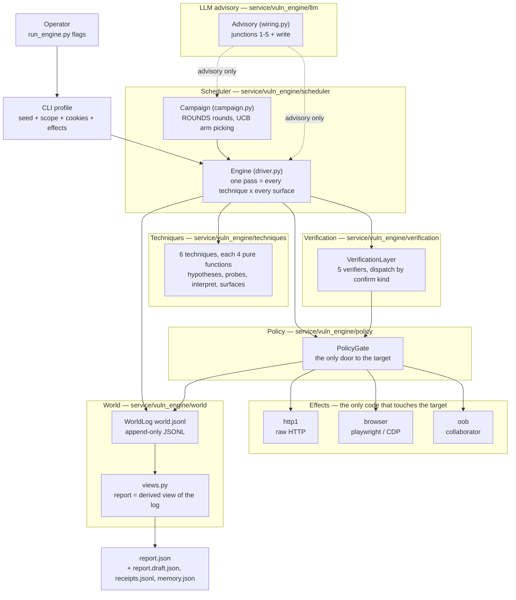
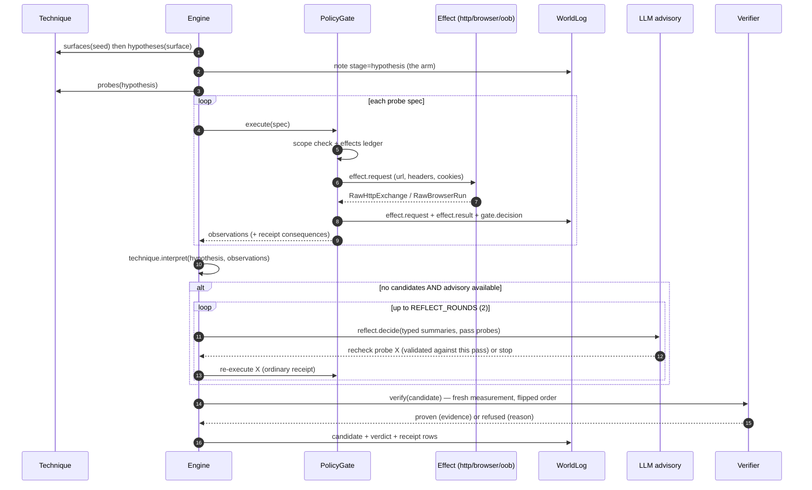
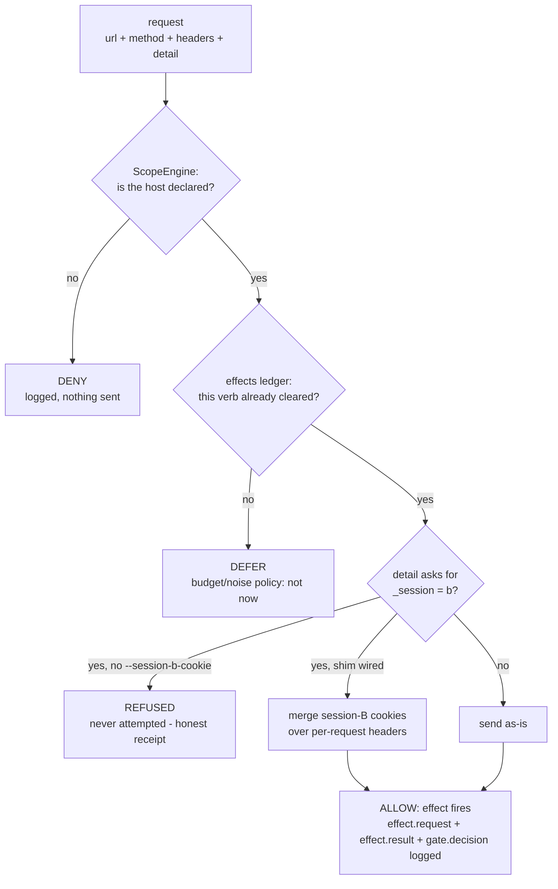
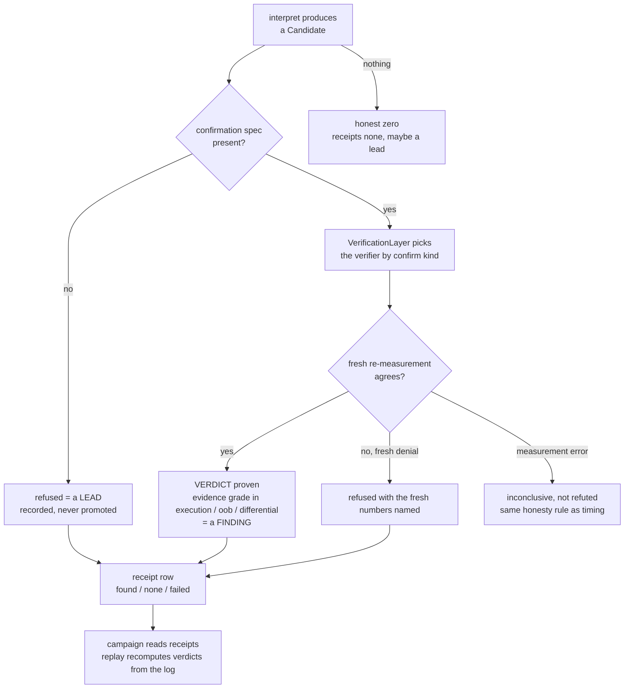
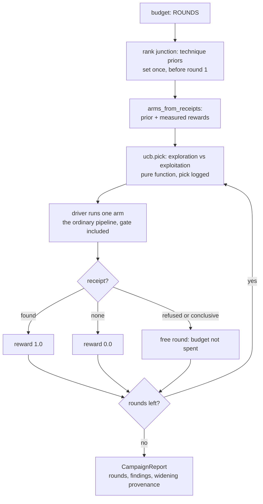
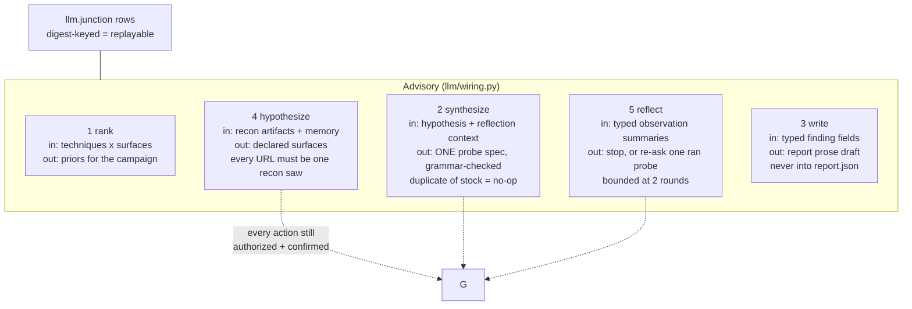
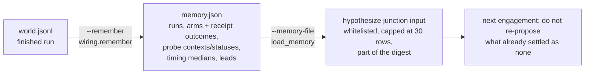

# The vuln engine, explained

A guided tour of `service/vuln_engine/` — what each piece is, how one probe
becomes one finding, and why the engine is built the way it is. Every claim
here is pinned by a test or by the code itself; file paths are given so you
can check. Companion docs: [`progress.md`](./progress.md) (the build log),
[`RnD_2026-09-25_smarter.md`](./RnD_2026-09-25_smarter.md) (the M1/M2/M3
addendum this implements).

---

## 1. The big picture

The engine is a *measuring instrument* for authorized bug-bounty work. You
(the operator) declare a target, the input surfaces worth testing, and the
sessions to test them with. Techniques propose hypotheses, the policy gate
authorizes every single request, verifiers confirm candidates independently,
and everything lands in one world log that the report is derived from.



The dashed arrows are the whole safety story: the model never drives. It
advises — ranks, proposes surfaces, synthesizes one payload shape, suggests a
re-ask, drafts prose — and every concrete action it influences still flows
through the ordinary gate and verifier.

---

## 2. The five invariants

Everything else is implementation; these are the design.

1. **The chokepoint.** Every packet that leaves the engine passes through
   `PolicyGate`. Techniques have no transports, verifiers go through the gate
   for their fresh measurements, the LLM has no tools at all.
2. **Evidence classes, not confidence.** `kernel/evidence.py` grades evidence
   `hypothesis < reflection < semantic < execution < oob < differential`, and
   only `execution`, `oob`, `differential` may support a finding. An LLM
   saying "looks like XSS" is a lead; a browser recording the script ran is a
   finding.
3. **Verification is a different measurement in kind.** A verifier may not
   read the proposer's evidence — only the candidate's *confirmation spec*
   (which URL / which payload). It re-measures fresh, through the gate, in a
   different order or class than the proposer used.
4. **One log.** The report cannot claim anything the world log does not
   contain. `world/views.py` derives findings, receipts, leads and report
   lines from `world.jsonl`; a replay recomputes decisions from the log
   offline (`--replay`).
5. **The model is quarantined and advisory.** Junctions see typed structural
   fields, never target response bodies. Answers are validated against fixed
   shapes; a drifted answer is a *degraded opinion*, not an exception. With
   no key configured, the engine runs byte-for-byte deterministically.

---

## 3. Directory map

| Path | What it is |
| --- | --- |
| `kernel/` | Shared vocabulary: `technique.py` (Surface, Hypothesis, ProbeSpec, capabilities), `evidence.py` (grades, oracles), `manifest.py`, `observation.py`, `verdict.py`, `exchange.py` |
| `techniques/` | One folder per technique; each holds `manifest.py` + four pure modules and a thin adapter class |
| `policy/gate.py` | The chokepoint: scope, effects ledger, per-request authorization, session shims |
| `transports/` | `http1`, `browser`, `oob` — raw effect implementations, no opinions |
| `scheduler/` | `driver.py` (one pass), `campaign.py` (multi-round), `ucb.py` (arm picking), `replay.py` |
| `verification/` | `VerificationLayer` + the five verifiers |
| `llm/` | Junction modules (pure) + `runtime.py` + `wiring.py` (the Advisory) + `client.py` |
| `world/` | `log.py` (append-only JSONL), `views.py` (report derivations), `observe.py` |
| `registry.py` | Alphabetical folder discovery; strict mode refuses manifests without postconditions |

---

## 4. A technique's anatomy

A technique is **four pure functions and a manifest** — no I/O anywhere. The
driver composes them; the technique never touches a transport.

| Function | Gets | Returns |
| --- | --- | --- |
| `surfaces(seed)` | the declared seed | the surfaces this technique fires on, filtered by *capability claim* |
| `hypotheses(surface)` | one surface | the testable claims ("param `id` delays the response") |
| `probes(hypothesis)` | one hypothesis | probe specs — url, method, payload, oracle, noise |
| `interpret(hypothesis, observations)` | the pass's observations | candidates, or nothing |

The manifest declares the technique's identity card: `vuln_class`,
`preconditions` (which capability claims it needs), `postconditions` (what it
proves — required, the registry refuses a technique without them),
`verification_needs` (the evidence class its confirmations must land in), and
a noise profile.

The six techniques today:

| Technique | Class | Fires on claim | Confirmed by |
| --- | --- | --- | --- |
| `xss_reflected` | reflected XSS | `response_reflects_input` / `public_param` | browser |
| `xss_dom` | DOM XSS | `public_param` (client-render lens) | browser |
| `xss_stored` | stored XSS | `persistent_storage` | stored runner (re-inject + browser) |
| `sqli_blind_time` | blind SQLi | `delayed_response` | timing (fresh differential) |
| `oob_fetch` | SSRF | `influence_remote_fetch` | oob (collaborator) |
| `idor_differential` | IDOR | `access_differs_by_session` | authorization (flipped sessions) |

---

## 5. The life of one arm

An **arm** is one technique × one surface. `_run_surface` in
`scheduler/driver.py` runs the whole cycle; this is the engine's heartbeat.



The reflect loop (M1) is the only new beat: it fires **only** when the pass
measured something and found nothing. Its recheck names a probe id from *this
pass's own grammar* — validated in `llm/reflect.py` and re-checked in the
driver — and the re-executed probe pays the ordinary gate like any other
request. Degraded in any direction (no key, refused answer, invented id,
`stop`), the loop never spins and the behavior is the one-pass engine
unchanged.

---

## 6. The policy gate

`policy/gate.py` is where authorization happens. Every request — proposer's,
verifier's, reflect's, synthesized — faces the same questions:



Details worth knowing:

- An IP-literal target must be a *declared address* (`--declare` /
  `target_profile`), never a domain — undeclared private space is refused.
- `effect.request` rows carry whitelisted detail only (`url`, `method`,
  `params`, `markers`, `session`) — bodies and secrets never reach the log.
- The session shims: `--cookie` is session A (sent on every request and page
  load), `--session-b-cookie` is session B, merged only for requests that
  explicitly ask for it. The IDOR technique is the first consumer.

---

## 7. Evidence, candidates, verdicts

`interpret` either finds a candidate or stays silent — silence is the honest
zero, and it is *common* (hardened targets answer everything with a 302).



The five verifiers and their confirmation shapes:

| Verifier | Confirm kind (constant) | What "fresh" means |
| --- | --- | --- |
| `browser` (BrowserVerifier) | `KIND_BROWSER_RUN` | a new browser run: script executed, dialogs, mutations |
| `oob` (OobVerifier) | `OOB_CONFIRM_KIND` | the collaborator really recorded the interaction |
| `timing` (TimingVerifier) | `TIMING_CONFIRM_KIND` | both populations re-measured fresh, margin required |
| `stored` (StoredXssVerifier) | `CONFIRM_STORED_EXECUTE` | payload re-injected, script proven on the read-back page |
| `authorization` (AuthorizationVerifier) | `authorization.differential` | both sessions re-asked **flipped**: B first, then A |

The flipped order is what makes the authorization confirmation a different
measurement in kind: a cache or ordering artifact that produced the proposer's
(A then B) pair will not reproduce it in reverse. The oracle is
`DIFFERENTIAL_SESSIONS = "two_sessions_one_object"` — technique and verifier
share the constant, and a test pins them together.

---

## 8. The world log

One JSONL file per run, append-only, the single source of truth.

| Event type | Written by | Meaning |
| --- | --- | --- |
| `run.begin` / `run.end` | driver | run boundaries, final counts |
| `note` | driver | hypotheses, reflect rechecks (`stage=reflect.recheck`), campaign notes |
| `effect.request` / `effect.result` | gate | what was sent, what came back (whitelisted fields) |
| `gate.decision` | gate | ALLOW / DENY / DEFER with the reason |
| `candidate` / `candidate.junction` | driver | what interpret (or the synthesize junction) proposed |
| `verdict` | verification | proven / refused, with evidence |
| `receipt` | driver | the arm ledger: found / none / failed |
| `llm.junction` | client | every model call, digest-keyed, input + answer on the record |
| `scheduler.pick` | campaign | which arm UCB picked and why |
| `campaign.widening` | campaign | the hypothesize junction's provenance when the seed was widened |

From these rows, `world/views.py` derives `gate_audit`, `findings`,
`leads`, `receipts_by_arm`, `report_lines` — and `--replay
output/vuln_engine/<target>/world.jsonl` recomputes a finished run's decisions
offline, no transports constructed at all.

---

## 9. The campaign

`--campaign ROUNDS` trades the exhaustive one-pass for a budgeted schedule:
each round, UCB picks the single most promising arm, the driver runs exactly
that arm, the receipts ledger updates.



The advisory-by-structure rule: a rank prior can lift an unproven arm toward a
measured one, but `Arm.ucb` **clamps the mean at `REWARD_FOUND`** — even a
hostile or simply wrong model opinion cannot outrank a measurement.
(`test_the_prior_never_outranks_a_measured_reward` pins it.)

---

## 10. The LLM advisory: five junctions and a pen

All junctions live in `service/vuln_engine/llm/`, each module pure (build
input → build prompt → validate answer → extract) with a thin runtime class in
`runtime.py` and the wiring in `wiring.py`. The client (`client.py`) is one
door: Groq's OpenAI-shaped endpoint by default (`openai/gpt-oss-20b`),
temperature 0, three attempts (429 with `Retry-After`, intermittent 413,
empty-content), and every call logged as an `llm.junction` row keyed by the
*content digest* of its input — so a replay finds cached opinions with the key
removed.



Validation is the bar, not eloquence: each junction's validator refuses
out-of-shape or invented answers (unknown technique names, URLs recon never
observed, probe ids the pass did not run, actions outside the fixed
vocabulary), and a refusal degrades the opinion whole — the engine continues
deterministically, the complaint lands in the log.

**Memory (M3)** is the cross-engagement slice of the same discipline:



`remember()` is deterministic distillation of the log — no model involved;
`_compact_memory` whitelists the fields the prompt may see, so even a
hand-edited memory file cannot bloat a prompt or smuggle prose into it.

---

## 11. Running it

```bash
# services (compose): fixture app :8080, DVWA :4280, collaborator :9009
docker compose up -d fixture_app dvwa oob_collaborator

# the Phase 1 exit criteria, LLM advisory on, memory written
python run_engine.py --fixture --llm-draft --remember --force

# DVWA blind SQLi: bootstrap prints the cookie header, then declare the surface
python docker/dvwa_bootstrap.py
python run_engine.py -t 127.0.0.1 \
  --surface "url=http://127.0.0.1:4280/vulnerabilities/sqli_blind/?Submit=Submit;param=id;capability=delayed_response" \
  --cookie "PHPSESSID=..." --cookie "security=low" \
  --llm-draft --remember --output-dir output/vuln_engine/dvwa

# IDOR: one object URL, two declared sessions
python run_engine.py -t 127.0.0.1 \
  --surface "url=http://127.0.0.1:8080/api/invoices/4821;capability=access_differs_by_session" \
  --cookie "session=a1b2c3d4e5f6" --session-b-cookie "session=9f8e7d6c5b4a" \
  --output-dir output/vuln_engine/idor_demo

# memory round trip: distill one target's log, feed it into the next run
python run_engine.py -t try.discourse.org --hypothesize-from-recon \
  --memory-file output/vuln_engine/discourse_campaign/memory.json --remember

# recompute a finished run offline
python run_engine.py --replay output/vuln_engine/127.0.0.1/world.jsonl
```

Each run is a directory under `output/vuln_engine/<target>/`:
`world.jsonl`, `report.json`, `report.draft.json` (model prose, flagged),
`receipts.jsonl`, `memory.json` (with `--remember`).

Environment: `VULN_ENGINE_LLM_API_KEY` (Groq) gates the advisory; without it
every junction degrades by design. `VULN_ENGINE_LLM_API_URL`, `_MODEL` and
`_MAX_COMPLETION_TOKENS` override the defaults. On this machine, Postgres
moved to port 5433 (the `platform` project squats 5432).

---

## 12. Where to read the code, in order

1. `kernel/technique.py` and `kernel/evidence.py` — the vocabulary; every
   later file speaks it.
2. `scheduler/driver.py` — `_run_surface` is §5 of this doc, in code.
3. `policy/gate.py` — the chokepoint and its ledger.
4. The verifier dispatch in `verification/__init__.py`, then
   `timing_verifier.py` and `authorization_verifier.py` for the two
   differential shapes.
5. `world/log.py` + `world/views.py` — why the report cannot lie.
6. `llm/client.py`, then any junction module (`reflect.py` is the smallest)
   — the pure-half pattern in miniature.
7. `techniques/sqli_blind_time/` then `techniques/idor_differential/` — a
   payload-family technique vs a two-session technique, same four functions.

### Tests as documentation

`tests/vuln_engine/conftest.py` builds the whole engine over fakes in
milliseconds — reading a test is often the fastest way to see a contract.
Three to start with: `test_the_reflect_loop_reasks_and_settles` (the reflect
wiring), `test_idor.py`'s full engine path (two sessions, end to end), and
`test_the_prior_never_outranks_a_measured_reward` (advisory, structurally).
