# The vuln engine, explained — a visual walkthrough

A learning companion to the vuln-engine docs. [`engine_view.md`](./engine_view.md)
is the **what**; this is the **why it feels obvious once you see it**. Every
section pairs a design idea with (a) a plain-language analogy, (b) a diagram,
and (c) a small piece of code that shows the shape of the thing at the level the
code actually lives.

It adds no new decisions. Where it shows code, it is showing the *proposed*
shape — `service/vuln_engine/` is stubs today (see [`engine_view.md`](./engine_view.md) §8),
so treat every snippet as a design sketch written in this repo's own idioms,
not as an implementation status report.

> **How to read this.** If you learn best from pictures: read the diagrams and
> the italic line under each one, and skip the code. If you learn by building:
> the code blocks are the ones that matter — they are written to be copy-paste
> plausible against the real `platform/` modules (dispatch, receipt, scoring,
> enrich, contract). The two paths meet at the worked example in §11.

**Where this sits among the other docs**

| File | Role |
|---|---|
| [`RnD.md`](./RnD.md) · [`RnD_2026-09.md`](./RnD_2026-09.md) | the literature passes — what the field learned |
| [`feasibility_notes.md`](./feasibility_notes.md) | the honest read — what survives contact with bug bounty |
| [`engine_principles.md`](./engine_principles.md) | the thesis — contracts, owned primitives, invariants |
| [`engine_view.md`](./engine_view.md) | the snapshot — the consolidated proposal |
| **this file** | the classroom — same proposal, taught |

---

## 0. The whole machine on one screen

Start here. Everything else in this document is a zoom-in on a box in this
picture.

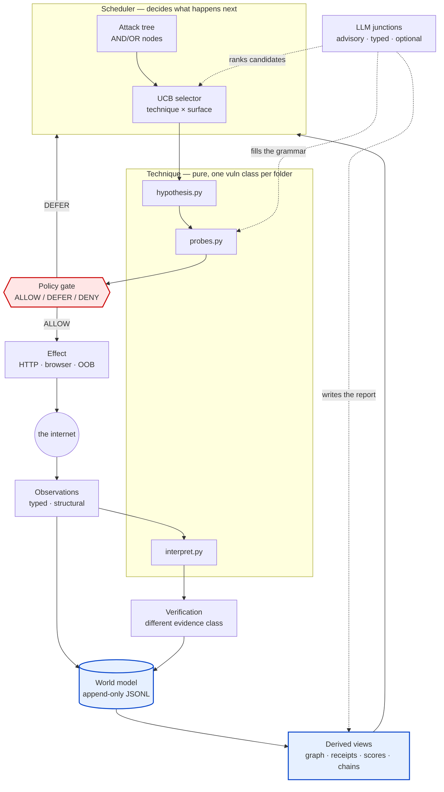

*The dashed lines are the only places an LLM exists. The red box is the only
door to the network. The blue boxes are the only place truth is stored.*

Read the picture as three lanes:

1. **Think lane (top)** — the scheduler and the techniques. Pure. No clock, no
   sockets, no LLM required.
2. **Act lane (middle)** — one chokepoint, then the wire.
3. **Remember lane (bottom)** — evidence in, derived views out, and the derived
   views feed the top lane back.

### The analogy for the whole thing: mission control, not a pilot

Most "AI pentest agent" designs put the model in the cockpit. This design puts
the model **on a phone line to the ground**, and the plane flies itself.

- The **autopilot and flight computer** are the deterministic engine: it holds
  the state, executes procedures, and stays on course.
- **Mission control** is the world model + scheduler: it sees the whole
  trajectory, not just the current gust.
- **Air traffic control** is the policy gate. No maneuver happens without a
  clearance, and every clearance is on tape.
- The **expert on the ground** is the LLM. You call them for three specific
  questions and then hang up. If the line drops, the plane does not crash — it
  flies the deterministic plan.

That last property is the whole thesis in one sentence: **the system is
complete without the model, and better with it.**

### Why this shape won, in numbers

The R&D converged on it from two directions ([`engine_view.md`](./engine_view.md) §1):

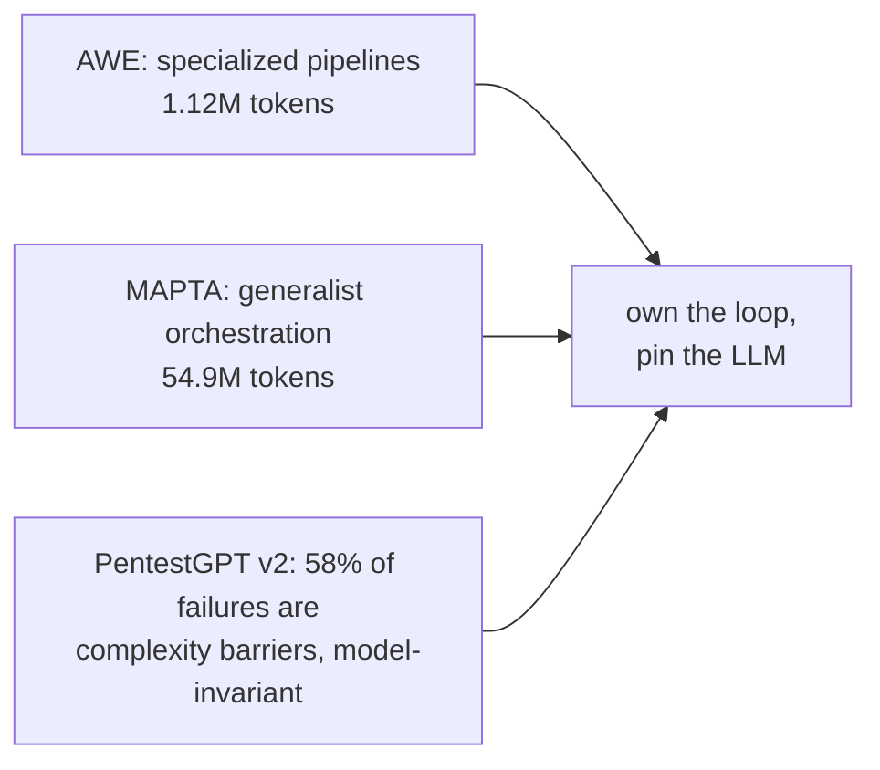

*One system matched the other's injection results at ~2% of the token cost; the
other big study said the failures aren't about model brains anyway. Both roads
lead to "own the harness, use the model narrowly."*

---

## 1. Rule one: generated is a lead, executed-and-observed is a finding

Before any architecture: one sentence that decides what counts as knowledge.

> **An LLM saying "that looks like XSS" is a lead. A browser recording that the
> script ran is a finding.**

### The analogy: a rumor versus a recording

- A **rumor** ("I heard the back door is unlocked") is worth acting on, but you
  never write it in the incident report as "the back door was unlocked."
- A **recording** (footage of the door opening) is a finding.

Both are useful. They are not the same category, and the failure mode of every
automated scanner is *blurring the two* — the GreyNoise "PoC pollution"
finding is exactly that blur happening at scale in public exploit repos.

*The design consequence:* every candidate carries an **evidence class** — how we
came to believe it — and the report keeps the class visible.

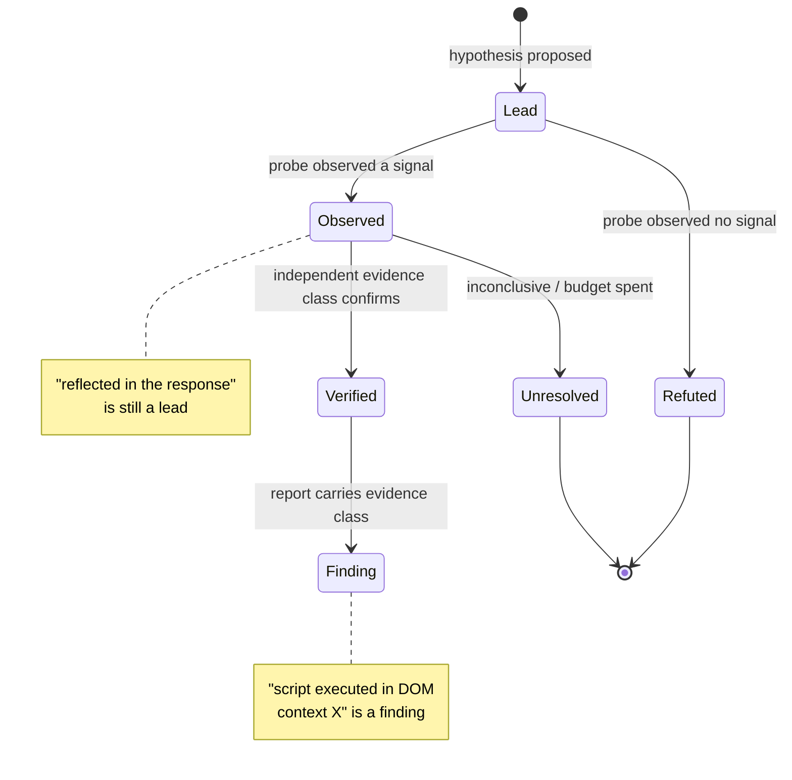

*A candidate's life. It only becomes a `Finding` by way of an independent
verifier — never by promotion from the thing that proposed it.*

### The code shape of an evidence class

The platform already has this instinct in `receipt.py`: only a **conclusive**
attempt earns a skip. The engine generalizes it — evidence is typed and graded,
never a blob.

```python
# service/vuln_engine/kernel/evidence.py  (proposed — sketch)
from __future__ import annotations

from dataclasses import dataclass


#: How we came to believe something. Ordered weakest to strongest for THIS
#: purpose: "did the thing actually happen?" — not for severity.
EVIDENCE_HYPOTHESIS = "hypothesis"        # an LLM or a rule said so
EVIDENCE_REFLECTION = "reflection"        # bytes came back, context unknown
EVIDENCE_SEMANTIC = "semantic"            # parsed/template context mapped
EVIDENCE_EXECUTION = "execution"          # a browser ran the script
EVIDENCE_OOB = "oob"                      # our own collaborator saw the interaction
EVIDENCE_DIFFERENTIAL = "differential"    # two authenticated states differed

#: The classes a *finding* may rest on. A hypothesis can never be one.
FINDING_GRADES = frozenset({EVIDENCE_EXECUTION, EVIDENCE_OOB, EVIDENCE_DIFFERENTIAL})


@dataclass(frozen=True)
class Evidence:
    """One observation, labeled with the class that produced it."""

    kind: str                        # an observation type (see §7.2)
    grade: str                       # one of the EVIDENCE_* constants
    payload: dict                    # typed fields — never raw bytes
    at: float = 0.0                  # set by the caller; modules stay clock-free

    @property
    def sufficient_for_finding(self) -> bool:
        return self.grade in FINDING_GRADES

    def to_dict(self) -> dict:
        return {"kind": self.kind, "grade": self.grade, "payload": self.payload, "at": self.at}
```

Two things to notice, because they show up everywhere:

- `at` is a **parameter**, not `time.time()`. That is the "pure at the
  boundary" invariant — a module that reads the clock cannot be replayed, and
  replay is how the whole engine is tested offline.
- `payload` is a `dict` of typed fields, not `str`. "Never raw text blobs"
  (contract three) starts right here.

---

## 2. Rule two: verification must use a different evidence class

> **The thing that proposes cannot be the thing that confirms.**

### The analogy: two auditors, different firms

If one accountant both writes the books and signs off on them, you have not
audited anything — you have a closed loop that can be *confidently wrong*.
Independent verification is not paranoia; it is the entire reason the number is
trustworthy.

The 2026 literature landed on exactly this from two independent systems:
AWE's browser-backed verification, and MAPTA's context-isolated validation
agent. The rule this engine adopts:

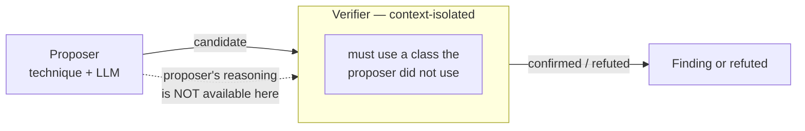

*The verifier is walled off from the proposer's reasoning. It never reads "I
think this is XSS because…"; it reads the raw observation and answers a
narrower question: did the effect actually occur?*

```python
# service/vuln_engine/kernel/verdict.py  (proposed — sketch)
from __future__ import annotations

from dataclasses import dataclass

from .evidence import Evidence, FINDING_GRADES


@dataclass(frozen=True)
class Verdict:
    """The verifier's answer.  Deliberately narrow: proven or not."""

    candidate_id: str
    proven: bool
    evidence: Evidence            # the *verifier's* evidence, not the proposer's
    reason: str = ""

    @staticmethod
    def check_independence(candidate_grade: str, evidence: Evidence) -> None:
        """Refuse a verdict that reuses the proposer's evidence class.

        This is invariant #8 of engine_principles.md §5 made executable.  It is
        cheap, and it is the single check that stops the closed FP loop.
        """
        if evidence.grade == candidate_grade:
            raise ValueError(
                f"verification reuses the proposer's evidence class ({evidence.grade!r}); "
                "choose a different class or report a lead, not a finding"
            )
        if not evidence.grade in FINDING_GRADES:
            raise ValueError(f"grade {evidence.grade!r} cannot support a finding")
```

---

## 3. The six contracts

The "puzzle" constraint — loosely coupled, independently replaceable modules —
is made structural by five contracts plus a memory, each with one job and one
hard rule. Same trick as the recon platform: **add a folder, get a pipeline,
discovered at runtime** (`platform/contract.py`, `platform/registry.py`).

| Contract | Owns | Hard rule |
|---|---|---|
| **Effect** | all I/O: HTTP, browser, OOB | *only* path to the network; passes the gate |
| **Observation** | typed structural readings | never raw text blobs |
| **Technique** | one vuln class: hypothesis → probe-spec → interpretation | pure; no I/O, no clock, no LLM |
| **Verification** | independent confirmation | different evidence class than the proposer |
| **Scheduler** | ordering, budgets, pruning | no technique internals, no network |
| **World model** | append-only log + derived views | no mutable state anywhere else |

### The analogy: a restaurant kitchen

| Contract | Kitchen role | The rule in kitchen words |
|---|---|---|
| Effect | the stove and the delivery door | every ingredient enters through one door |
| Observation | the labeled containers | never a mystery tub in the walk-in |
| Technique | the recipe cards | a card is not a cook — it never turns on the stove |
| Verification | the health inspector | never the chef who cooked the dish |
| Scheduler | the head chef's ticket rail | orders dishes, doesn't know how to make them |
| World model | the inventory ledger | everything is written down, nothing lives in memory |

*The "puzzle" property is Lego, not welded steel: every brick snaps out and a
different one snaps in without touching the other bricks.*

### Why "pure technique" is not academic purity

A recipe card is **identical every time you read it**. That is the entire
payoff:

- **You can test it without cooking.** Feed a recorded kitchen (a replay
  fixture) into `interpret.py`; assert on the output. No network, no clock,
  no flakiness.
- **Two runs of the same evidence produce the same decision.** When a run
  behaves strangely, you can reproduce it exactly.
- **You can delete it.** If SSTI is broken, delete `techniques/ssti/` and the
  engine runs exactly as before.

### A single probe round, as a sequence

This one diagram is the heartbeat of the engine:

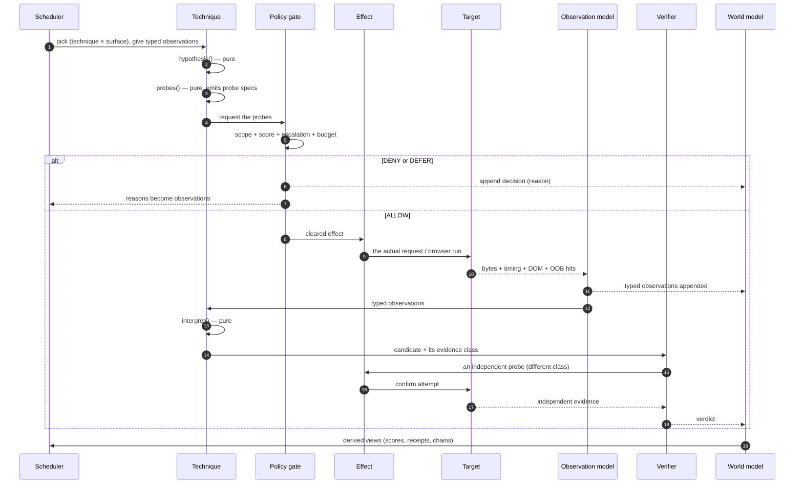

*Notice the scheduler never talks to the network, the technique never talks to
the network, and the gate never lets anything through without writing down why.*

---

## 4. The chokepoint: one door, every bag

> **There is exactly one code path to the network.**

This is the design's load-bearing safety idea, and it is already built on the
recon side: `platform/dispatch.py` answers `ALLOW` / `DEFER` / `DENY` with a
reason, denies by default, and audits every call.

### The analogy: airport security

You can add as many passengers (modules) as you like. There is one security
lane. Every bag is scanned. Every denial is logged with a reason. A module that
cannot reach the wire directly **cannot bypass scope** — not because it is
polite, but because it has no socket.

### The decision tree, as the code actually decides

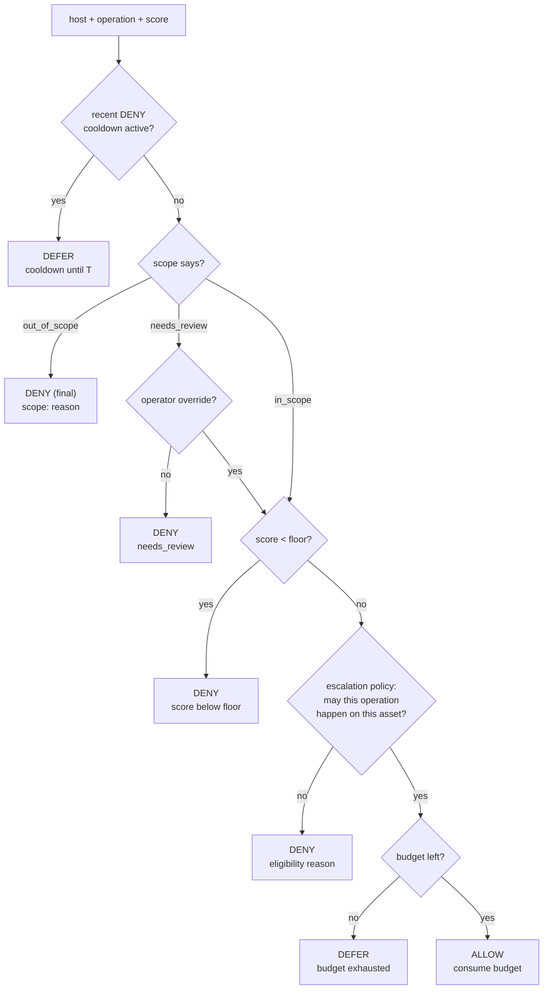

*Straight from `Dispatcher.decide()`. Scope is checked first because it can
never be scored away; budgets are checked last so a refused operation costs
nothing.*

### The policy wrapper: how a technique gets to the wire

Techniques never import `dispatch`. They declare an intended effect and the
policy layer is the only thing that calls transport. This is the seam:

```python
# service/vuln_engine/policy/gate.py  (proposed — sketch, wraps the real Dispatcher)
from __future__ import annotations

from dataclasses import dataclass

from service.recon_pipeline.platform import dispatch


@dataclass(frozen=True)
class EffectRequest:
    """What a technique wants done — a *description*, not a call."""

    kind: str                  # "http.request" | "browser.run" | "oob.allocate"
    host: str
    operation: str             # the escalation vocabulary: "url_validation", …
    detail: dict               # method, path, headers, body, timeout…
    noise: "NoiseProfile"      # what it will cost in visibility (see §7.5)


class PolicyGate:
    """The one and only caller of Effect.  Wraps platform dispatch verbatim."""

    def __init__(self, dispatcher: dispatch.Dispatcher, effect) -> None:
        self._dispatcher = dispatcher
        self._effect = effect

    def run(self, req: EffectRequest):
        """Decide, then (only then) execute.  DENY and DEFER are observations."""
        decision = self._dispatcher.decide(
            req.host,
            operation=req.operation,
            evidence_state=req.detail.get("evidence_state", ""),
            has_service_evidence=bool(req.detail.get("service_evidence")),
        )
        if decision.verb != dispatch.ALLOW:
            # A DENY is not a failure to swallow — it is evidence the planner
            # learns from (`engine_principles.md` §3.2 / engine_view §4.2).
            return {"verb": decision.verb, "reason": decision.reason, "observation": None}
        return {"verb": decision.verb, "reason": decision.reason,
                "observation": self._effect.perform(req)}
```

The DENY-as-observation detail is one of the design's **own contributions** —
no system in the R&D survey has an authorization regime this strict, so nobody
has solved "the planner should learn from refusals." Here a refusal is just
another typed observation in the log.

---

## 5. The LLM's position: three phone calls, all optional

The model appears at exactly **three named, typed junctions**
([`engine_principles.md`](./engine_principles.md) §1.2), and never anywhere else:

| Junction | Question | Why the model is safe here |
|---|---|---|
| **Rank** | which candidate deserves the next unit of budget? | advisory to a deterministic UCB — it can only nudge |
| **Synthesize** | fill this grammar with a payload | the grammar validates before anything is sent |
| **Write** | turn structured evidence into prose | one-way, from typed data to text |

### The analogy: the consultant on call

You keep one expert on retainer. You call them for three things — "which of
these looks most promising?", "how would you phrase this within these rules?",
"write this up" — and **you never let them drive**. If they stop answering,
your business does not stop; it reverts to the checklist on the wall.

That last clause is a real contract, not a nicety: **no key means deterministic
behavior, never silence.** The recon side already implements exactly this in
`platform/enrich.py` — `available=False` and a `no-opinion` label instead of an
exception. The engine inherits the pattern.

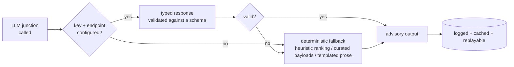

*Every junction has a deterministic floor. The engine never has a mode where it
is waiting on a model to be useful.*

### The dangerous junction, and the seatbelt

"Generate a payload against a live third-party target" is the highest-risk
action in the whole design ([`feasibility_notes.md`](./feasibility_notes.md) §7).
The seatbelt is the **grammar**: the technique decides *what shapes are legal*,
and the model can only fill blanks. Free-form generation is parked explicitly.

### The analogy: mad libs, not a blank page

- **Blank page:** "Write an exploit for this target." Unbounded output, real
  target, no validation → this is PoC pollution waiting to happen.
- **Mad libs:** `{"context": <quoted_attribute>, "payload": <STRING∈grammar>}`.
  The model fills the blanks; the form rejects anything that does not fit.

```python
# service/vuln_engine/llm/junctions.py  (proposed — sketch, mirrors enrich.py)
from __future__ import annotations

from dataclasses import dataclass


@dataclass
class Advisory:
    """A junction's answer, or the honest no-opinion."""

    value: object | None
    source: str = "deterministic"   # "deterministic" | "llm"
    reason: str = ""


class Synthesizer:
    """Junction 2 — payload synthesis *inside* a technique's grammar."""

    def __init__(self, client=None, grammar=None) -> None:
        self._client = client
        self._grammar = grammar or {}

    def fill(self, context: dict, *, fallback: list[str]) -> Advisory:
        """Propose payloads for *context*; validate against the grammar.

        Two independent safety gates:
          1. the model may only emit values from the grammar's alphabet;
          2. the fallback list is curated and always available, so a missing
             key, a timeout or a malformed answer is a *downgrade*, not a stall.
        """
        if self._client is None:
            return Advisory(value=fallback, reason="no LLM key; curated payloads")
        try:
            raw = self._client.complete_json(self._grammar["prompt"], context)
        except Exception as exc:                      # noqa: BLE001 — degrade, never raise
            return Advisory(value=fallback, source="deterministic", reason=f"llm unavailable: {exc}")
        valid = [p for p in raw.get("payloads", []) if self._grammar_accepts(p)]
        if not valid:
            return Advisory(value=fallback, reason="model output failed grammar validation")
        return Advisory(value=valid, source="llm")

    def _grammar_accepts(self, payload: str) -> bool:
        """The seatbelt.  Grammar-validated before Effect ever sees a byte."""
        return all(token in self._grammar.get("alphabet", "") for token in payload)
```

*Two gates, one fallback: the attack surface of a hallucinating model shrinks
to the grammar's alphabet, and its absence is a downgrade rather than an
outage.*

---

## 6. Owned primitives: where the edge actually is

Every published system surveyed wraps readymade tools (nuclei, sqlmap, nmap)
behind an agent loop. That passes the bar and stops there. The sharper argument:
**the highest-value technique families are structurally closed to wrapper
architectures** — not "worse with a wrapper," but *impossible*.

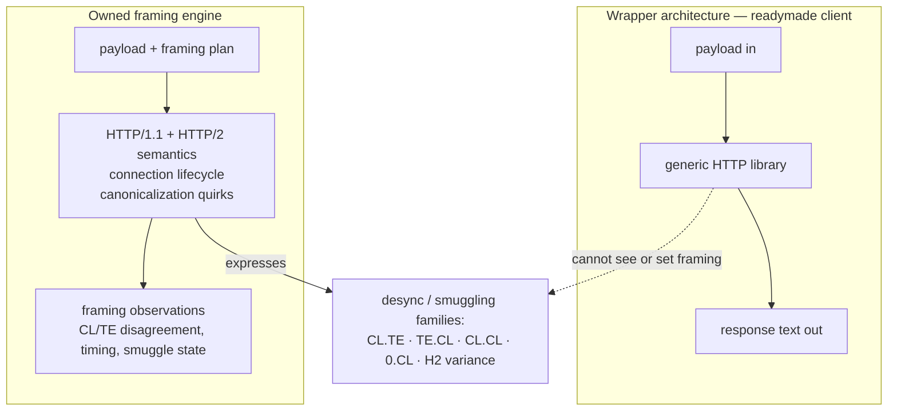

*A client you cannot open the hood on cannot inspect its own engine — and
smuggling research is entirely about the engine.*

### 6.1 The analogy: you cannot fix a window from the sidewalk

A generic HTTP library hands you a window's **view**: "status 200, this HTML."
It does not let you touch the **frame**: header order, connection reuse across a
smuggled-request boundary, whether `Content-Length` or `Transfer-Encoding` wins.
Desync attacks live entirely in the frame. So a scanner built on the library
cannot run the probes — at any price. Owning the stack is the only way in.

*Secondary payoff:* one client means one coherent traffic identity. No
subprocess-spawn shapes, no mixed library fingerprints between phases.

### 6.2 Structural observations: the lab report, not the sample

This is the least glamorous and most load-bearing primitive. The rule is
"never raw text," which sounds abstract until the analogy lands:

> A doctor does not hand you a photograph of the swamp the nurse scooped out of
> your arm. The lab returns **numbers with units and labels**: potassium 4.2
> mmol/L.

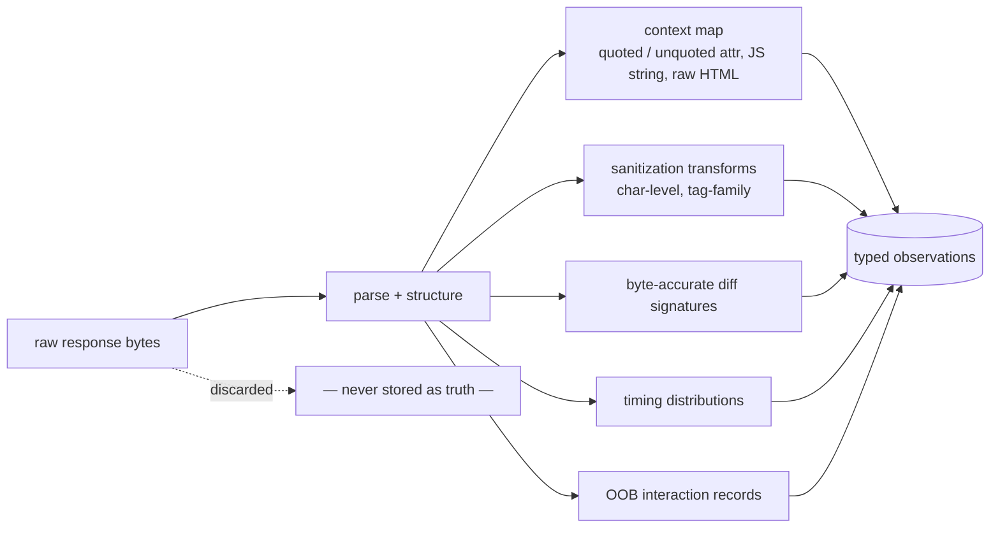

*Why it pays twice: (1) **learning** — a memory layer can generalize over
"double-quoted attribute" but not over HTML soup; (2) **verification** — "script
executed in DOM context X after mutation Y" is only expressible if the
observation model has those words. AWE's filter-inference step is this idea
applied to one vuln class; done at platform level it applies to all of them.*

### 6.3 Probe grammar: exercises with blanks

Templates-as-data (Nuclei's real breakthrough) made techniques enumerable and
diffable. The next step is a **declarative probe grammar + interpreter**:
parameter positions, context constraints, mutation operators, oracle predicates.
Then the engine can *enumerate and mutate* the space the template author never
wrote — which is how a small technique library covers a large probe space.

### 6.4 The instrumented browser and your own OOB collaborator

Two components that must be owned, not borrowed:

- **Instrumented browser** — hooked at the DOM/JS API level (script execution,
  mutations, dialogs), not screenshot-level tooling. It is *loud*; it goes
  through stealth pacing like everything else.
- **Self-hosted OOB correlator** — per-probe unique identifiers, so an inbound
  DNS/HTTP interaction becomes a first-class observation. Blind classes (SSRF,
  blind SQLi, XXE) have no other evidence class strong enough for a finding.

### 6.5 Noise-budgeted scheduling: the objective nobody optimizes

Every published system optimizes tokens or wall-clock. Neither is the right
objective for an operator who **can afford to wait weeks but cannot afford to
look like a scanner**.

### The analogy: the alert meter in a stealth game

In a stealth game your goal is not "finish fast" — it is "finish without filling
the alert bar." Every action raises it; some raise it a lot. The mission becomes
**maximize progress per unit of heat.**

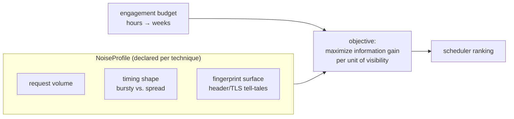

*The recon side already paces DNS across ~11 hourly windows. This generalizes
that from a DNS budget to the engine's **core scheduling objective**. As far as
the 2026 literature shows, no surveyed system does this — it is the open
differentiator.*

Hovering over open question #3 in [`engine_view.md`](./engine_view.md) §6: the
units of "visibility" are not settled. A plausible formulation (and why it
matters) —

```python
# service/vuln_engine/kernel/noise.py  (proposed — sketch, units are an OPEN question)
from __future__ import annotations

from dataclasses import dataclass


@dataclass(frozen=True)
class NoiseProfile:
    """What a technique costs in visibility.  Declared, never measured post-hoc."""

    requests_per_surface: int          # raw volume
    burstiness: float                  # 0.0 steady … 1.0 machine-gun
    fingerprint_distance: float        # 0.0 = house identity … 1.0 = distinctive
    requires_browser: bool = False     # browsers are the loudest thing we own

    @property
    def cost(self) -> float:
        """A first cut at a scalar.  Deliberately simple until §6 open question 3 lands."""
        return (
            self.requests_per_surface
            * (1.0 + self.burstiness)
            * (1.0 + self.fingerprint_distance)
            * (3.0 if self.requires_browser else 1.0)
        )
```

*The comment is the point: the shape of the declaration is decided (every
technique declares a profile), the units are not. The doc is honest about which
is which.*

---

## 7. Scheduling: attack tree, UCB, and difficulty

Three mechanisms, one job: **spend the next unit of budget where it buys the
most**.

### 7.1 The attack tree — the plan is a structure, not a diary

The first R&D pass had a tension ([`feasibility_notes.md`](./feasibility_notes.md) §10):
GoalAct's plan is a **linear transcript**, STRUCTUREDAGENT's and VulnBot's are
**trees/DAGs**, and they do not compose. The 2026 evidence (EGATS) put
difficulty-aware **tree search** ahead of linear replanning on long horizons. So
the tree wins — and the transcript survives as a *propose mechanism inside a
node*.

### The analogy: a heist plan

To open the vault you need a **keycard AND a guard schedule**. To get a keycard
you can **pickpocket OR bribe OR clone a reader**. That plan is a small
AND/OR graph, and it is obviously not a diary — the order isn't the point, the
*dependencies* are.

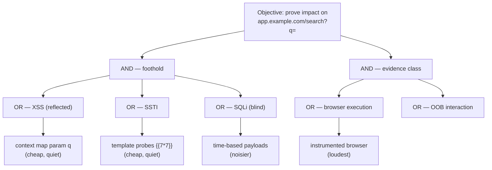

*AND = a kill-chain precondition set (must have this *and* that). OR =
alternative techniques for one objective. Failure back-propagates: a failed OR
branch marks the node and moves on; an unreachable AND node parks the subtree.*

### 7.2 UCB — the lunch problem

### The analogy: picking lunch

You have favorite spots (exploit) and a list of untried ones (explore). A good
policy: *try the untried place once, revisit the proven one often, and
occasionally re-test a flop in case it improved.* That is an upper-confidence
bound — "rank by the optimistic estimate of what this arm could be worth" — and
it automatically forces exploration without any explicit exploration budget.

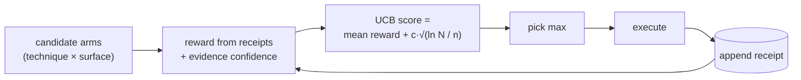

*The right-hand term is the optimism: an arm tried zero times has an infinite
upper bound and therefore gets tried. As `n` grows, the estimate cools toward
its real mean — explore early, exploit late, with no schedule to tune.*

```python
# service/vuln_engine/scheduler/ucb.py  (proposed — sketch, pure math)
from __future__ import annotations

import math
from dataclasses import dataclass


@dataclass(frozen=True)
class Arm:
    """One (technique × surface) choice.  History comes from receipts, not from here."""

    technique: str
    surface: str
    throws: int = 0          # times attempted (from the receipts ledger)
    rewards: float = 0.0     # accumulated reward (conclusive successes, graded)
    prior: float = 0.0       # TDA evidence confidence for this surface

    def ucb(self, total_throws: int, c: float = 1.4) -> float:
        """Optimistic estimate.  Pure: same inputs, same number, always."""
        if self.throws == 0:
            return float("inf")          # an untried arm always wins once
        mean = (self.rewards + self.prior) / self.throws
        return mean + c * math.sqrt(math.log(max(total_throws, 1)) / self.throws)


def pick(arms: list[Arm], *, noise: dict[str, "NoiseProfile | None"] = None) -> Arm | None:
    """Highest upper bound, adjusted for what the attempt will cost in visibility.

    The `noise` term is the design's own addition: the reward is *information
    gain*, and the denominator is what the attempt will cost the campaign's
    signature.  Nobody in the surveyed literature optimizes this.
    """
    if not arms:
        return None
    total = sum(arm.throws for arm in arms) or 1
    def score(arm: Arm) -> float:
        profile = (noise or {}).get(arm.technique)
        cost = profile.cost if profile else 1.0
        return arm.ucb(total) / cost
    return max(arms, key=score)
```

### 7.3 Difficulty assessment — the finding that cut failures 58% → 27%

PentestGPT v2's **Task Difficulty Assessment** scores every decision on four
real-time signals, and the recon side already collects most of them:

| TDA dimension | Where it already exists on the recon side |
|---|---|
| horizon estimation | frontier/round data — how deep into the loop we are |
| evidence confidence | the S2 scorer (`scoring.py`) — 6,815+ scored nodes |
| context load | measurable: how much state a decision needs |
| historical success | the receipts ledger (`receipt.py`) |

*A difficulty-aware plan is one that spends fewer expensive probes on
low-confidence, long-horizon branches — and the reason it helps is exactly the
stealth objective: cheap doubts first.*

---

## 8. Memory: a scratchpad and a diary

Two tiers, deliberately different in kind:

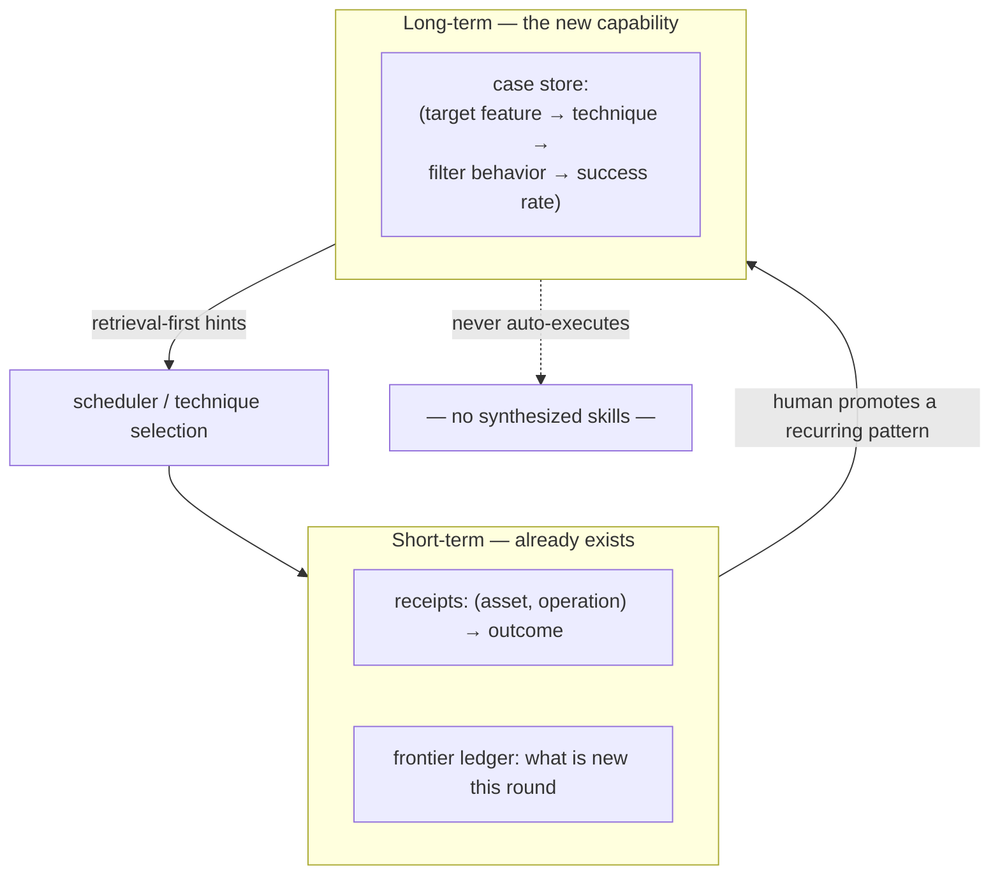

*Short-term is the **coffee-shop punch card**: one stamp per drink; and
critically, a machine that was broken earns no stamp.* Long-term is the
**diary**: "every time I ordered the seasonal latte from this shop it took
fifteen minutes" — consulted, never obeyed blindly.

The punch-card subtlety is real and already implemented in `receipt.py`:

```python
# from service/recon_pipeline/platform/receipt.py — the rule the engine inherits
OUTCOME_NONE = "none"        # we looked, nothing was there   → conclusive
OUTCOME_FOUND = "found"      # we looked, and there it was    → conclusive
OUTCOME_FAILED = "failed"    # the scan errored               → NOT conclusive

#: Attempts that must not be treated as "done" next round.
INCONCLUSIVE: frozenset[str] = frozenset({OUTCOME_FAILED, ""})
```

*Why this matters: recording a failure as an attempt would be the receipt
**quietly inventing knowledge we do not have**. An address whose scan errored
has not been examined — a later round must be free to look again.*

The long-term tier is what the field calls **memory-as-state, not
skills-as-code** (Memento, MemSkill): store what worked, with the situation it
worked in, and retrieve it. Auto-synthesized skills stay parked — a frozen skill
in a world that moves is a stale assumption wearing a name.

---

## 9. Intel and chaining: a CVE is just another node

### The analogy: the intel bulletin and the map

- **CVE ingestion** is the bulletin board: OSV/GHSA, EPSS, KEV, plus the
  *early* signals (public PoC availability, weaponization chatter, patch
  availability). Early signals matter because **EPSS is a late signal** — its
  median movement is 121× larger *after* KEV listing than before. EPSS confirms
  risk; it does not warn of it.
- **Chaining** is the map: techniques declare preconditions and postconditions
  in their manifests, so "can A's output feed B's input?" is a **computed
  query over the world model**, not an LLM's imaginative mood.

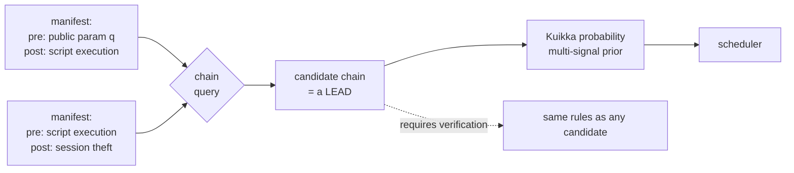

*Kuikka et al.'s contribution is turning "which of 400 candidate chains do we
spend the next hour on?" from an LLM judgment call into a **computed quantity**
that can be explained: "this chain is prioritized because four independent paths
converge on this host with combined probability 0.31." Chains are leads until
verified — the rule from §1 applies unchanged.*

---

## 10. Reporting and the one metric that matters

The headline metric is not "vulnerabilities found." It is **valid-submission
rate** — the fraction of reports that survive triage. ARTEMIS's 82% is the bar
that made an autonomous agent credible against ten human pentesters.

| Volume metric | Precision metric |
|---|---|
| "we found 400 potential issues" | "we found 9, and 82% were valid" |
| invites triage burden | earns trust |
| what a scanner does | what a colleague does |

*The report states what was proven, how, and with what reproducibility — and
carries the evidence class of each finding, so a reader can tell the difference
between "the browser ran the script" and "the string came back in the HTML."*

---

## 11. Worked example: one reflected-XSS candidate, end to end

Everything above, in motion, on a single surface. Target:
`https://app.example.com/search?q=hello` (in scope, score 72).

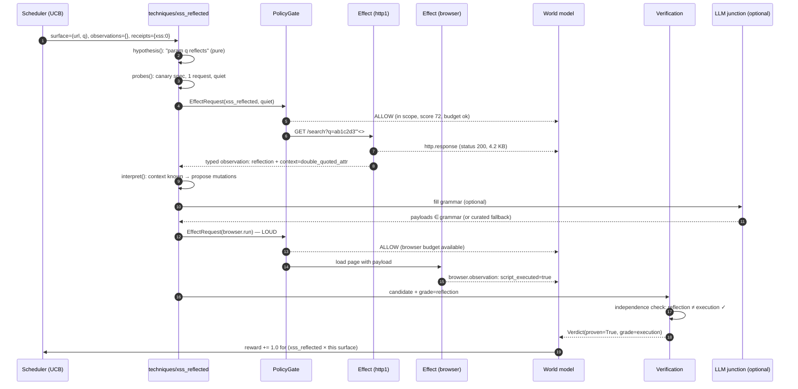

### The probe spec the technique emitted (pure, no I/O)

```json
{
  "technique": "xss_reflected",
  "surface": {"url": "https://app.example.com/search", "param": "q", "where": "query"},
  "probes": [
    {
      "id": "canary-01",
      "mutation": "replace",
      "value": "ab1c2d3\"'<>",
      "context_constraints": [],
      "oracle": "reflection_at_least_once",
      "noise": {"requests_per_surface": 1, "burstiness": 0.0,
                "fingerprint_distance": 0.0, "requires_browser": false}
    },
    {
      "id": "exec-01",
      "mutation": "if_context_is",
      "when": {"context": "double_quoted_attribute"},
      "value_candidates": ["\"><script>confirm(1)</script>", "\" onmouseover=confirm(1) x=\""],
      "oracle": "script_execution",
      "noise": {"requests_per_surface": 1, "burstiness": 0.0,
                "fingerprint_distance": 0.0, "requires_browser": true}
    }
  ]
}
```

*Two probes, and notice how much structure is in them: a **context constraint**
(`when`), an **oracle predicate** (`script_execution`, not "looks bad"), and a
**noise declaration** per probe. That is the grammar from §6.3 doing its job —
and it is exactly the surface an LLM is allowed to fill.*

### What lands in the world model (the JSONL rows)

```jsonl
{"type":"effect.request","technique":"xss_reflected","probe":"canary-01","host":"app.example.com","operation":"url_validation","at":1760000000.1}
{"type":"gate.decision","host":"app.example.com","verb":"ALLOW","reason":"in scope and within budget","at":1760000000.1}
{"type":"observation.http","probe":"canary-01","status":200,"bytes":4312,"reflection":true,"context":"double_quoted_attribute","at":1760000000.9}
{"type":"gate.decision","host":"app.example.com","verb":"ALLOW","reason":"in scope and within budget","at":1760000010.0}
{"type":"observation.browser","probe":"exec-01","script_executed":true,"dom_mutation":"none","dialogs":["confirm"],"at":1760000013.4}
{"type":"verdict","candidate":"xss_reflected:app.example.com:/search:q","proven":true,"grade":"execution","proposer_grade":"reflection","at":1760000013.5}
{"type":"receipt","asset":"url:https://app.example.com/search?q=","operation":"xss_reflected","outcome":"found","at":1760000013.6}
```

*One line per atomic fact, append-only, replayable. From this log alone, an
offline test can reproduce every downstream decision — which is why the log
*is* the environment for testing.*

### The report line it becomes

> **Reflected XSS in `q` on `/search`** — Confirmed by browser execution
> (script ran; `confirm` dialog triggered in a double-quoted attribute
> context). Probes: one canary, one context-targeted payload. Reproducible:
> `https://app.example.com/search?q=%22%3E%3Cscript%3Econfirm(1)%3C/script%3E`.
> Evidence class: execution.

*What is proven, how, with what reproducibility — the reporting rule from §10,
applied.*

---

## 12. Adding a technique: the eight-item checklist

The contract's acid test, from [`engine_principles.md`](./engine_principles.md) §5:
**adding SSTI must never require editing anything outside `techniques/ssti/`.**
If it does, the contract is wrong — not the technique.

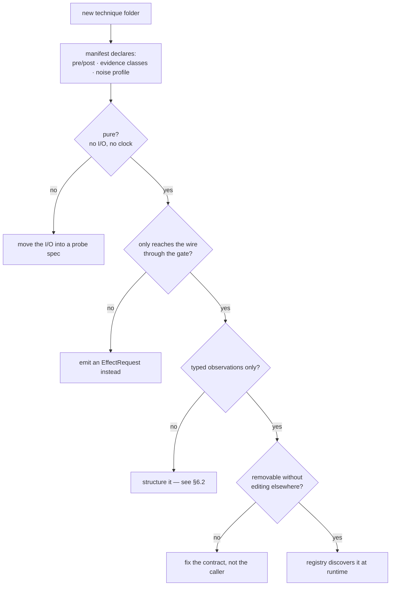

```
service/vuln_engine/
  kernel/        contracts only — Effect, Observation, Technique, Verdict,
                 Budget, Evidence, NoiseProfile          (no logic)
  transports/    http1 · http2 · browser · oob           (capability-reporting)
  techniques/    <class>/ hypothesis.py · probes.py · interpret.py · manifest.json
  verification/  browser-runner · differential · oob-correlator
  scheduler/     attack tree + UCB over receipts/history, noise-budgeted
  world/         append-only JSONL event log + derived views
  memory/        case store keyed by structural features, not targets
  llm/           typed junctions + prompt registry + replay cache
  policy/        wraps platform dispatch; sole caller of Effect
```

*Same contract as `pipelines/`: the folder is the registration. Compare
`service/recon_pipeline/pipelines/url_endpoint/contract.py` — a manifest and a
class, discovered by walking a directory.*

### A technique manifest, in the shape the engine needs

```python
# service/vuln_engine/techniques/xss_reflected/manifest.py  (proposed — sketch)
from __future__ import annotations

from dataclasses import dataclass, field


@dataclass(frozen=True)
class TechniqueManifest:
    """What a technique must declare to be discoverable and schedulable.

    Mirrors the recon side's `Manifest` (contract.py): declarative, in the
    folder, validated at discovery.  Pre/postconditions are what make *chaining
    a data query* instead of an LLM guess (§9).
    """

    name: str
    vuln_class: str
    #: What the world must look like for this to be worth trying.
    preconditions: tuple[str, ...] = ()
    #: What it establishes when it succeeds — the chain edges.
    postconditions: tuple[str, ...] = ()
    #: Which evidence classes this technique can *produce*.
    produces: tuple[str, ...] = ()
    #: Which class a verifier must use to confirm it (invariant #8).
    verification_needs: str = ""
    #: What it costs in visibility (§6.5).
    noise: "NoiseProfile | None" = None
    transports: tuple[str, ...] = ("http1",)     # capability requirements
```

```python
XSS_MANIFEST = TechniqueManifest(
    name="xss_reflected",
    vuln_class="xss",
    preconditions=("public_param", "http_response_reflects_input"),
    postconditions=("script_execution",),
    produces=("reflection", "context_map"),
    verification_needs="execution",          # browser, not the proposer's reflection
    noise=NoiseProfile(requests_per_surface=2, burstiness=0.0,
                       fingerprint_distance=0.0, requires_browser=True),
    transports=("http1", "browser"),
)
```

---

## 13. What is decided, and what is still open

The distinction the docs are careful about: **invariants are binding, decisions
are not made.**

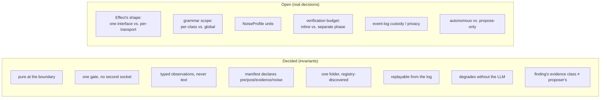

*Every invariant has a cheap test (see §14). Every open question is a decision
someone still has to make — and three of them (Effect's shape, grammar scope,
NoiseProfile units) block the next tier of the build order.*

### Build order, as a dependency chain

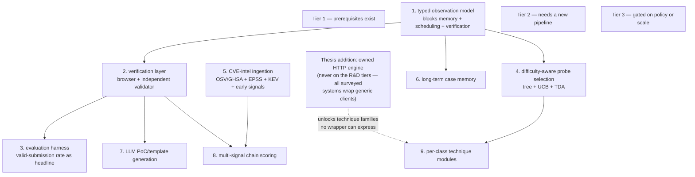

*Step 1 is the observation model — it gates memory, scheduling and verification
simultaneously, which is why it was upgraded from "a schema" to "the first thing
you build."*

---

## 14. Cheat sheet

### The invariants, each with the test that proves it

| Invariant | The cheap test |
|---|---|
| Pure at the boundary | `grep -r "time\.\|requests\.\|socket\." techniques/` returns nothing |
| One gate, one socket | no module outside `policy/` imports a transport |
| Typed observations | no `Observation` payload typed as `str` |
| Manifest completeness | discovery fails loudly on a manifest missing `postconditions` |
| Removable | delete the folder, the suite still passes |
| Replayable | a recorded log reproduces every decision offline |
| LLM-optional | unset `LLM_API_KEY`, same tests pass |
| Independent verification | verifier grade ≠ proposer grade, asserted in code (§2) |

### The analogies, collected

| Concept | Analogy | The one-line lesson |
|---|---|---|
| Whole engine | mission control, not a pilot | the plane flies without the model |
| Policy gate | airport security | one door, every bag, a reason logged |
| Pure technique | recipe card | the card is not the cook; testable without cooking |
| Typed observation | lab report | numbers with units, not a photo of the swamp |
| Event log | bank ledger | balance is derived; the ledger wins |
| Receipt | coffee punch card | but a broken machine earns no stamp |
| UCB | picking lunch | try the new place once; revisit the proven one often |
| Noise budget | stealth-game alert meter | maximize progress per unit of heat |
| AND/OR tree | heist plan | dependencies matter, order does not |
| Verification | two auditors, different firms | the same chain cannot propose and confirm |
| Grammar-bounded synthesis | mad libs | the model fills blanks the engine chose |
| Owned HTTP engine | you cannot fix a window from the sidewalk | framing attacks live in the frame |
| Long-term memory | a diary | consulted, never obeyed blindly |

### If you read only three things

1. **§1 and §2** — the two rules. Everything else is machinery to make them true.
2. **§0's diagram** — the three lanes and the one door.
3. **§11's sequence diagram** — the heartbeat, in motion.

---

*Status: learning companion, 2026-09-21. Teaches the proposal in
[`engine_view.md`](./engine_view.md) and the thesis in
[`engine_principles.md`](./engine_principles.md); adds no decisions and no
capabilities. Code blocks are design sketches in this repo's idioms —
`service/vuln_engine/` is stubs. Update this file when the design moves, rather
than forking a new explanation.*
